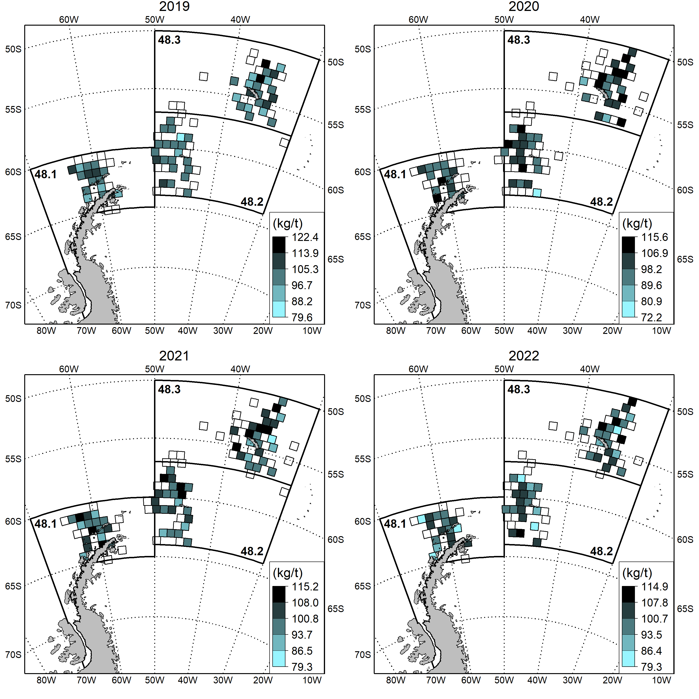

<!-- README.md is generated from README.Rmd. Please edit that file -->

```{r, echo = FALSE}
knitr::opts_chunk$set(
  collapse = TRUE,
  comment = "#>",
  fig.path = "Advanced_Grids-"
)
library(knitr)
```


<center>
# Advanced grids tutorial
</center>

------------------------------------------------------------------------

This page provides an example of data gridding over four fishing seasons. It uses simulated data (Effort.csv and Observations.csv) as inputs and generates a four-panel plot displaying the data in each of four fishing seasons. Users can replace the input data with their own and run the code below without edits if they keep the same structure as the simulated data (same column names, in particular).

```{r, message=F}
library(CCAMLRGIS)
library(dplyr)
#Use simplified coastline
coast=st_union(Coast[Coast$ID=="All",]) 
#Get ASDs
ASDs=load_ASDs()
#keep only 48.1-48.3
ASDs=ASDs[ASDs$GAR_Short_Label%in%c("481","482","483"),] 

#Load data
Effort=read.csv("Effort.csv")
Observations=read.csv("Observations.csv")

#Build a grid for all "Effort" data (5,000 sq.km cells)
Eff_gr=create_PolyGrids(Input=Effort,NamesIn=c("Latitude","Longitude"),Area=5000)
#Because "Observations" was built using a subset of "Effort" locations,
#"Eff_gr" has cells in which all records belong (for both "Effort" and "Observations")

#Assign cells to each record in "Observations"
Observations=assign_areas(Input=Observations,
                          Polys="Eff_gr",
                          AreaNameFormat="ID",
                          NamesIn =c("Latitude","Longitude"),
                          NamesOut="ID")

#Now "Observations" has a new column (ID) which identifies the cell in which each record falls

#Assign cells to each record in "Effort"
Effort=assign_areas(Input=Effort,
                    Polys="Eff_gr",
                    AreaNameFormat="ID",
                    NamesIn =c("Latitude","Longitude"),
                    NamesOut="ID")

#Now "Effort" has a new column (ID) which identifies the cell in which each record falls


#Prepare map elements


#Rotate objects
Lonzero=-50 #This longitude will point up
R_asds=Rotate_obj(ASDs,Lonzero)
R_coast=Rotate_obj(coast,Lonzero)
R_grid=Rotate_obj(Eff_gr,Lonzero)

#Create a bounding box (X and Y limits) for the region
bb=st_bbox(st_buffer(R_asds,50000)) #Get bounding box (x/y limits) + buffer
bx=st_as_sfc(bb) #Build spatial box to plot

#Use bounding box to crop coastline
R_coast=st_intersection(R_coast,bx)


#Plot (loop, build map in each season)


png(filename="Advanced_grids.png", width = 3000, height = 3000,res=200)
par(mfrow=c(2,2))
par(mai=c(0,0.4,0,0.4),cex=1,lend=1)

for(s in sort(unique(Effort$Season))){ # "s" is one season
  
  #Find in which cell there was effort in season s
  Eff_cells=unique(Effort$ID[Effort$Season==s])
  
  #Take subset of Observations for Season "s"
  tmp=Observations%>%filter(Season==s)%>%select(-Season) 
  #Compute median of observed values in each cell
  tmp=tmp%>%group_by(ID)%>%summarise(Med=median(Value,na.rm=T))
  #Generate colors for cells
  Gridcol=add_col(tmp$Med,cuts=6,cols=c("cadetblue1","black"))
  
  #Plot Subareas
  plot(st_geometry(R_asds),border="black",lwd=3)
  #Add Reference grid
  add_RefGrid(bb=bb,ResLat=5,ResLon=10,lwd=2,fontsize=1.2)
  #Plot cells in which there was fishing effort (without color)
  plot(st_geometry(R_grid[R_grid$ID%in%Eff_cells,]),lwd=1.5,add=T)
  #Plot cells with observations (colored by median of values)
  plot(st_geometry(R_grid[match(tmp$ID,R_grid$ID),]),col=Gridcol$varcol,add=T,lwd=1.5)
  #Plot coast
  plot(R_coast,add=T,col='grey',border='black',lwd=1)
  #Add bounding box
  plot(bx,add=T,border='black',lwd=2,xpd=T)
  
  #Add Subarea labels
  text(-1122978, 3150000,"48.1",font=2,cex=1.5,adj=c(-0.15,1.5))
  text(750000, 2900000,"48.2",font=2,cex=1.5,adj=c(-0.15,1.5))
  text(0, 4371229,"48.3",font=2,cex=1.5,adj=c(-0.15,1.5))
  #Add Season label
  text(mean(c(bb$xmin,bb$xmax)),bb$ymax,s,cex=1.8,adj=c(0.5,-1.4),xpd=T)
  #Add color scale
  add_Cscale(pos='154/200',title='(kg/t)',cuts=sprintf("%.1f",Gridcol$cuts),cols=Gridcol$cols,
             height=32,width=18,fontsize=1.4,offset = -570)
}
dev.off()
```


```{r fig.align="center",out.width="100%",message=F,dpi=300,echo=F,fig.cap="Figure 1. Spatial distribution of simulated rates from 2019 to 2022. Cells of 5,000 square kilometers are color-coded according to the median of values. Blank cells indicate where fishing occurred and no observations were recorded."}

```

