<!-- README.md is generated from README.Rmd. Please edit that file -->
<center>

# Basemaps

</center>

------------------------------------------------------------------------

Each of the following sections contain code to produce maps
corresponding to the areas shown in the [Fishery
Reports](https://fisheryreports.ccamlr.org./). To produce any of these
maps, one must download the entire *Basemaps* folder and run the code
given in the *Initialization* section first.

## Initialization

### This code must be executed first, then each section can be executed independently.

``` r
library(CCAMLRGIS)
library(terra)
library(png)
#Download bathymetry:
Bathy=load_Bathy(LocalFile=F,Res=1000) #Once downloaded, re-use it. See help(load_Bathy)
# Bathy=SmallBathy() #Use this for testing purposes first
#Get coastline
coast=load_Coastline()
#Get ASDs
ASDs=load_ASDs()
#Get Labels
Labs_all=read.csv("Insets/Labels_Basemaps.csv")
Labs=Labs_all[Labs_all$Type=="L",]
Labs_p=create_Points(Labs,NamesIn =  c("Lat","Lon"))
#Build pointers
Labs=Labs_all[Labs_all$Type!="L",]
Labs_l=create_Points(Labs,NamesIn =  c("Lat","Lon"))
```

<center>

### Contents

</center>

------------------------------------------------------------------------

1.  [Area 48](#1-area-48)
2.  [Subarea 48.1](#2-subarea-481)
3.  [Subarea 48.2](#3-subarea-482)
4.  [Subarea 48.3](#4-subarea-483)
5.  [Subarea 48.4](#5-subarea-484)
6.  [Subarea 48.6](#6-subarea-486)
7.  [Division 58.4.1](#7-division-5841)
8.  [Division 58.4.2](#8-division-5842)
9.  [Division 58.4.3a](#9-division-5843a)
10. [Division 58.4.3b](#10-division-5843b)
11. [Division 58.4.4](#11-division-5844)
12. [Division 58.5.1](#12-division-5851)
13. [Division 58.5.2](#13-division-5852)
14. [Subarea 58.6](#14-subarea-586)
15. [Subarea 58.7](#15-subarea-587)
16. [Ross Sea region](#16-ross-sea-region)
17. [Subarea 88.2](#17-subarea-882)
18. [Subarea 88.3](#18-subarea-883)

------------------------------------------------------------------------

<br>

### 1. Area 48

``` r
#Load SSMUs
SSMUs=load_SSMUs()

#Rotate objects
Lonzero=-45 #This longitude will point up
R_ssmus=Rotate_obj(SSMUs,Lonzero)
R_bathy=Rotate_obj(Bathy,Lonzero)
#> |---------|---------|---------|---------|=========================================                                          
R_asds=Rotate_obj(ASDs,Lonzero)
R_labsp=Rotate_obj(Labs_p,Lonzero)
R_coast=Rotate_obj(coast,Lonzero)

#Select ASD of interest
R_asdsb=R_asds[R_asds$GAR_Short_Label%in%c("481","482","483","484"),]

#Create a bounding box for the region
bb=st_bbox(st_buffer(R_asdsb,50000)) #Get bounding box (x/y limits) + buffer
bx=st_as_sfc(bb) #Build spatial box to plot

#Use bounding box to crop elements
R_asds=suppressWarnings(st_intersection(R_asds,bx))
R_coast=suppressWarnings(st_intersection(R_coast,bx))
R_bathy=crop(R_bathy,ext(bb))

#Get height and width of bounding box
Lx=bb['xmax']-bb['xmin']
Ly=bb['ymax']-bb['ymin']

#Get inset map
inset=readPNG("Insets/Map_Cover_48.png",native = T)


#Plot
png(filename='Map_Area_48.png',width=2600,height=2000*(Ly/Lx),res=300)

plot(R_bathy,breaks=Depth_cuts,col=Depth_cols,legend=FALSE,axes=FALSE,mar=c(0.6,1.5,0.6,11),maxcell=5e6)
plot(st_geometry(R_coast[R_coast$surface=="Ice",]),col="white",add=T,lwd=0.5)
plot(st_geometry(R_ssmus),border="orange",lwd=2,add=T)
plot(st_geometry(R_asds),border="black",lwd=2,add=T)
plot(st_geometry(R_coast[R_coast$surface=="Land",]),col="grey",add=T)
add_RefGrid(bb=bb,ResLat = 5,ResLon = 10,lwd=1,fontsize = 0.75)
plot(bx,lwd=2,add=T,xpd=T)

Off=150 #Offset legends

#Colorscale
add_Cscale(pos='3/10',height=40,maxVal=-1,offset = Off,fontsize=0.68,width=15,lwd=1,
           cuts = Depth_cuts,
           cols = Depth_cols)

#Legend
Loc=add_Cscale(pos='15/20',height=43,mode='Legend',offset = Off)
# par(lwd=2)
legend(Loc,legend=c('Areas, Subareas and Divisions','Small Scale Management Units'),
       border=c('black','orange'),
       fill='white',
       seg.len=0,cex=0.68,
       bg='white',
       xpd=TRUE)

#Add inset map
Loc=add_Cscale(pos='100/100',height=0,mode='Legend',offset = Off)
rasterImage(inset,xleft=Loc[1],
            ybottom=Loc[2],
            xright=Loc[1]+Lx/3.2,
            ytop=Loc[2]+Lx/3.2,
            xpd=T)

#Add labels
R_labsp=R_labsp[R_labsp$Area=="48",]
R_labsp$x=st_coordinates(R_labsp)[,1]
R_labsp$y=st_coordinates(R_labsp)[,2]
R_labsp=st_drop_geometry(R_labsp)
add_labels(mode='input',LabelTable=R_labsp[,c("x","y","text","fontsize","fonttype","angle","col")])

dev.off()
#> png 
#>   2
```

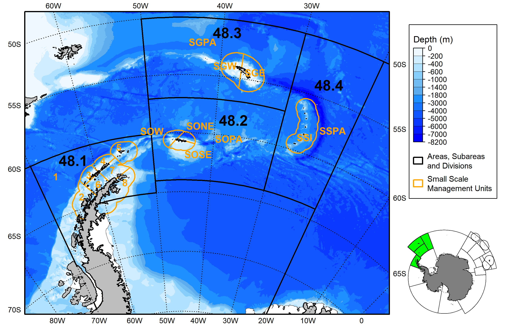

<br>

### 2. Subarea 48.1

``` r
#Load RBs
RBs=load_RBs()
RBs=RBs[grep("481",RBs$GAR_Short_Label),]

#Rotate objects
Lonzero=-60 #This longitude will point up
R_rbs=Rotate_obj(RBs,Lonzero)
R_bathy=Rotate_obj(Bathy,Lonzero)
R_asds=Rotate_obj(ASDs,Lonzero)
R_labsp=Rotate_obj(Labs_p,Lonzero)
R_coast=Rotate_obj(coast,Lonzero)

#Select ASD of interest
R_asdsb=R_asds[R_asds$GAR_Short_Label=="481",]

#Create a bounding box for the region
bb=st_bbox(st_buffer(R_asdsb,10000)) #Get bounding box (x/y limits) + buffer
bx=st_as_sfc(bb) #Build spatial box to plot

#Use bounding box to crop elements
R_asds=suppressWarnings(st_intersection(R_asds,bx))
R_coast=suppressWarnings(st_intersection(R_coast,bx))
R_bathy=crop(R_bathy,ext(bb))

#Get height and width of bounding box
Lx=bb['xmax']-bb['xmin']
Ly=bb['ymax']-bb['ymin']

#Get inset map
inset=readPNG("Insets/Map_Cover_481.png",native = T)


#Plot
png(filename='Map_Area_481.png',width=2600,height=2000*(Ly/Lx),res=300)

plot(R_bathy,breaks=Depth_cuts2,col=Depth_cols2,legend=FALSE,axes=FALSE,mar=c(0.6,1.9,0.6,12),maxcell=5e6)
plot(st_geometry(R_coast[R_coast$surface=="Ice",]),col="white",add=T,lwd=0.5)
plot(st_geometry(R_rbs),border="darkgreen",lwd=2,add=T)
plot(st_geometry(R_asds),border="black",lwd=2,add=T)
plot(st_geometry(R_coast[R_coast$surface=="Land",]),col="grey",add=T)
add_RefGrid(bb=bb,ResLat = 2.5,ResLon = 5,lwd=1,fontsize = 0.75)
plot(bx,lwd=2,add=T,xpd=T)

Off=80 #Offset legends

#Colorscale
add_Cscale(pos='3/10',height=40,maxVal=-1,offset = Off,fontsize=0.68,width=15,lwd=1,
           cuts = Depth_cuts2,
           cols = Depth_cols2)

#Legend
Loc=add_Cscale(pos='15/20',height=43,mode='Legend',offset = Off)
# par(lwd=2)
legend(Loc,legend=c('Areas, Subareas and Divisions','Research Blocks'),
       border=c('black','darkgreen'),
       fill='white',
       seg.len=0,cex=0.68,
       bg='white',
       xpd=TRUE)

#Add inset map
Loc=add_Cscale(pos='100/100',height=0,mode='Legend',offset = Off)
rasterImage(inset,xleft=Loc[1],
            ybottom=Loc[2],
            xright=Loc[1]+Lx/3.2,
            ytop=Loc[2]+Lx/3.2,
            xpd=T)

#Add labels
R_labsp=R_labsp[R_labsp$Area=="481",]
R_labsp$x=st_coordinates(R_labsp)[,1]
R_labsp$y=st_coordinates(R_labsp)[,2]
R_labsp=st_drop_geometry(R_labsp)
add_labels(mode='input',LabelTable=R_labsp[,c("x","y","text","fontsize","fonttype","angle","col")])

dev.off()
#> png 
#>   2
```

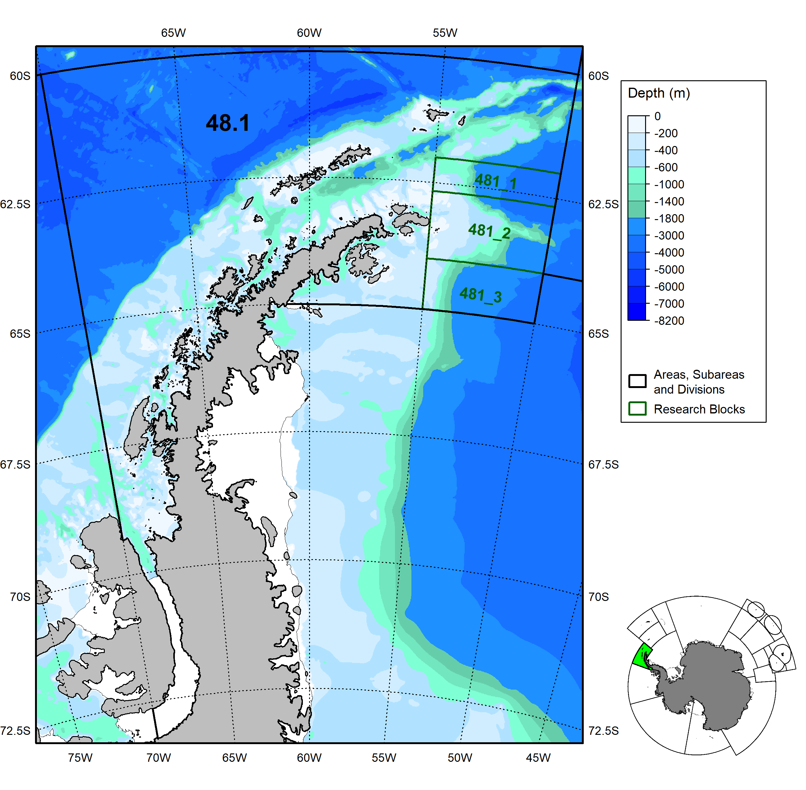

<br>

### 3. Subarea 48.2

``` r
#Load RBs
RBs=load_RBs()
RBs=RBs[grep("482",RBs$GAR_Short_Label),]

#Rotate objects
Lonzero=-40 #This longitude will point up
R_rbs=Rotate_obj(RBs,Lonzero)
R_bathy=Rotate_obj(Bathy,Lonzero)
#> |---------|---------|---------|---------|=========================================                                          
R_asds=Rotate_obj(ASDs,Lonzero)
R_labsp=Rotate_obj(Labs_p,Lonzero)
R_coast=Rotate_obj(coast,Lonzero)

#Select ASD of interest
R_asdsb=R_asds[R_asds$GAR_Short_Label=="482",]

#Create a bounding box for the region
bb=st_bbox(st_buffer(R_asdsb,10000)) #Get bounding box (x/y limits) + buffer
bx=st_as_sfc(bb) #Build spatial box to plot

#Use bounding box to crop elements
R_asds=suppressWarnings(st_intersection(R_asds,bx))
R_coast=suppressWarnings(st_intersection(R_coast,bx))
R_bathy=crop(R_bathy,ext(bb))

#Get height and width of bounding box
Lx=bb['xmax']-bb['xmin']
Ly=bb['ymax']-bb['ymin']

#Get inset map
inset=readPNG("Insets/Map_Cover_482.png",native = T)


#Plot
png(filename='Map_Area_482.png',width=2600,height=2000*(Ly/Lx),res=300)

plot(R_bathy,breaks=Depth_cuts2,col=Depth_cols2,legend=FALSE,axes=FALSE,mar=c(0.6,2.0,0.6,12),maxcell=5e6)
plot(st_geometry(R_coast[R_coast$surface=="Ice",]),col="white",add=T,lwd=0.5)
plot(st_geometry(R_rbs),border="darkgreen",lwd=2,add=T)
plot(st_geometry(R_asds),border="black",lwd=2,add=T)
plot(st_geometry(R_coast[R_coast$surface=="Land",]),col="grey",add=T)
add_RefGrid(bb=bb,ResLat = 2.5,ResLon = 5,lwd=1,fontsize = 0.75)
plot(bx,lwd=2,add=T,xpd=T)

Off=80 #Offset legends

#Colorscale
add_Cscale(pos='3/10',height=40,maxVal=-1,offset = Off,fontsize=0.68,width=15,lwd=1,
           cuts = Depth_cuts2,
           cols = Depth_cols2)

#Legend
Loc=add_Cscale(pos='14/20',height=43,mode='Legend',offset = Off)
# par(lwd=2)
legend(Loc,legend=c('Areas, Subareas and Divisions','Research Blocks'),
       border=c('black','darkgreen'),
       fill='white',
       cex=0.6,
       bg='white',
       xpd=TRUE,x.intersp=0.6,y.intersp=0.7,box.lwd=1)

#Add inset map
Loc=add_Cscale(pos='100/100',height=0,mode='Legend',offset = Off)
rasterImage(inset,xleft=Loc[1],
            ybottom=Loc[2],
            xright=Loc[1]+Lx/3.4,
            ytop=Loc[2]+Lx/3.4,
            xpd=T)

#Add labels
R_labsp=R_labsp[R_labsp$Area=="482",]
R_labsp$x=st_coordinates(R_labsp)[,1]
R_labsp$y=st_coordinates(R_labsp)[,2]
R_labsp=st_drop_geometry(R_labsp)
add_labels(mode='input',LabelTable=R_labsp[,c("x","y","text","fontsize","fonttype","angle","col")])

dev.off()
#> png 
#>   2
```


<br>

### 4. Subarea 48.3

``` r
#Load MAs
MAs=load_MAs()
MAs=MAs[grep("483",MAs$GAR_Short_Label),]

#Rotate objects
Lonzero=-40 #This longitude will point up
R_mas=Rotate_obj(MAs,Lonzero)
R_bathy=Rotate_obj(Bathy,Lonzero)
#> |---------|---------|---------|---------|=========================================                                          
R_asds=Rotate_obj(ASDs,Lonzero)
R_labsp=Rotate_obj(Labs_p,Lonzero)
R_labsl=Rotate_obj(Labs_l,Lonzero)
R_coast=Rotate_obj(coast,Lonzero)

#Select ASD of interest
R_asdsb=R_asds[R_asds$GAR_Short_Label=="483",]

#Create a bounding box for the region
bb=st_bbox(st_buffer(R_asdsb,10000)) #Get bounding box (x/y limits) + buffer
bx=st_as_sfc(bb) #Build spatial box to plot

#Use bounding box to crop elements
R_asds=suppressWarnings(st_intersection(R_asds,bx))
R_coast=suppressWarnings(st_intersection(R_coast,bx))
R_bathy=crop(R_bathy,ext(bb))

#Get height and width of bounding box
Lx=bb['xmax']-bb['xmin']
Ly=bb['ymax']-bb['ymin']

#Get inset map
inset=readPNG("Insets/Map_Cover_483.png",native = T)


#Plot
png(filename='Map_Area_483.png',width=2600,height=2000*(Ly/Lx),res=300)

plot(R_bathy,breaks=Depth_cuts,col=Depth_cols,legend=FALSE,axes=FALSE,mar=c(0.6,2.0,0.6,11.5),maxcell=5e6)
plot(st_geometry(R_coast[R_coast$surface=="Ice",]),col="white",add=T,lwd=0.5)
plot(st_geometry(R_mas),border="darkred",lwd=2,add=T)
plot(st_geometry(R_asds),border="black",lwd=2,add=T)
plot(st_geometry(R_coast[R_coast$surface=="Land",]),col="grey",add=T)
add_RefGrid(bb=bb,ResLat = 2.5,ResLon = 5,lwd=1,fontsize = 0.75)
plot(bx,lwd=2,add=T,xpd=T)

Off=100 #Offset legends

#Colorscale
add_Cscale(pos='5/20',height=42,maxVal=-1,offset = Off,fontsize=0.65,width=15,lwd=1,
           cuts = Depth_cuts,
           cols = Depth_cols)

#Legend
Loc=add_Cscale(pos='27/40',height=43,mode='Legend',offset = Off)
# par(lwd=1.5)
legend(Loc,legend=c('Areas, Subareas and Divisions','Management Areas'),
       border=c('black','darkred'),
       fill='white',
       cex=0.6,
       bg='white',
       xpd=TRUE,x.intersp=0.6,y.intersp=0.7,box.lwd=1)

#Add inset map
Loc=add_Cscale(pos='500/500',height=0,mode='Legend',offset = Off)
rasterImage(inset,xleft=Loc[1],
            ybottom=Loc[2],
            xright=Loc[1]+Lx/4.6,
            ytop=Loc[2]+Lx/4.6,
            xpd=T)

#Add labels
R_labsp=R_labsp[R_labsp$Area=="483",]
R_labsp$x=st_coordinates(R_labsp)[,1]
R_labsp$y=st_coordinates(R_labsp)[,2]
R_labsp=st_drop_geometry(R_labsp)
add_labels(mode='input',LabelTable=R_labsp[,c("x","y","text","fontsize","fonttype","angle","col")])
#Add pointers
R_labsl=R_labsl[R_labsl$Area=="483",]
R_labsl$x=st_coordinates(R_labsl)[,1]
R_labsl$y=st_coordinates(R_labsl)[,2]
R_labsl=st_drop_geometry(R_labsl)
segments(x0=R_labsl$x[R_labsl$Type=="S"],
           y0=R_labsl$y[R_labsl$Type=="S"],
           x1=R_labsl$x[R_labsl$Type=="E"],
           y1=R_labsl$y[R_labsl$Type=="E"],
           lwd=2,lend=1)
dev.off()
#> png 
#>   2
```


<br>

### 5. Subarea 48.4

``` r
#Load MAs
MAs=load_MAs()
MAs=MAs[grep("484_SS",MAs$GAR_Short_Label),]

#Rotate objects
Lonzero=-25 #This longitude will point up
R_mas=Rotate_obj(MAs,Lonzero)
R_bathy=Rotate_obj(Bathy,Lonzero)
R_asds=Rotate_obj(ASDs,Lonzero)
R_labsp=Rotate_obj(Labs_p,Lonzero)
R_coast=Rotate_obj(coast,Lonzero)

#Select ASD of interest
R_asdsb=R_asds[R_asds$GAR_Short_Label=="484",]

#Create a bounding box for the region
bb=st_bbox(st_buffer(R_asdsb,10000)) #Get bounding box (x/y limits) + buffer
bx=st_as_sfc(bb) #Build spatial box to plot

#Use bounding box to crop elements
R_asds=suppressWarnings(st_intersection(R_asds,bx))
R_coast=suppressWarnings(st_intersection(R_coast,bx))
R_bathy=crop(R_bathy,ext(bb))

#Get height and width of bounding box
Lx=bb['xmax']-bb['xmin']
Ly=bb['ymax']-bb['ymin']

#Get inset map
inset=readPNG("Insets/Map_Cover_484.png",native = T)


#Plot
png(filename='Map_Area_484.png',width=2600,height=1500*(Ly/Lx),res=300)

plot(R_bathy,breaks=Depth_cuts,col=Depth_cols,legend=FALSE,axes=FALSE,mar=c(2,2,2,15),maxcell=5e6)
plot(st_geometry(R_coast[R_coast$surface=="Ice",]),col="white",add=T,lwd=0.5)
plot(st_geometry(R_mas),border="darkred",lwd=2,add=T)
plot(st_geometry(R_asds),border="black",lwd=2,add=T)
plot(st_geometry(R_coast[R_coast$surface=="Land",]),col="grey",add=T)
add_RefGrid(bb=bb,ResLat = 2.5,ResLon = 5,lwd=1,fontsize = 0.9)
plot(bx,lwd=2,add=T,xpd=T)

Off=70 #Offset legends

#Colorscale
add_Cscale(pos='5/20',height=40,maxVal=-1,offset = Off,fontsize=0.8,width=17,lwd=1,
           cuts = Depth_cuts,
           cols = Depth_cols)

#Legend
Loc=add_Cscale(pos='27/40',height=43,mode='Legend',offset = Off)
# par(lwd=2)
legend(Loc,legend=c('Areas, Subareas and Divisions','Management Areas'),
       border=c('black','darkred'),
       fill='white',
       seg.len=0,cex=0.8,
       bg='white',
       xpd=TRUE)

#Add inset map
Loc=add_Cscale(pos='90/100',height=0,mode='Legend',offset = Off)
rasterImage(inset,xleft=Loc[1],
            ybottom=Loc[2],
            xright=Loc[1]+Lx/2,
            ytop=Loc[2]+Lx/2,
            xpd=T)

#Add labels
R_labsp=R_labsp[R_labsp$Area=="484",]
R_labsp$x=st_coordinates(R_labsp)[,1]
R_labsp$y=st_coordinates(R_labsp)[,2]
R_labsp=st_drop_geometry(R_labsp)
add_labels(mode='input',LabelTable=R_labsp[,c("x","y","text","fontsize","fonttype","angle","col")])

dev.off()
#> png 
#>   2
```

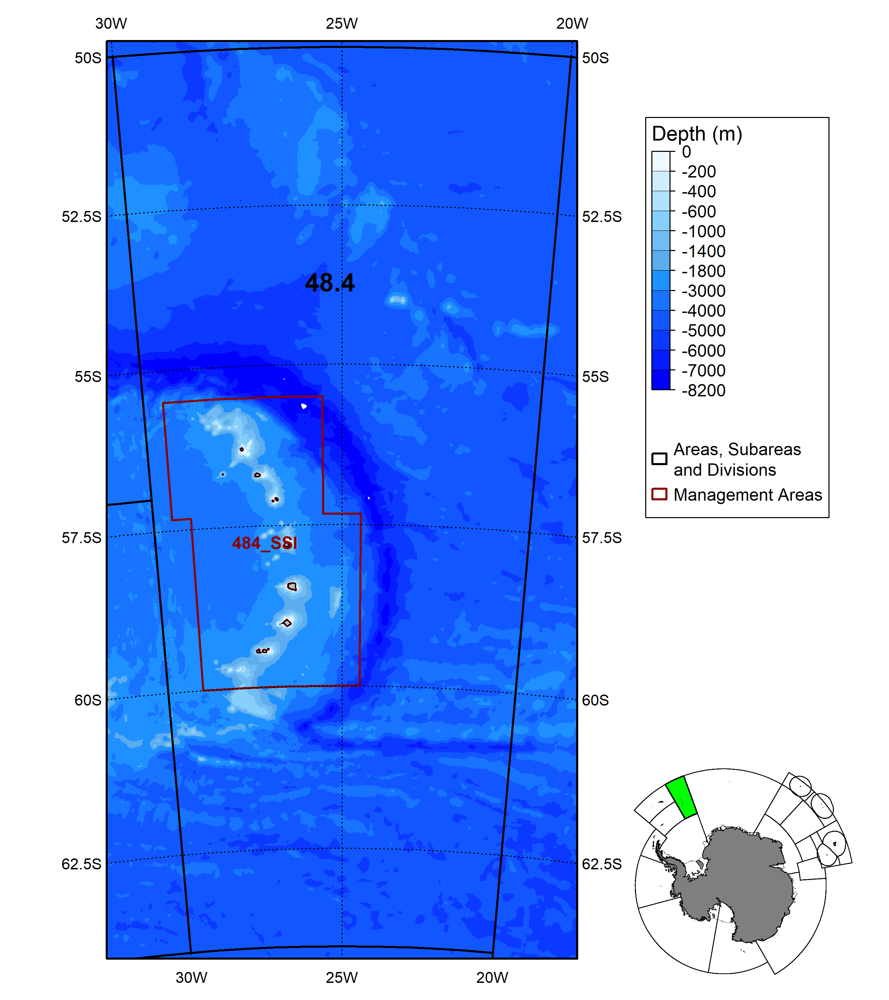

<br>

### 6. Subarea 48.6

``` r
#Load RBs
RBs=load_RBs()
RBs=RBs[grep("486",RBs$GAR_Short_Label),]
#Load SSRUs
SSRUs=load_SSRUs()
SSRUs=SSRUs[grep("486",SSRUs$GAR_Short_Label),]

#Rotate objects
Lonzero=5 #This longitude will point up
R_rbs=Rotate_obj(RBs,Lonzero)
R_bathy=Rotate_obj(Bathy,Lonzero)
R_asds=Rotate_obj(ASDs,Lonzero)
R_labsp=Rotate_obj(Labs_p,Lonzero)
R_labsl=Rotate_obj(Labs_l,Lonzero)
R_coast=Rotate_obj(coast,Lonzero)
R_ssrus=Rotate_obj(SSRUs,Lonzero)

#Select ASD of interest
R_asdsb=R_asds[R_asds$GAR_Short_Label=="486",]

#Create a bounding box for the region
bb=st_bbox(st_buffer(R_asdsb,10000)) #Get bounding box (x/y limits) + buffer
bx=st_as_sfc(bb) #Build spatial box to plot

#Use bounding box to crop elements
R_asds=suppressWarnings(st_intersection(R_asds,bx))
R_coast=suppressWarnings(st_intersection(R_coast,bx))
R_bathy=crop(R_bathy,ext(bb))

#Get height and width of bounding box
Lx=bb['xmax']-bb['xmin']
Ly=bb['ymax']-bb['ymin']

#Get inset map
inset=readPNG("Insets/Map_Cover_486.png",native = T)


#Plot
png(filename='Map_Area_486.png',width=2600,height=2000*(Ly/Lx),res=300)

plot(R_bathy,breaks=Depth_cuts2,col=Depth_cols2,legend=FALSE,axes=FALSE,mar=c(0.6,2.0,0.6,11.5),maxcell=5e6)
plot(st_geometry(R_coast[R_coast$surface=="Ice",]),col="white",add=T,lwd=0.5)
plot(st_geometry(R_rbs),border="darkgreen",lwd=2,add=T)
plot(st_geometry(R_ssrus),border="gray40",lwd=2,add=T)
plot(st_geometry(R_asds),border="black",lwd=2,add=T)
plot(st_geometry(R_coast[R_coast$surface=="Land",]),col="grey",add=T)
add_RefGrid(bb=bb,ResLat = 5,ResLon = 10,lwd=1,fontsize = 0.7)
plot(bx,lwd=2,add=T,xpd=T)

Off=170 #Offset legends

#Colorscale
add_Cscale(pos='5/20',height=42,maxVal=-1,offset = Off,fontsize=0.65,width=15,lwd=1,
           cuts = Depth_cuts2,
           cols = Depth_cols2)

#Legend
Loc=add_Cscale(pos='27/40',height=43,mode='Legend',offset = Off)
# par(lwd=2)
legend(Loc,legend=c('Areas, Subareas and Divisions','Small Scale Research Units','Research Blocks'),
       border=c('black','gray40','darkgreen'),
       fill='white',
       seg.len=0,cex=0.65,
       bg='white',
       xpd=TRUE)

#Add inset map
Loc=add_Cscale(pos='500/500',height=0,mode='Legend',offset = Off)
rasterImage(inset,xleft=Loc[1],
            ybottom=Loc[2],
            xright=Loc[1]+Lx/3,
            ytop=Loc[2]+Lx/3,
            xpd=T)

#Add labels
R_labsp=R_labsp[R_labsp$Area=="486",]
R_labsp$x=st_coordinates(R_labsp)[,1]
R_labsp$y=st_coordinates(R_labsp)[,2]
R_labsp=st_drop_geometry(R_labsp)
add_labels(mode='input',LabelTable=R_labsp[,c("x","y","text","fontsize","fonttype","angle","col")])
#Add pointers
R_labsl=R_labsl[R_labsl$Area=="486",]
R_labsl$x=st_coordinates(R_labsl)[,1]
R_labsl$y=st_coordinates(R_labsl)[,2]
R_labsl=st_drop_geometry(R_labsl)
segments(x0=R_labsl$x[R_labsl$Type=="S"],
           y0=R_labsl$y[R_labsl$Type=="S"],
           x1=R_labsl$x[R_labsl$Type=="E"],
           y1=R_labsl$y[R_labsl$Type=="E"],
           lwd=2,lend=1)
dev.off()
#> png 
#>   2
```


<br>

### 7. Division 58.4.1

``` r
#Load RBs
RBs=load_RBs()
RBs=RBs[grep("5841",RBs$GAR_Short_Label),]
#Load SSRUs
SSRUs=load_SSRUs()
SSRUs=SSRUs[grep("5841",SSRUs$GAR_Short_Label),]

#Rotate objects
Lonzero=115 #This longitude will point up
R_rbs=Rotate_obj(RBs,Lonzero)
R_bathy=Rotate_obj(Bathy,Lonzero)
R_asds=Rotate_obj(ASDs,Lonzero)
R_labsp=Rotate_obj(Labs_p,Lonzero)
R_coast=Rotate_obj(coast,Lonzero)
R_ssrus=Rotate_obj(SSRUs,Lonzero)

#Select ASD of interest
R_asdsb=R_asds[R_asds$GAR_Short_Label=="5841",]

#Create a bounding box for the region
bb=st_bbox(st_buffer(R_asdsb,10000)) #Get bounding box (x/y limits) + buffer
bx=st_as_sfc(bb) #Build spatial box to plot

#Use bounding box to crop elements
R_asds=suppressWarnings(st_intersection(R_asds,bx))
R_coast=suppressWarnings(st_intersection(R_coast,bx))
R_bathy=crop(R_bathy,ext(bb))

#Get height and width of bounding box
Lx=bb['xmax']-bb['xmin']
Ly=bb['ymax']-bb['ymin']

#Get inset map
inset=readPNG("Insets/Map_Cover_5841.png",native = T)


#Plot
png(filename='Map_Area_5841.png',width=2600,height=2000*(Ly/Lx),res=300)

plot(R_bathy,breaks=Depth_cuts2,col=Depth_cols2,legend=FALSE,axes=FALSE,mar=c(0.6,1.5,0.6,9.5),maxcell=5e6)
plot(st_geometry(R_coast[R_coast$surface=="Ice",]),col="white",add=T,lwd=0.5)
plot(st_geometry(R_ssrus),border="gray40",lwd=2,add=T)
plot(st_geometry(R_rbs),border="darkgreen",lwd=2,add=T)
plot(st_geometry(R_asds),border="black",lwd=2,add=T)
plot(st_geometry(R_coast[R_coast$surface=="Land",]),col="grey",add=T)
add_RefGrid(bb=bb,ResLat = 5,ResLon = 10,lwd=1,fontsize = 0.7)
plot(bx,lwd=2,add=T,xpd=T)

Off=180 #Offset legends

#Colorscale
add_Cscale(pos='9/40',height=42,maxVal=-1,offset = Off,fontsize=0.55,width=13,lwd=1,
           cuts = Depth_cuts2,
           cols = Depth_cols2)

#Legend
Loc=add_Cscale(pos='52/80',height=43,mode='Legend',offset = Off)
# par(lwd=2)
legend(Loc,legend=c('Areas, Subareas and Divisions','Small Scale Research Units','Research Blocks'),
       border=c('black','gray40','darkgreen'),
       fill='white',
       cex=0.5,
       bg='white',
       xpd=TRUE,x.intersp=0.6,y.intersp=0.6,box.lwd=1)


#Add inset map
Loc=add_Cscale(pos='500/500',height=-12,mode='Legend',offset = Off)
rasterImage(inset,xleft=Loc[1],
            ybottom=Loc[2],
            xright=Loc[1]+Lx/5,
            ytop=Loc[2]+Lx/5,
            xpd=T)

#Add labels
R_labsp=R_labsp[R_labsp$Area=="5841",]
R_labsp$x=st_coordinates(R_labsp)[,1]
R_labsp$y=st_coordinates(R_labsp)[,2]
R_labsp=st_drop_geometry(R_labsp)
add_labels(mode='input',LabelTable=R_labsp[,c("x","y","text","fontsize","fonttype","angle","col")])

dev.off()
#> png 
#>   2
```

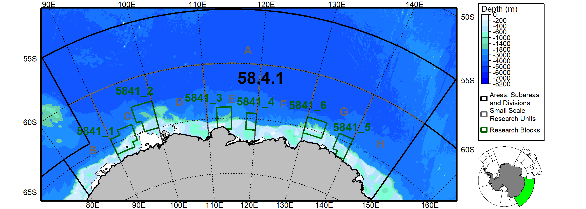

<br>

### 8. Division 58.4.2

``` r
#Load RBs
RBs=load_RBs()
RBs=RBs[grep("5842",RBs$GAR_Short_Label),]
#Load SSRUs
SSRUs=load_SSRUs()
SSRUs=SSRUs[grep("5842",SSRUs$GAR_Short_Label),]

#Rotate objects
Lonzero=55 #This longitude will point up
R_rbs=Rotate_obj(RBs,Lonzero)
R_bathy=Rotate_obj(Bathy,Lonzero)
#> |---------|---------|---------|---------|=========================================                                          
R_asds=Rotate_obj(ASDs,Lonzero)
R_labsp=Rotate_obj(Labs_p,Lonzero)
R_coast=Rotate_obj(coast,Lonzero)
R_ssrus=Rotate_obj(SSRUs,Lonzero)

#Select ASD of interest
R_asdsb=R_asds[R_asds$GAR_Short_Label=="5842",]

#Create a bounding box for the region
bb=st_bbox(st_buffer(R_asdsb,10000)) #Get bounding box (x/y limits) + buffer
bx=st_as_sfc(bb) #Build spatial box to plot

#Use bounding box to crop elements
R_asds=suppressWarnings(st_intersection(R_asds,bx))
R_coast=suppressWarnings(st_intersection(R_coast,bx))
R_bathy=crop(R_bathy,ext(bb))

#Get height and width of bounding box
Lx=bb['xmax']-bb['xmin']
Ly=bb['ymax']-bb['ymin']

#Get inset map
inset=readPNG("Insets/Map_Cover_5842.png",native = T)


#Plot
png(filename='Map_Area_5842.png',width=2600,height=2000*(Ly/Lx),res=300)

plot(R_bathy,breaks=Depth_cuts2,col=Depth_cols2,legend=FALSE,axes=FALSE,mar=c(0.6,1.5,0.6,9.5),maxcell=5e6)
plot(st_geometry(R_coast[R_coast$surface=="Ice",]),col="white",add=T,lwd=0.5)
plot(st_geometry(R_ssrus),border="gray40",lwd=2,add=T)
plot(st_geometry(R_rbs),border="darkgreen",lwd=2,add=T)
plot(st_geometry(R_asds),border="black",lwd=2,add=T)
plot(st_geometry(R_coast[R_coast$surface=="Land",]),col="grey",add=T)
add_RefGrid(bb=bb,ResLat = 5,ResLon = 10,lwd=1,fontsize = 0.7)
plot(bx,lwd=2,add=T,xpd=T)

Off=120 #Offset legends

#Colorscale
add_Cscale(pos='9/40',height=42,maxVal=-1,offset = Off,fontsize=0.55,width=13,lwd=1,
           cuts = Depth_cuts2,
           cols = Depth_cols2)

#Legend
Loc=add_Cscale(pos='52/80',height=43,mode='Legend',offset = Off)
# par(lwd=2)
legend(Loc,legend=c('Areas, Subareas and Divisions','Small Scale Research Units','Research Blocks'),
       border=c('black','gray40','darkgreen'),
       fill='white',
       seg.len=0,cex=0.55,
       bg='white',
       xpd=TRUE,x.intersp=0.6,y.intersp=0.6,box.lwd=1)

#Add inset map
Loc=add_Cscale(pos='500/500',height=-11,mode='Legend',offset = Off)
rasterImage(inset,xleft=Loc[1],
            ybottom=Loc[2],
            xright=Loc[1]+Lx/4.5,
            ytop=Loc[2]+Lx/4.5,
            xpd=T)

#Add labels
R_labsp=R_labsp[R_labsp$Area=="5842",]
R_labsp$x=st_coordinates(R_labsp)[,1]
R_labsp$y=st_coordinates(R_labsp)[,2]
R_labsp=st_drop_geometry(R_labsp)
add_labels(mode='input',LabelTable=R_labsp[,c("x","y","text","fontsize","fonttype","angle","col")])

dev.off()
#> png 
#>   2
```

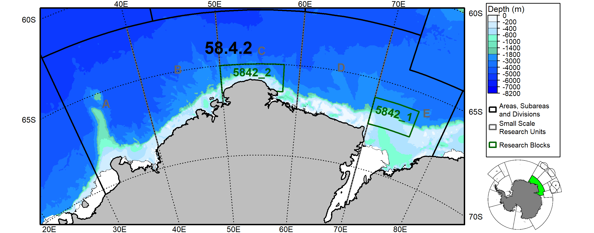

<br>

### 9. Division 58.4.3a

``` r
#Load RBs
RBs=load_RBs()
RBs=RBs[grep("5843a",RBs$GAR_Short_Label),]
#Load EEZs
EEZs=load_EEZs()

#Rotate objects
Lonzero=66.6 #This longitude will point up
R_rbs=Rotate_obj(RBs,Lonzero)
R_bathy=Rotate_obj(Bathy,Lonzero)
R_asds=Rotate_obj(ASDs,Lonzero)
R_labsp=Rotate_obj(Labs_p,Lonzero)
R_coast=Rotate_obj(coast,Lonzero)
R_eezs=Rotate_obj(EEZs,Lonzero)

#Select ASD of interest
R_asdsb=R_asds[R_asds$GAR_Short_Label=="5843a",]

#Create a bounding box for the region
bb=st_bbox(st_buffer(R_asdsb,10000)) #Get bounding box (x/y limits) + buffer
bx=st_as_sfc(bb) #Build spatial box to plot

#Use bounding box to crop elements
R_eezs=suppressWarnings(st_intersection(R_eezs,bx))
R_asds=suppressWarnings(st_intersection(R_asds,bx))
R_coast=suppressWarnings(st_intersection(R_coast,bx))
R_bathy=crop(R_bathy,ext(bb))

#Get height and width of bounding box
Lx=bb['xmax']-bb['xmin']
Ly=bb['ymax']-bb['ymin']

#Get inset map
inset=readPNG("Insets/Map_Cover_5843a.png",native = T)


#Plot
png(filename='Map_Area_5843a.png',width=2600,height=2000*(Ly/Lx),res=300)

plot(R_bathy,breaks=Depth_cuts2,col=Depth_cols2,legend=FALSE,axes=FALSE,mar=c(1,2.5,1,11),maxcell=5e6)
plot(st_geometry(R_coast[R_coast$surface=="Ice",]),col="white",add=T,lwd=0.5)
plot(st_geometry(R_eezs),border="purple",lwd=2,add=T)
plot(st_geometry(R_rbs),border="darkgreen",lwd=2,add=T)
plot(st_geometry(R_asds),border="black",lwd=2,add=T)
plot(st_geometry(R_coast[R_coast$surface=="Land",]),col="grey",add=T)
add_RefGrid(bb=bb,ResLat = 2.5,ResLon = 5,lwd=1,fontsize = 0.9)
plot(bx,lwd=2,add=T,xpd=T)

Off=70 #Offset legends

#Colorscale
add_Cscale(pos='9/40',height=42,maxVal=-1,offset = Off,fontsize=0.55,width=13,lwd=1,
           cuts = Depth_cuts2,
           cols = Depth_cols2)

#Legend
Loc=add_Cscale(pos='53/80',height=43,mode='Legend',offset = Off)
# par(lwd=2)
legend(Loc,legend=c('Areas, Subareas and Divisions','Exclusive Economic Zones','Research Blocks'),
       border=c('black','purple','darkgreen'),
       fill='white',
       seg.len=0,cex=0.55,
       bg='white',
       xpd=TRUE)

#Add inset map
Loc=add_Cscale(pos='500/500',height=0,mode='Legend',offset = Off)
rasterImage(inset,xleft=Loc[1],
            ybottom=Loc[2],
            xright=Loc[1]+Lx/3.5,
            ytop=Loc[2]+Lx/3.5,
            xpd=T)

#Add labels
R_labsp=R_labsp[R_labsp$Area=="5843a",]
R_labsp$x=st_coordinates(R_labsp)[,1]
R_labsp$y=st_coordinates(R_labsp)[,2]
R_labsp=st_drop_geometry(R_labsp)
add_labels(mode='input',LabelTable=R_labsp[,c("x","y","text","fontsize","fonttype","angle","col")])

dev.off()
#> png 
#>   2
```

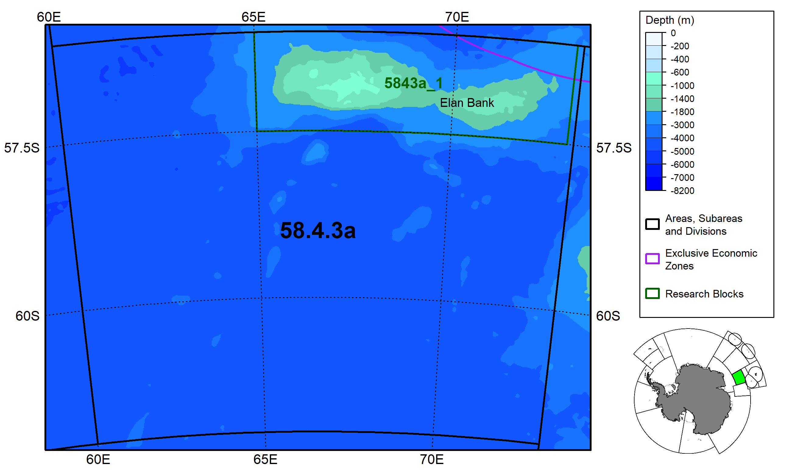

<br>

### 10. Division 58.4.3b

``` r
#Load SSRUs
SSRUs=load_SSRUs()
SSRUs=SSRUs[grep("5843b",SSRUs$GAR_Short_Label),]
#Load EEZs
EEZs=load_EEZs()

#Rotate objects
Lonzero=79.6 #This longitude will point up
R_ssrus=Rotate_obj(SSRUs,Lonzero)
R_bathy=Rotate_obj(Bathy,Lonzero)
R_asds=Rotate_obj(ASDs,Lonzero)
R_labsp=Rotate_obj(Labs_p,Lonzero)
R_coast=Rotate_obj(coast,Lonzero)
R_eezs=Rotate_obj(EEZs,Lonzero)

#Select ASD of interest
R_asdsb=R_asds[R_asds$GAR_Short_Label=="5843b",]

#Create a bounding box for the region
bb=st_bbox(st_buffer(R_asdsb,10000)) #Get bounding box (x/y limits) + buffer
bx=st_as_sfc(bb) #Build spatial box to plot

#Use bounding box to crop elements
R_eezs=suppressWarnings(st_intersection(R_eezs,bx))
R_asds=suppressWarnings(st_intersection(R_asds,bx))
R_coast=suppressWarnings(st_intersection(R_coast,bx))
R_bathy=crop(R_bathy,ext(bb))

#Get height and width of bounding box
Lx=bb['xmax']-bb['xmin']
Ly=bb['ymax']-bb['ymin']

#Get inset map
inset=readPNG("Insets/Map_Cover_5843b.png",native = T)


#Plot
png(filename='Map_Area_5843b.png',width=2600,height=2000*(Ly/Lx),res=300)

plot(R_bathy,breaks=Depth_cuts,col=Depth_cols,legend=FALSE,axes=FALSE,mar=c(0.5,2.5,0.5,14),maxcell=5e6)
plot(st_geometry(R_coast[R_coast$surface=="Ice",]),col="white",add=T,lwd=0.5)
plot(st_geometry(R_ssrus),border="gray40",lwd=2,add=T)
plot(st_geometry(R_eezs),border="purple",lwd=2,add=T)
plot(st_geometry(R_asds),border="black",lwd=2,add=T)
plot(st_geometry(R_coast[R_coast$surface=="Land",]),col="grey",add=T)
add_RefGrid(bb=bb,ResLat = 2.5,ResLon = 5,lwd=1,fontsize = 0.9)
plot(bx,lwd=2,add=T,xpd=T)

Off=85 #Offset legends

#Colorscale
add_Cscale(pos='11/40',height=40,maxVal=-1,offset = Off,fontsize=0.8,width=16,lwd=1,
           cuts = Depth_cuts,
           cols = Depth_cols)

#Legend
Loc=add_Cscale(pos='58/80',height=43,mode='Legend',offset = Off)
# par(lwd=2)
legend(Loc,legend=c('Areas, Subareas and Divisions','Exclusive Economic Zones','Small Scale Research Units'),
       border=c('black','purple','gray40'),
       fill='white',
       seg.len=0,cex=0.8,
       bg='white',
       xpd=TRUE)

#Add inset map
Loc=add_Cscale(pos='500/500',height=0,mode='Legend',offset = Off)
rasterImage(inset,xleft=Loc[1],
            ybottom=Loc[2],
            xright=Loc[1]+Lx/2.5,
            ytop=Loc[2]+Lx/2.5,
            xpd=T)

#Add labels
R_labsp=R_labsp[R_labsp$Area=="5843b",]
R_labsp$x=st_coordinates(R_labsp)[,1]
R_labsp$y=st_coordinates(R_labsp)[,2]
R_labsp=st_drop_geometry(R_labsp)
add_labels(mode='input',LabelTable=R_labsp[,c("x","y","text","fontsize","fonttype","angle","col")])

dev.off()
#> png 
#>   2
```


<br>

### 11. Division 58.4.4

``` r
#Load SSRUs
SSRUs=load_SSRUs()
SSRUs=SSRUs[grep("5844",SSRUs$GAR_Short_Label),]
#Load EEZs
EEZs=load_EEZs()
#Load RBs
RBs=load_RBs()
RBs=RBs[grep("5844",RBs$GAR_Short_Label),]

#Rotate objects
Lonzero=45 #This longitude will point up
R_ssrus=Rotate_obj(SSRUs,Lonzero)
R_rbs=Rotate_obj(RBs,Lonzero)
R_bathy=Rotate_obj(Bathy,Lonzero)
R_asds=Rotate_obj(ASDs,Lonzero)
R_labsp=Rotate_obj(Labs_p,Lonzero)
R_labsl=Rotate_obj(Labs_l,Lonzero)
R_coast=Rotate_obj(coast,Lonzero)
R_eezs=Rotate_obj(EEZs,Lonzero)

#Select ASD of interest
R_asdsb=R_asds[R_asds$GAR_Short_Label%in%c("5844a","5844b"),]

#Create a bounding box for the region
bb=st_bbox(st_buffer(R_asdsb,10000)) #Get bounding box (x/y limits) + buffer
bx=st_as_sfc(bb) #Build spatial box to plot

#Use bounding box to crop elements
R_eezs=suppressWarnings(st_intersection(R_eezs,bx))
R_asds=suppressWarnings(st_intersection(R_asds,bx))
R_coast=suppressWarnings(st_intersection(R_coast,bx))
R_bathy=crop(R_bathy,ext(bb))

#Get height and width of bounding box
Lx=bb['xmax']-bb['xmin']
Ly=bb['ymax']-bb['ymin']

#Get inset map
inset=readPNG("Insets/Map_Cover_5844.png",native = T)


#Plot
png(filename='Map_Area_5844.png',width=2600,height=2000*(Ly/Lx),res=300)

plot(R_bathy,breaks=Depth_cuts2,col=Depth_cols2,legend=FALSE,axes=FALSE,mar=c(0.1,2.5,0.1,12),maxcell=5e6)
plot(st_geometry(R_coast[R_coast$surface=="Ice",]),col="white",add=T,lwd=0.5)
plot(st_geometry(R_ssrus),border="gray40",lwd=2,add=T)
plot(st_geometry(R_eezs),border="purple",lwd=2,add=T)
plot(st_geometry(R_rbs),border="darkgreen",lwd=2,add=T)
plot(st_geometry(R_asds),border="black",lwd=2,add=T)
plot(st_geometry(R_coast[R_coast$surface=="Land",]),col="grey",add=T)
add_RefGrid(bb=bb,ResLat = 2.5,ResLon = 5,lwd=1,fontsize = 0.9)
plot(bx,lwd=2,add=T,xpd=T)

Off=210 #Offset legends

#Colorscale
add_Cscale(pos='11/40',height=40,maxVal=-1,offset = Off,fontsize=0.6,width=14,lwd=1,
           cuts = Depth_cuts2,
           cols = Depth_cols2)

#Legend
Loc=add_Cscale(pos='56/80',height=43,mode='Legend',offset = Off)
# par(lwd=1.5,xpd=T)
legend(Loc,legend=c('Areas, Subareas and Divisions','Exclusive Economic Zones','Small Scale Research Units','Research Blocks'),
       border=c('black','purple','gray40','darkgreen'),
       fill='white',
       cex=0.6,
       bg='white',
       xpd=TRUE,x.intersp=0.6,y.intersp=0.6,box.lwd=1)

#Add inset map
Loc=add_Cscale(pos='500/500',height=-2,mode='Legend',offset = Off)
rasterImage(inset,xleft=Loc[1],
            ybottom=Loc[2],
            xright=Loc[1]+Lx/4,
            ytop=Loc[2]+Lx/4,
            xpd=T)

#Add labels
R_labsp=R_labsp[R_labsp$Area=="5844",]
R_labsp$x=st_coordinates(R_labsp)[,1]
R_labsp$y=st_coordinates(R_labsp)[,2]
R_labsp=st_drop_geometry(R_labsp)
add_labels(mode='input',LabelTable=R_labsp[,c("x","y","text","fontsize","fonttype","angle","col")])
#Add pointers
R_labsl=R_labsl[R_labsl$Area=="5844",]
R_labsl$x=st_coordinates(R_labsl)[,1]
R_labsl$y=st_coordinates(R_labsl)[,2]
R_labsl=st_drop_geometry(R_labsl)
segments(x0=R_labsl$x[R_labsl$Type=="S"],
           y0=R_labsl$y[R_labsl$Type=="S"],
           x1=R_labsl$x[R_labsl$Type=="E"],
           y1=R_labsl$y[R_labsl$Type=="E"],
           lwd=2,lend=1)
dev.off()
#> png 
#>   2
```

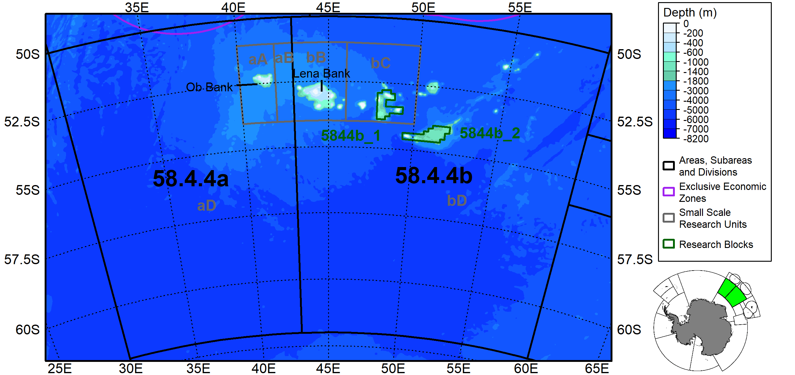

<br>

### 12. Division 58.5.1

``` r
#Load EEZs
EEZs=load_EEZs()

#Rotate objects
Lonzero=70 #This longitude will point up
R_bathy=Rotate_obj(Bathy,Lonzero)
R_asds=Rotate_obj(ASDs,Lonzero)
R_labsp=Rotate_obj(Labs_p,Lonzero)
R_coast=Rotate_obj(coast,Lonzero)
R_eezs=Rotate_obj(EEZs,Lonzero)

#Select ASD of interest
R_asdsb=R_asds[R_asds$GAR_Short_Label=="5851",]

#Create a bounding box for the region
bb=st_bbox(st_buffer(R_asdsb,10000)) #Get bounding box (x/y limits) + buffer
bx=st_as_sfc(bb) #Build spatial box to plot

#Use bounding box to crop elements
R_eezs=suppressWarnings(st_intersection(R_eezs,bx))
R_asds=suppressWarnings(st_intersection(R_asds,bx))
R_coast=suppressWarnings(st_intersection(R_coast,bx))
R_bathy=crop(R_bathy,ext(bb))

#Get height and width of bounding box
Lx=bb['xmax']-bb['xmin']
Ly=bb['ymax']-bb['ymin']

#Get inset map
inset=readPNG("Insets/Map_Cover_5851.png",native = T)


#Plot
png(filename='Map_Area_5851.png',width=2600,height=2000*(Ly/Lx),res=300)

plot(R_bathy,breaks=Depth_cuts,col=Depth_cols,legend=FALSE,axes=FALSE,mar=c(0.1,2.5,0.1,12),maxcell=5e6)
plot(st_geometry(R_coast[R_coast$surface=="Ice",]),col="white",add=T,lwd=0.5)
plot(st_geometry(R_eezs),border="purple",lwd=2,add=T)
plot(st_geometry(R_asds),border="black",lwd=2,add=T)
plot(st_geometry(R_coast[R_coast$surface=="Land",]),col="grey",add=T)
add_RefGrid(bb=bb,ResLat = 2.5,ResLon = 5,lwd=1,fontsize = 0.9,offset = c(10000,30000),LatR = c(-80, -40))
plot(bx,lwd=2,add=T,xpd=T)

Off=210 #Offset legends

#Colorscale
add_Cscale(pos='11/40',height=40,maxVal=-1,offset = Off,fontsize=0.6,width=14,lwd=1,
           cuts = Depth_cuts,
           cols = Depth_cols)

#Legend
Loc=add_Cscale(pos='56/80',height=43,mode='Legend',offset = Off)
par(lwd=1.5,xpd=T)
legend(Loc,legend=c('Areas, Subareas and Divisions','Exclusive Economic Zones'),
       border=c('black','purple'),
       fill='white',
       cex=0.6,
       bg='white',
       xpd=TRUE,x.intersp=0.6,y.intersp=0.6,box.lwd=1)

#Add inset map
Loc=add_Cscale(pos='500/500',height=-2,mode='Legend',offset = Off)
rasterImage(inset,xleft=Loc[1],
            ybottom=Loc[2],
            xright=Loc[1]+Lx/4,
            ytop=Loc[2]+Lx/4,
            xpd=T)

#Add labels
R_labsp=R_labsp[R_labsp$Area=="5851",]
R_labsp$x=st_coordinates(R_labsp)[,1]
R_labsp$y=st_coordinates(R_labsp)[,2]
R_labsp=st_drop_geometry(R_labsp)
add_labels(mode='input',LabelTable=R_labsp[,c("x","y","text","fontsize","fonttype","angle","col")])

dev.off()
#> png 
#>   2
```

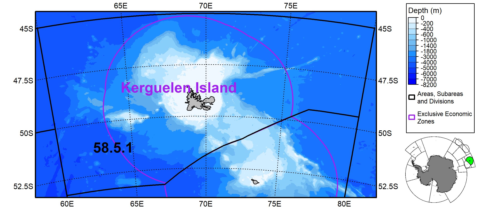

<br>

### 13. Division 58.5.2

``` r
#Load EEZs
EEZs=load_EEZs()

#Rotate objects
Lonzero=70 #This longitude will point up
R_bathy=Rotate_obj(Bathy,Lonzero)
R_asds=Rotate_obj(ASDs,Lonzero)
R_labsp=Rotate_obj(Labs_p,Lonzero)
R_coast=Rotate_obj(coast,Lonzero)
R_eezs=Rotate_obj(EEZs,Lonzero)
R_labsl=Rotate_obj(Labs_l,Lonzero)

#Select ASD of interest
R_asdsb=R_asds[R_asds$GAR_Short_Label=="5852",]

#Create a bounding box for the region
bb=st_bbox(st_buffer(R_asdsb,20000)) #Get bounding box (x/y limits) + buffer
bx=st_as_sfc(bb) #Build spatial box to plot

#Use bounding box to crop elements
R_eezs=suppressWarnings(st_intersection(R_eezs,bx))
R_asds=suppressWarnings(st_intersection(R_asds,bx))
R_coast=suppressWarnings(st_intersection(R_coast,bx))
R_bathy=crop(R_bathy,ext(bb))

#Get height and width of bounding box
Lx=bb['xmax']-bb['xmin']
Ly=bb['ymax']-bb['ymin']

#Get inset map
inset=readPNG("Insets/Map_Cover_5852.png",native = T)


#Plot
png(filename='Map_Area_5852.png',width=2600,height=2000*(Ly/Lx),res=300)

plot(R_bathy,breaks=Depth_cuts,col=Depth_cols,legend=FALSE,axes=FALSE,mar=c(0.1,2.5,0.1,12),maxcell=5e6)
plot(st_geometry(R_coast[R_coast$surface=="Ice",]),col="white",add=T,lwd=0.5)
plot(st_geometry(R_eezs),border="purple",lwd=2,add=T)
plot(st_geometry(R_asds),border="black",lwd=2,add=T)
plot(st_geometry(R_coast[R_coast$surface=="Land",]),col="grey",add=T)
add_RefGrid(bb=bb,ResLat = 2.5,ResLon = 5,lwd=1,fontsize = 0.9,offset = c(10000,30000),LatR = c(-80, -40))
plot(bx,lwd=2,add=T,xpd=T)

Off=150 #Offset legends

#Colorscale
add_Cscale(pos='11/40',height=40,maxVal=-1,offset = Off,fontsize=0.6,width=14,lwd=1,
           cuts = Depth_cuts,
           cols = Depth_cols)

#Legend
Loc=add_Cscale(pos='56/80',height=43,mode='Legend',offset = Off)
# par(lwd=1.5,xpd=T)
legend(Loc,legend=c('Areas, Subareas and Divisions','Exclusive Economic Zones'),
       border=c('black','purple'),
       fill='white',
       cex=0.6,
       bg='white',
       xpd=TRUE,x.intersp=0.6,y.intersp=0.6,box.lwd=1)

#Add inset map
Loc=add_Cscale(pos='500/500',height=-4,mode='Legend',offset = Off)
rasterImage(inset,xleft=Loc[1],
            ybottom=Loc[2],
            xright=Loc[1]+Lx/4.5,
            ytop=Loc[2]+Lx/4.5,
            xpd=T)

#Add labels
R_labsp=R_labsp[R_labsp$Area=="5852",]
R_labsp$x=st_coordinates(R_labsp)[,1]
R_labsp$y=st_coordinates(R_labsp)[,2]
R_labsp=st_drop_geometry(R_labsp)
add_labels(mode='input',LabelTable=R_labsp[,c("x","y","text","fontsize","fonttype","angle","col")])
#Add pointers
R_labsl=R_labsl[R_labsl$Area=="5852",]
R_labsl$x=st_coordinates(R_labsl)[,1]
R_labsl$y=st_coordinates(R_labsl)[,2]
R_labsl=st_drop_geometry(R_labsl)
segments(x0=R_labsl$x[R_labsl$Type=="S"],
           y0=R_labsl$y[R_labsl$Type=="S"],
           x1=R_labsl$x[R_labsl$Type=="E"],
           y1=R_labsl$y[R_labsl$Type=="E"],
           lwd=2,lend=1)
dev.off()
#> png 
#>   2
```

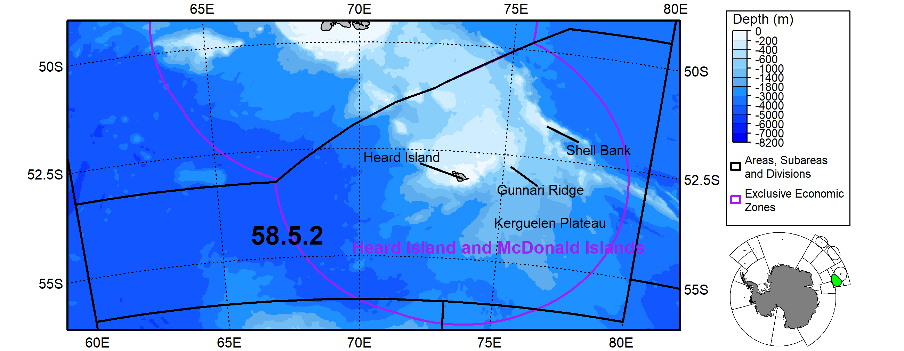

<br>

### 14. Subarea 58.6

``` r
#Load EEZs
EEZs=load_EEZs()

#Rotate objects
Lonzero=52 #This longitude will point up
R_bathy=Rotate_obj(Bathy,Lonzero)
#> |---------|---------|---------|---------|=========================================                                          
R_asds=Rotate_obj(ASDs,Lonzero)
R_labsp=Rotate_obj(Labs_p,Lonzero)
R_coast=Rotate_obj(coast,Lonzero)
R_eezs=Rotate_obj(EEZs,Lonzero)

#Select ASD of interest
R_asdsb=R_asds[R_asds$GAR_Short_Label=="586",]

#Create a bounding box for the region
bb=st_bbox(st_buffer(R_asdsb,10000)) #Get bounding box (x/y limits) + buffer
bb[4]=bb[4]+0.06*bb[4]
bx=st_as_sfc(bb) #Build spatial box to plot

#Use bounding box to crop elements
R_eezs=suppressWarnings(st_intersection(R_eezs,bx))
R_asds=suppressWarnings(st_intersection(R_asds,bx))
R_coast=suppressWarnings(st_intersection(R_coast,bx))
R_bathy=crop(R_bathy,ext(bb))

#Get height and width of bounding box
Lx=bb['xmax']-bb['xmin']
Ly=bb['ymax']-bb['ymin']

#Get inset map
inset=readPNG("Insets/Map_Cover_586.png",native = T)


#Plot
png(filename='Map_Area_586.png',width=2600,height=2000*(Ly/Lx),res=300)

plot(R_bathy,breaks=Depth_cuts,col=Depth_cols,legend=FALSE,axes=FALSE,mar=c(0.1,2.5,0.1,12),maxcell=5e6)
plot(st_geometry(R_coast[R_coast$surface=="Ice",]),col="white",add=T,lwd=0.5)
plot(st_geometry(R_eezs),border="purple",lwd=2,add=T)
plot(st_geometry(R_asds),border="black",lwd=2,add=T)
plot(st_geometry(R_coast[R_coast$surface=="Land",]),col="grey",add=T)
add_RefGrid(bb=bb,ResLat = 2.5,ResLon = 5,lwd=1,fontsize = 0.9,offset = c(10000,30000),LatR = c(-80, -40))
plot(bx,lwd=2,add=T,xpd=T)

Off=120 #Offset legends

#Colorscale
add_Cscale(pos='11/40',height=40,maxVal=-1,offset = Off,fontsize=0.6,width=14,lwd=1,
           cuts = Depth_cuts,
           cols = Depth_cols)

#Legend
Loc=add_Cscale(pos='58/80',height=43,mode='Legend',offset = Off)
# par(lwd=2)
legend(Loc,legend=c('Areas, Subareas and Divisions','Exclusive Economic Zones'),
       border=c('black','purple'),
       fill='white',
       seg.len=0,cex=0.6,
       bg='white',
       xpd=TRUE)

#Add inset map
Loc=add_Cscale(pos='500/500',height=0,mode='Legend',offset = Off)
rasterImage(inset,xleft=Loc[1],
            ybottom=Loc[2],
            xright=Loc[1]+Lx/4,
            ytop=Loc[2]+Lx/4,
            xpd=T)

#Add labels
R_labsp=R_labsp[R_labsp$Area=="586",]
R_labsp$x=st_coordinates(R_labsp)[,1]
R_labsp$y=st_coordinates(R_labsp)[,2]
R_labsp=st_drop_geometry(R_labsp)
add_labels(mode='input',LabelTable=R_labsp[,c("x","y","text","fontsize","fonttype","angle","col")])

dev.off()
#> png 
#>   2
```

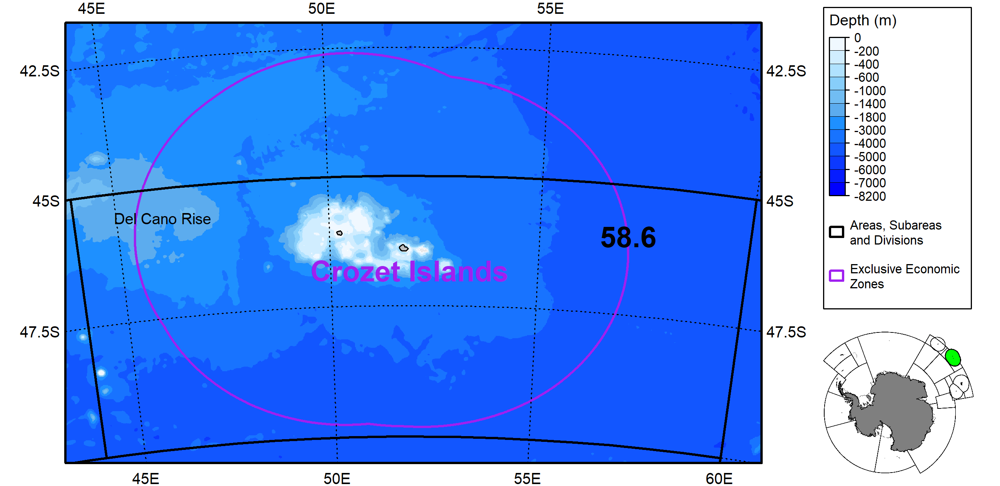

<br>

### 15. Subarea 58.7

``` r
#Load EEZs
EEZs=load_EEZs()

#Rotate objects
Lonzero=37 #This longitude will point up
R_bathy=Rotate_obj(Bathy,Lonzero)
#> |---------|---------|---------|---------|=========================================                                          
R_asds=Rotate_obj(ASDs,Lonzero)
R_labsp=Rotate_obj(Labs_p,Lonzero)
R_coast=Rotate_obj(coast,Lonzero)
R_eezs=Rotate_obj(EEZs,Lonzero)

#Select ASD of interest
R_asdsb=R_asds[R_asds$GAR_Short_Label=="587",]

#Create a bounding box for the region
bb=st_bbox(st_buffer(R_asdsb,30000)) #Get bounding box (x/y limits) + buffer
bb[4]=bb[4]+0.05*bb[4]
bb[2]=bb[2]-0.02*bb[2]
bx=st_as_sfc(bb) #Build spatial box to plot

#Use bounding box to crop elements
R_eezs=suppressWarnings(st_intersection(R_eezs,bx))
R_asds=suppressWarnings(st_intersection(R_asds,bx))
R_coast=suppressWarnings(st_intersection(R_coast,bx))
R_bathy=crop(R_bathy,ext(bb))

#Get height and width of bounding box
Lx=bb['xmax']-bb['xmin']
Ly=bb['ymax']-bb['ymin']

#Get inset map
inset=readPNG("Insets/Map_Cover_587.png",native = T)


#Plot
png(filename='Map_Area_587.png',width=2600,height=2000*(Ly/Lx),res=300)

plot(R_bathy,breaks=Depth_cuts,col=Depth_cols,legend=FALSE,axes=FALSE,mar=c(0.1,2.5,0.1,12),maxcell=5e6)
plot(st_geometry(R_coast[R_coast$surface=="Ice",]),col="white",add=T,lwd=0.5)
plot(st_geometry(R_eezs),border="purple",lwd=2,add=T)
plot(st_geometry(R_asds),border="black",lwd=2,add=T)
plot(st_geometry(R_coast[R_coast$surface=="Land",]),col="grey",add=T)
add_RefGrid(bb=bb,ResLat = 2.5,ResLon = 5,lwd=1,fontsize = 0.9,offset = c(10000,30000),LatR = c(-80, -40))
plot(bx,lwd=2,add=T,xpd=T)

Off=120 #Offset legends

#Colorscale
add_Cscale(pos='11/40',height=40,maxVal=-1,offset = Off,fontsize=0.6,width=14,lwd=1,
           cuts = Depth_cuts,
           cols = Depth_cols)

#Legend
Loc=add_Cscale(pos='58/80',height=43,mode='Legend',offset = Off)
# par(lwd=2)
legend(Loc,legend=c('Areas, Subareas and Divisions','Exclusive Economic Zones'),
       border=c('black','purple'),
       fill='white',
       seg.len=0,cex=0.6,
       bg='white',
       xpd=TRUE)

#Add inset map
Loc=add_Cscale(pos='500/500',height=0,mode='Legend',offset = Off)
rasterImage(inset,xleft=Loc[1],
            ybottom=Loc[2],
            xright=Loc[1]+Lx/3.5,
            ytop=Loc[2]+Lx/3.5,
            xpd=T)

#Add labels
R_labsp=R_labsp[R_labsp$Area=="587",]
R_labsp$x=st_coordinates(R_labsp)[,1]
R_labsp$y=st_coordinates(R_labsp)[,2]
R_labsp=st_drop_geometry(R_labsp)
add_labels(mode='input',LabelTable=R_labsp[,c("x","y","text","fontsize","fonttype","angle","col")])

dev.off()
#> png 
#>   2
```

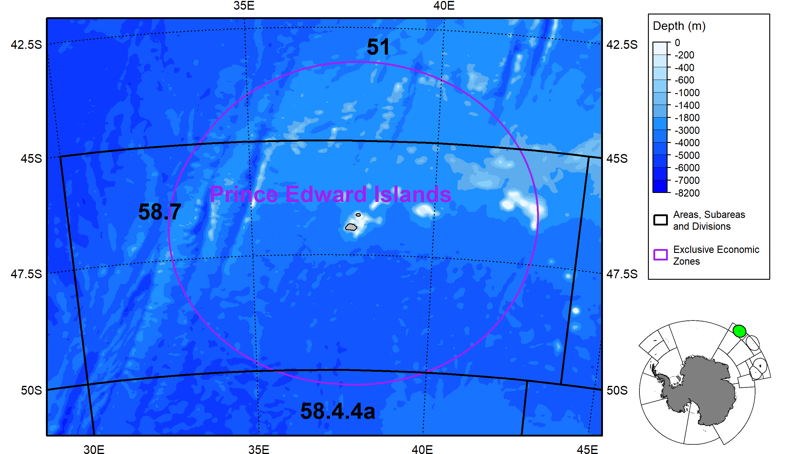

### 16. Ross Sea region

``` r
#Load MPAs
MPAs=load_MPAs()
MPAs=MPAs[MPAs$GAR_Short_Label!="SOSS",]

#Load MAs
MAs=load_MAs()
MAs=MAs[MAs$GAR_Short_Label%in%c("S70","N70"),]

#Load SSRUs
SSRUs=load_SSRUs()

#Rotate objects
Lonzero=180 #This longitude will point up
R_bathy=Rotate_obj(Bathy,Lonzero)
R_asds=Rotate_obj(ASDs,Lonzero)
R_labsp=Rotate_obj(Labs_p,Lonzero)
R_coast=Rotate_obj(coast,Lonzero)
R_mpas=Rotate_obj(MPAs,Lonzero)
R_mas=Rotate_obj(MAs,Lonzero)
R_ssrus=Rotate_obj(SSRUs,Lonzero)

#Create a bounding box for the region
bb=st_bbox(st_buffer(suppressWarnings( st_union(R_mpas,R_mas)),30000)) #Get bounding box (x/y limits) + buffer
bx=st_as_sfc(bb) #Build spatial box to plot

#Use bounding box to crop elements
R_ssrus=suppressWarnings(st_intersection(R_ssrus,bx))
R_asds=suppressWarnings(st_intersection(R_asds,bx))
R_coast=suppressWarnings(st_intersection(R_coast,bx))
R_bathy=crop(R_bathy,ext(bb))

#Get height and width of bounding box
Lx=bb['xmax']-bb['xmin']
Ly=bb['ymax']-bb['ymin']

#Get inset map
inset=readPNG("Insets/Map_Cover_RSr.png",native = T)


#Plot
png(filename='Map_Area_RSr.png',width=2600,height=2000*(Ly/Lx),res=300)

plot(R_bathy,breaks=Depth_cuts,col=Depth_cols,legend=FALSE,axes=FALSE,mar=c(0.1,2.5,0.1,12),maxcell=5e6)
plot(st_geometry(R_coast[R_coast$surface=="Ice",]),col="white",add=T,lwd=0.5)
plot(st_geometry(R_ssrus),border="gray40",lwd=2,add=T)
plot(st_geometry(R_asds),border="black",lwd=2,add=T)
plot(st_geometry(R_mas),border="darkred",lwd=2,add=T)
plot(st_geometry(R_mpas),border="red",col=rgb(1,0.5,0,0.4),lwd=3,lty=3,add=T)
plot(st_geometry(R_coast[R_coast$surface=="Land",]),col="grey",add=T)
add_RefGrid(bb=bb,ResLat = 5,ResLon = 10,lwd=1,fontsize = 0.9,offset = c(10000,60000),LatR = c(-85, -40))
plot(bx,lwd=2,add=T,xpd=T)

Off=180 #Offset legends

#Colorscale
add_Cscale(pos='11/40',height=40,maxVal=-1,offset = Off,fontsize=0.65,width=14,lwd=1,
           cuts = Depth_cuts,
           cols = Depth_cols)

#Legend
Loc=add_Cscale(pos='58/80',height=43,mode='Legend',offset = Off)
# par(lwd=2)
legend(Loc,legend=c('Areas, Subareas and Divisions','Small Scale Research Units','Area of directed fishing','Marine Protected Area'),
       border=c('black','gray40','darkred','red'),
       cex=0.65,
       fill=c('white','white','white',rgb(1,0.5,0,0.4)),
       bg='white',
       xpd=TRUE,x.intersp=0.6,y.intersp=0.6,box.lwd=1)

#Add inset map
Loc=add_Cscale(pos='500/500',height=0,mode='Legend',offset = Off)
rasterImage(inset,xleft=Loc[1],
            ybottom=Loc[2],
            xright=Loc[1]+Lx/2.9,
            ytop=Loc[2]+Lx/2.9,
            xpd=T)

#Add labels
R_labsp=R_labsp[R_labsp$Area=="RSr",]
R_labsp$x=st_coordinates(R_labsp)[,1]
R_labsp$y=st_coordinates(R_labsp)[,2]
R_labsp=st_drop_geometry(R_labsp)
add_labels(mode='input',LabelTable=R_labsp[,c("x","y","text","fontsize","fonttype","angle","col")])

dev.off()
#> png 
#>   2
```

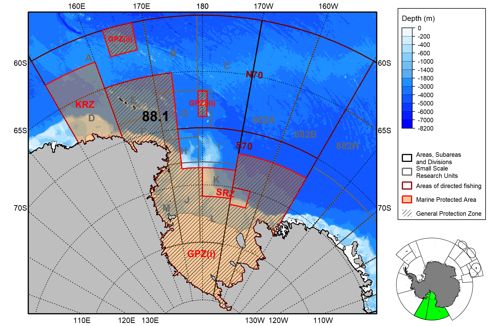

### 17. Subarea 88.2

``` r
#Load MPAs
MPAs=load_MPAs()
MPAs=MPAs[MPAs$GAR_Short_Label!="SOSS",]

#Load MAs
MAs=load_MAs()
MAs=MAs[MAs$GAR_Short_Label%in%c("S70","N70"),]

#Load SSRUs
SSRUs=load_SSRUs()

#Load RBs
RBs=load_RBs()
RBs=RBs[grep("882",RBs$GAR_Short_Label),]

#Rotate objects
Lonzero=-137.5 #This longitude will point up
R_bathy=Rotate_obj(Bathy,Lonzero)
#> |---------|---------|---------|---------|=========================================                                          
R_asds=Rotate_obj(ASDs,Lonzero)
R_labsp=Rotate_obj(Labs_p,Lonzero)
R_coast=Rotate_obj(coast,Lonzero)
R_mpas=Rotate_obj(MPAs,Lonzero)
R_mas=Rotate_obj(MAs,Lonzero)
R_ssrus=Rotate_obj(SSRUs,Lonzero)
R_rbs=Rotate_obj(RBs,Lonzero)

#Select ASD of interest
R_asdsb=R_asds[R_asds$GAR_Short_Label=="882",]

#Create a bounding box for the region
bb=st_bbox(st_buffer(R_asdsb,30000)) #Get bounding box (x/y limits) + buffer
bx=st_as_sfc(bb) #Build spatial box to plot

#Use bounding box to crop elements
R_ssrus=suppressWarnings(st_intersection(R_ssrus,bx))
R_asds=suppressWarnings(st_intersection(R_asds,bx))
R_mpas=suppressWarnings(st_intersection(R_mpas,bx))
R_mas=suppressWarnings(st_intersection(R_mas,bx))
R_coast=suppressWarnings(st_intersection(R_coast,bx))
R_bathy=crop(R_bathy,ext(bb))

#Get height and width of bounding box
Lx=bb['xmax']-bb['xmin']
Ly=bb['ymax']-bb['ymin']

#Get inset map
inset=readPNG("Insets/Map_Cover_882.png",native = T)


#Plot
png(filename='Map_Area_882.png',width=2600,height=2000*(Ly/Lx),res=300)

plot(R_bathy,breaks=Depth_cuts,col=Depth_cols,legend=FALSE,axes=FALSE,mar=c(0.1,2.5,0.1,12),maxcell=5e6)
plot(st_geometry(R_coast[R_coast$surface=="Ice",]),col="white",add=T,lwd=0.5)
plot(st_geometry(R_ssrus),border="gray40",lwd=2,add=T)
plot(st_geometry(R_asds),border="black",lwd=2,add=T)
plot(st_geometry(R_mas),border="darkred",lwd=2,add=T)
plot(st_geometry(R_mpas),border="red",col=rgb(1,0.5,0,0.4),lwd=3,lty=3,add=T)
plot(st_geometry(R_rbs),border="darkgreen",lwd=2,add=T)
plot(st_geometry(R_coast[R_coast$surface=="Land",]),col="grey",add=T)
add_RefGrid(bb=bb,ResLat = 5,ResLon = 10,lwd=1,fontsize = 0.9,offset = c(10000,60000),LatR = c(-85, -40))
plot(bx,lwd=2,add=T,xpd=T)

Off=180 #Offset legends

#Colorscale
add_Cscale(pos='11/40',height=40,maxVal=-1,offset = Off,fontsize=0.65,width=14,lwd=1,
           cuts = Depth_cuts,
           cols = Depth_cols)

#Legend
Loc=add_Cscale(pos='58/80',height=43,mode='Legend',offset = Off)
# par(lwd=2)
legend(Loc,legend=c('Areas, Subareas and Divisions','Small Scale Research Units','Research Blocks','Area of directed fishing','Marine Protected Area'),
       border=c('black','gray40','darkgreen','darkred','red'),
       cex=0.65,
       fill=c('white','white','white','white',rgb(1,0.5,0,0.4)),
       bg='white',
       xpd=TRUE,x.intersp=0.6,y.intersp=0.6,box.lwd=1)

#Add inset map
Loc=add_Cscale(pos='500/500',height=0,mode='Legend',offset = Off)
rasterImage(inset,xleft=Loc[1],
            ybottom=Loc[2],
            xright=Loc[1]+Lx/3.2,
            ytop=Loc[2]+Lx/3.2,
            xpd=T)

#Add labels
R_labsp=R_labsp[R_labsp$Area=="882",]
R_labsp$x=st_coordinates(R_labsp)[,1]
R_labsp$y=st_coordinates(R_labsp)[,2]
R_labsp=st_drop_geometry(R_labsp)
add_labels(mode='input',LabelTable=R_labsp[,c("x","y","text","fontsize","fonttype","angle","col")])

dev.off()
#> png 
#>   2
```


### 18. Subarea 88.3

``` r
#Load SSRUs
SSRUs=load_SSRUs()

#Load RBs
RBs=load_RBs()
RBs=RBs[grep("883",RBs$GAR_Short_Label),]

#Rotate objects
Lonzero=-87.5 #This longitude will point up
R_bathy=Rotate_obj(Bathy,Lonzero)
R_asds=Rotate_obj(ASDs,Lonzero)
R_labsp=Rotate_obj(Labs_p,Lonzero)
R_coast=Rotate_obj(coast,Lonzero)
R_ssrus=Rotate_obj(SSRUs,Lonzero)
R_rbs=Rotate_obj(RBs,Lonzero)

#Select ASD of interest
R_asdsb=R_asds[R_asds$GAR_Short_Label=="883",]

#Create a bounding box for the region
bb=st_bbox(st_buffer(R_asdsb,30000)) #Get bounding box (x/y limits) + buffer
bx=st_as_sfc(bb) #Build spatial box to plot

#Use bounding box to crop elements
R_ssrus=suppressWarnings(st_intersection(R_ssrus,bx))
R_asds=suppressWarnings(st_intersection(R_asds,bx))
R_coast=suppressWarnings(st_intersection(R_coast,bx))
R_bathy=crop(R_bathy,ext(bb))

#Get height and width of bounding box
Lx=bb['xmax']-bb['xmin']
Ly=bb['ymax']-bb['ymin']

#Get inset map
inset=readPNG("Insets/Map_Cover_883.png",native = T)


#Plot
png(filename='Map_Area_883.png',width=2600,height=2000*(Ly/Lx),res=300)

plot(R_bathy,breaks=Depth_cuts,col=Depth_cols,legend=FALSE,axes=FALSE,mar=c(0.1,2.5,0.1,12),maxcell=5e6)
plot(st_geometry(R_coast[R_coast$surface=="Ice",]),col="white",add=T,lwd=0.5)
plot(st_geometry(R_ssrus),border="gray40",lwd=2,add=T)
plot(st_geometry(R_asds),border="black",lwd=2,add=T)
plot(st_geometry(R_rbs),border="darkgreen",lwd=2,add=T)
plot(st_geometry(R_coast[R_coast$surface=="Land",]),col="grey",add=T)
add_RefGrid(bb=bb,ResLat = 5,ResLon = 10,lwd=1,fontsize = 0.9,offset = c(10000,60000),LatR = c(-85, -40))
plot(bx,lwd=2,add=T,xpd=T)

Off=120 #Offset legends

#Colorscale
add_Cscale(pos='11/40',height=40,maxVal=-1,offset = Off,fontsize=0.65,width=14,lwd=1,
           cuts = Depth_cuts,
           cols = Depth_cols)

#Legend
Loc=add_Cscale(pos='58/80',height=43,mode='Legend',offset = Off)
# par(lwd=2)
legend(Loc,legend=c('Areas, Subareas and Divisions','Small Scale Research Units','Research Blocks'),
       border=c('black','gray40','darkgreen'),
       seg.len=0,cex=0.65,
       fill='white',
       bg='white',
       xpd=TRUE)

#Add inset map
Loc=add_Cscale(pos='500/500',height=0,mode='Legend',offset = Off)
rasterImage(inset,xleft=Loc[1],
            ybottom=Loc[2],
            xright=Loc[1]+Lx/3,
            ytop=Loc[2]+Lx/3,
            xpd=T)

#Add labels
R_labsp=R_labsp[R_labsp$Area=="883",]
R_labsp$x=st_coordinates(R_labsp)[,1]
R_labsp$y=st_coordinates(R_labsp)[,2]
R_labsp=st_drop_geometry(R_labsp)
add_labels(mode='input',LabelTable=R_labsp[,c("x","y","text","fontsize","fonttype","angle","col")])

dev.off()
#> png 
#>   2
```

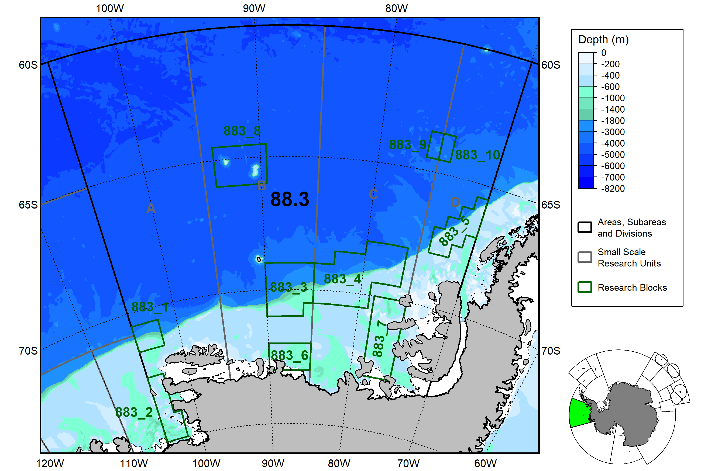
