<!-- README.md is generated from README.Rmd. Please edit that file -->

# CCAMLRGIS R package

<!-- badges: start -->

[](https://cran.r-project.org/package=CCAMLRGIS)
[](https://github.com/ccamlr/CCAMLRGIS/actions/workflows/rhub.yaml)
<!-- badges: end -->

This package was developed to simplify the production of maps in the
CAMLR Convention Area. It provides two main categories of functions:
load functions and create functions. Load functions are used to import
spatial layers from the online [CCAMLR GIS](http://gis.ccamlr.org/) such
as the ASD boundaries. Create functions are used to create layers from
user data such as polygons and grids.

## Installation

You can install the CCAMLRGIS R package from CRAN with:

``` r
install.packages("CCAMLRGIS")
```

## Documentation

<center>

### A package to load and create spatial data, including layers and tools that are relevant to CCAMLR activities.

</center>

------------------------------------------------------------------------

<center>

### Table of contents

</center>

------------------------------------------------------------------------

1.  [Basemaps](#1-basemaps)
2.  [Create functions](#2-create-functions)

- 2.1. [Points](#create-points), [lines](#create-lines),
  [polygons](#create-polygons) and [grids](#create-grids)
- 2.2. [Create Stations](#22-create-stations)
- 2.3. [Create Pies](#23-create-pies)
- 2.4. [Create Arrow](#24-create-arrow)
- 2.5. [Create Hashes](#25-create-hashes)

3.  [Load functions](#3-load-functions)

- 3.1. Online use
- 3.2. Offline use

4.  Other functions

- 4.1. [get_depths](#41-get_depths)
- 4.2. [seabed_area](#42-seabed_area)
- 4.3. [assign_areas](#43-assign_areas)
- 4.4. [project_data](#44-project_data)
- 4.5. [get_C_intersection](#45-get_c_intersection)
- 4.6. [get_iso_polys](#46-get_iso_polys)
- 4.7. [Rotate_obj](#47-rotate_obj)

5.  Adding colors, legends and labels

- 5.1. [Bathymetry colors](#51-bathymetry-colors)
- 5.2. [Adding colors to data](#52-adding-colors-to-data)
- 5.3. [Adding legends](#53-adding-legends)
- 5.4. [Adding labels](#54-adding-labels)
- 5.5. [Using sf](#55-using-sf)

------------------------------------------------------------------------

## Introduction

First, install the package by typing:

``` r
install.packages("CCAMLRGIS")
```

Then, load the package by typing:

``` r
library(CCAMLRGIS)
```

In order to plot bathymetry data, you will also need to load
[terra](https://CRAN.R-project.org/package=terra):

``` r
library(terra)
```

All spatial manipulations are made using the South Pole Lambert
Azimuthal Equal Area projection (type ?CCAMLRp for more details), and
follow CCAMLR’s [geospatial
rules](https://github.com/ccamlr/geospatial_operations#1-geospatial-rules).

``` r
#Map with axes, to illustrate projection

#Set the figure margins as c(bottom, left, top, right)
par(mai=c(1.2,0.7,0.5,0.45),xpd=TRUE)
#plot entire Coastline
plot(st_geometry(Coast[Coast$ID=='All',]),col='grey',lwd=0.1)
#Add reference grid
add_RefGrid(bb=st_bbox(Coast[Coast$ID=='All',]),ResLat=10,ResLon=20,LabLon=-40,fontsize=0.8,lwd=0.5)
#add axes and labels
axis(1,pos=0,at=seq(-4000000,4000000,by=1000000),tcl=-0.15,labels=F,lwd=0.8,lwd.ticks=0.8,col='blue')
axis(2,pos=0,at=seq(-4000000,4000000,by=1000000),tcl=-0.15,labels=F,lwd=0.8,lwd.ticks=0.8,col='blue')
text(seq(1000000,4000000,by=1000000),0,seq(1,4,by=1),cex=0.75,col='blue',adj=c(0.5,1.75))
text(seq(-4000000,-1000000,by=1000000),0,seq(-4,-1,by=1),cex=0.75,col='blue',adj=c(0.5,1.75))
text(0,seq(1000000,4000000,by=1000000),seq(1,4,by=1),cex=0.75,col='blue',adj=c(1.75,0.5))
text(0,seq(-4000000,-1000000,by=1000000),seq(-4,-1,by=1),cex=0.75,col='blue',adj=c(1.75,0.5))
text(0,0,0,cex=0.75,col='blue',adj=c(-0.5,-0.5))
text(5200000,0,expression('x ('*10^6~'m)'),cex=0.75,col='blue')
text(0,4700000,expression('y ('*10^6~'m)'),cex=0.75,col='blue')
```

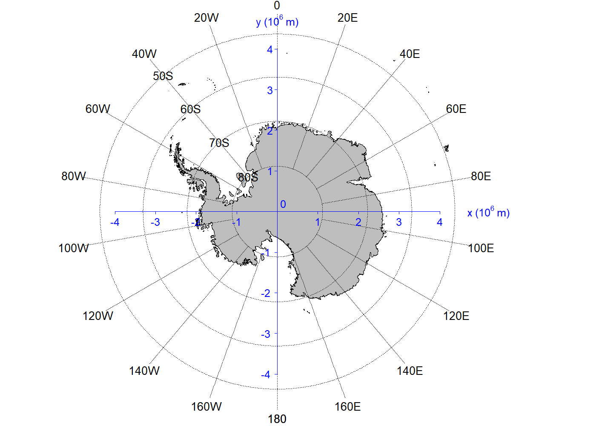

<center>

#### The South Pole Lambert Azimuthal Equal Area projection converts Latitudes and Longitudes into locations on a disk with x/y axes and units of meters. The South Pole is at x=0m ; y=0m. The tip of the Peninsula, for example, is around x=-2,500,000m ; y=2,000,000m.

</center>

## 1. Basemaps

Additional basemaps are available
[here](https://github.com/ccamlr/CCAMLRGIS/blob/master/Basemaps/Basemaps.md).

#### Bathymetry:

Prior to detailing the package’s capabilities, a set of basic commands
are shown here to display a few core mapping elements. All scripts use
the low-resolution bathymetry raster included in the package
(‘SmallBathy’). In order to obtain higher resolution bathymetry data,
use the *Load_Bathy()* function:

``` r
#Load_Bathy() example:
Bathy=load_Bathy(LocalFile = FALSE,Res=5000)
plot(Bathy, breaks=Depth_cuts,col=Depth_cols,axes=FALSE,legend=FALSE,mar=c(0,0,0,0))
```

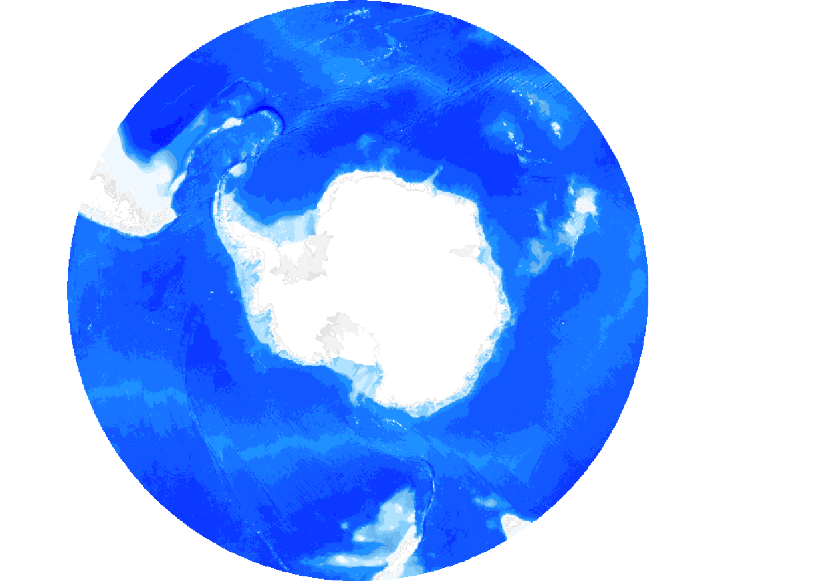

``` r


#Please refer to ?load_Bathy for more details, including how to save the bathymetry data so that you
#do not have to re-download it every time you need it.
```

#### Statistical Areas, Subareas and Divisions (ASDs):

``` r
#Load ASDs and EEZs
ASDs=load_ASDs()
EEZs=load_EEZs()
#Plot the bathymetry
plot(SmallBathy(),breaks=Depth_cuts,col=Depth_cols,legend=F,axes=F,box=F,mar=c(0,0,0,2))
#Add reference grid
add_RefGrid(bb=st_bbox(SmallBathy()),ResLat=10,ResLon=20,LabLon=0,fontsize=0.75,lwd=0.75,offset = 4)
#Add color scale
add_Cscale(height=90,fontsize=0.75,offset=-1500,width=15,maxVal=-1,lwd=0.5)
#Add ASD and EEZ boundaries
plot(st_geometry(ASDs),add=T,lwd=0.75,border='red',xpd=T)
plot(st_geometry(EEZs),add=T,lwd=0.75,border='red',xpd=T)
#Add coastline (for all ASDs)
plot(st_geometry(Coast[Coast$ID=='All',]),col='grey',lwd=0.01,add=T,xpd=T)
#Add ASD labels
add_labels(mode='auto',layer='ASDs',fontsize=0.6,col='red')
```

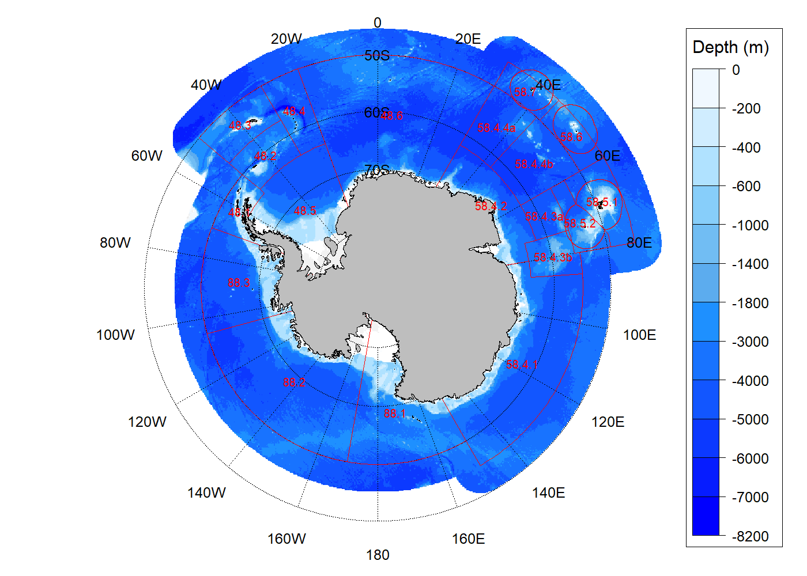

#### Local map (*e.g.*, Subarea 48.6):

``` r
#Load ASDs
ASDs=load_ASDs()
#Sub-sample ASDs to only keep Subarea 48.6
S486=ASDs[ASDs$GAR_Short_Label=='486',]
#Crop bathymetry to match the extent of S486
B486=crop(SmallBathy(),ext(S486))
#Plot the bathymetry
plot(B486,breaks=Depth_cuts,col=Depth_cols,legend=F,axes=F,mar=c(1.4,2,1.4,7))
#Add color scale
add_Cscale(height=80,fontsize=0.7,offset=300,width=15,lwd=0.5,maxVal=-1)
#Add coastline (for Subarea 48.6 only)
plot(Coast[Coast$ID=='48.6',],col='grey',lwd=0.01,add=T,xpd=T)
#Add reference grid
add_RefGrid(bb=st_bbox(B486),ResLat=5,ResLon=10,fontsize=0.75,lwd=0.75,offset = 100000)
#Add Subarea 48.6 boundaries
plot(st_geometry(S486),add=T,lwd=1,border='red',xpd=T)
#Add a -2000m contour
contour(B486,levels=-2000,add=T,lwd=0.5,labcex=0.3,xpd=T)
#Add single label at the centre of the polygon (see ?Labels)
text(Labels$x[Labels$t=='48.6'],Labels$y[Labels$t=='48.6'],labels='48.6',col='red',cex=1.5)
```

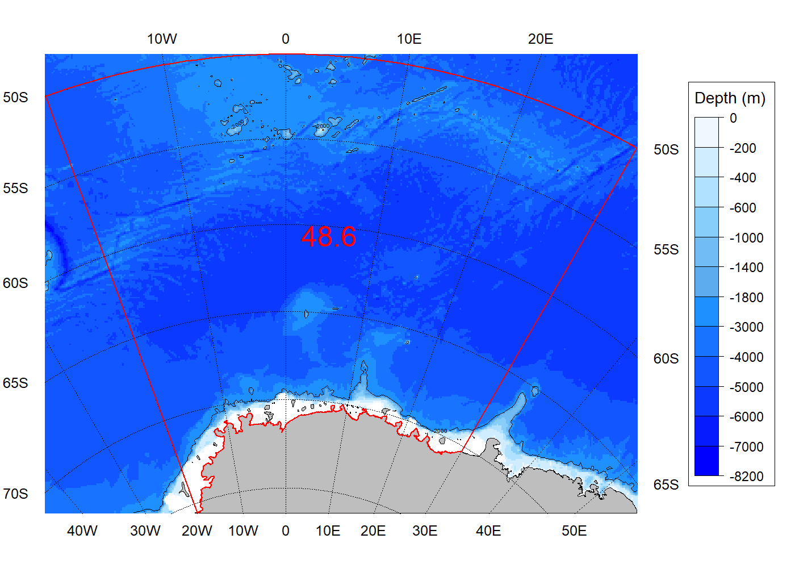

## 2. Create functions

### 2.1. Points, lines, polygons and grids

These functions are used to transform user data into spatial layers with
the appropriate projection. User data should be provided as a dataframe
containing Latitudes and Longitudes in decimal degrees. Depending on the
function used, some other variables may be required (see help).

#### Create points:

For details, type:

``` r
?create_Points
```

``` r

#Prepare layout for 4 sub-plots
par(mfrow=c(2,2),mai=c(0,0.01,0.2,0.01))

#Example 1: Simple points with labels
MyPoints=create_Points(PointData)
plot(st_geometry(MyPoints),main='Example 1',cex.main=0.75,cex=0.5,lwd=0.5)
text(MyPoints$x,MyPoints$y,MyPoints$name,adj=c(0.5,-0.5),xpd=T,cex=0.75)
box()

#Example 2: Simple points with labels, highlighting one group of points with the same name
MyPoints=create_Points(PointData)
plot(st_geometry(MyPoints),main='Example 2',cex.main=0.75,cex=0.5,lwd=0.5)
text(MyPoints$x,MyPoints$y,MyPoints$name,adj=c(0.5,-0.5),xpd=T,cex=0.75)
plot(st_geometry(MyPoints[MyPoints$name=='four',]),bg='red',pch=21,cex=1,add=T)
box()

#Example 3: Buffered points with radius proportional to catch
MyPoints=create_Points(PointData,Buffer=1*PointData$Catch)
plot(st_geometry(MyPoints),col='green',main='Example 3',cex.main=0.75,cex=0.5,lwd=0.5)
text(MyPoints$x,MyPoints$y,MyPoints$name,adj=c(0.5,0.5),xpd=T,cex=0.75)
box()

#Example 4: Buffered points with radius proportional to catch and clipped to the Coast
MyPoints=create_Points(PointData,Buffer=2*PointData$Catch,Clip=T)
plot(st_geometry(MyPoints),col='cyan',main='Example 4',cex.main=0.75,cex=0.75,lwd=0.5)
plot(st_geometry(Coast[Coast$ID=='All',]),add=T,col='grey',lwd=0.5)
box()
```

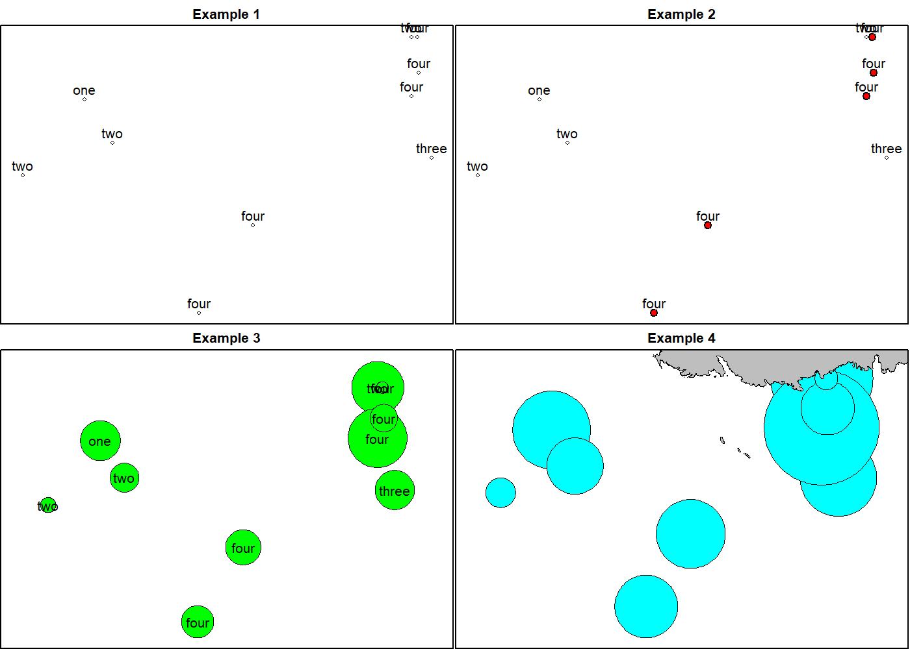

#### Create lines:

For details, type:

``` r
?create_Lines
```

``` r
#If your data contains line end locations in separate columns, you may reformat it as follows:

#Original data:
MyData=data.frame(
  Line=c(1,2),
  Lat_Start=c(-60,-65),
  Lon_Start=c(-10,5),
  Lat_End=c(-61,-66),
  Lon_End=c(-2,2)
)

#Reformat data to use as input in create_Lines as:
Input=data.frame(
  Line=c(MyData$Line,MyData$Line),
  Lat=c(MyData$Lat_Start,MyData$Lat_End),
  Lon=c(MyData$Lon_Start,MyData$Lon_End)
)
```

``` r

#Prepare layout for 3 sub-plots
par(mai=c(0,0.01,0.2,0.01),mfrow=c(1,3))

#Example 1: Simple and non-densified lines
MyLines=create_Lines(LineData)
plot(st_geometry(MyLines),col=rainbow(nrow(MyLines)),main='Example 1',cex.main=0.75,lwd=2)
box()

#Example 2: Simple and densified lines (note the curvature of the lines)
MyLines=create_Lines(LineData,Densify=T)
plot(st_geometry(MyLines),col=rainbow(nrow(MyLines)),main='Example 2',cex.main=0.75,lwd=2)
box()

#Example 3: Densified, buffered and clipped lines
MyLines=create_Lines(LineData,Densify=T,Buffer=c(10,40,50,80,100),Clip=T)
plot(st_geometry(MyLines[5:1,]),col=rainbow(nrow(MyLines)),main='Example 3',cex.main=0.75,lwd=1)
plot(Coast[Coast$ID=='All',],col='grey',add=T,lwd=0.5)
box()
```

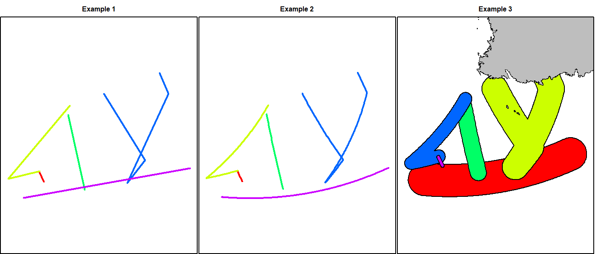

Adding a buffer with the argument *SeparateBuf* set to FALSE results in
a single polygon which may be viewed as a footprint:

``` r

#Set the figure margins as c(bottom, left, top, right)
par(mai=c(0.01,0.01,0.01,0.01))

#Buffer merged lines
MyLines=create_Lines(LineData,Buffer=10,SeparateBuf=F)
#The resulting polygon has an area of:
MyLines$Buffered_AreaKm2
#> [1] 222654.8

plot(st_geometry(MyLines),col='green',lwd=1)
box()
```

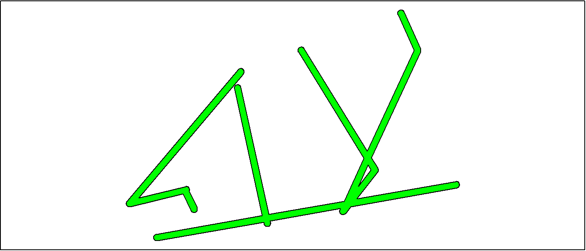

#### Create polygons:

For details, type:

``` r
?create_Polys
```

``` r

#Prepare layout for 3 sub-plots
par(mfrow=c(1,3),mai=c(0,0.01,0.2,0.01))

#Example 1: Simple and non-densified polygons
MyPolys=create_Polys(PolyData,Densify=F)
plot(st_geometry(MyPolys),col='blue',main='Example 1',cex.main=0.75,lwd=0.5)
text(MyPolys$Labx,MyPolys$Laby,MyPolys$ID,col='white',cex=0.75)
box()

#Example 2: Simple and densified polygons (note the curvature of lines)
MyPolys=create_Polys(PolyData)
plot(st_geometry(MyPolys),col='red',main='Example 2',cex.main=0.75,lwd=0.5)
text(MyPolys$Labx,MyPolys$Laby,MyPolys$ID,col='white',cex=0.75)
box()

#Example 3: Buffered and clipped polygons
MyPolysBefore=create_Polys(PolyData,Buffer=c(10,-15,120))
MyPolysAfter=create_Polys(PolyData,Buffer=c(10,-15,120),Clip=T)
plot(st_geometry(MyPolysBefore),col='green',main='Example 3',cex.main=0.75,lwd=0.5)
plot(st_geometry(Coast[Coast$ID=='All',]),add=T,lwd=0.5)
plot(st_geometry(MyPolysAfter),col='orange',add=T,lwd=0.5)
text(MyPolysAfter$Labx,MyPolysAfter$Laby,MyPolysAfter$ID,col='white',cex=0.75)
box()
```

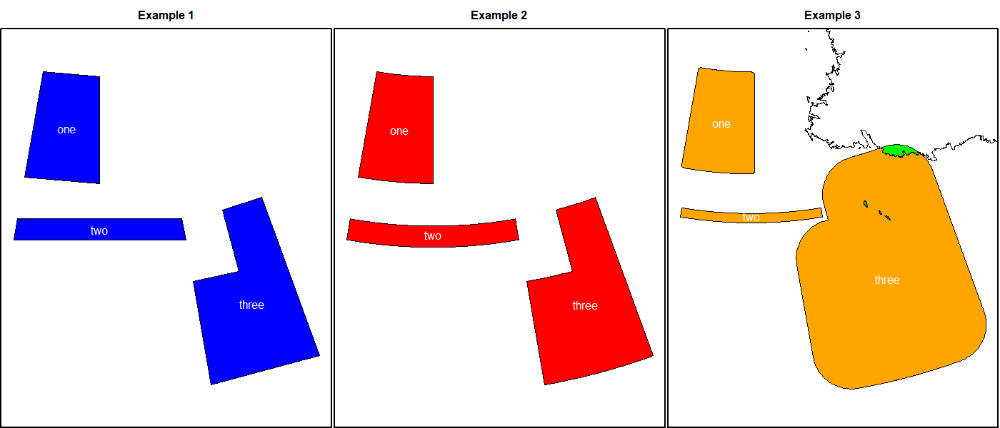

``` r
#Convention area
#The locations of vertices are given clockwise, starting from the northwest corner of 48.3
CA=data.frame(
  Name="CA",
  Lat=c(-50,-50,-45,-45,-55,-55,-60,-60),
  Lon=c(-50,30,30,80,80,150,150,-50)
)

#Prepare layout for 2 sub-plots
par(mfrow=c(1,2),mai=c(0,0,0.2,0))

#Example 4: Convention area contour
MyPoly=create_Polys(CA)
plot(st_geometry(MyPoly),col='blue',border='green',main='Example 4',cex.main=0.75,lwd=2)
box()

#Example 5: Convention area contour, coastline clipped
MyPoly=create_Polys(CA,Clip = TRUE)
plot(st_geometry(MyPoly),col='blue',border='green',main='Example 5',cex.main=0.75,lwd=2)
box()
```

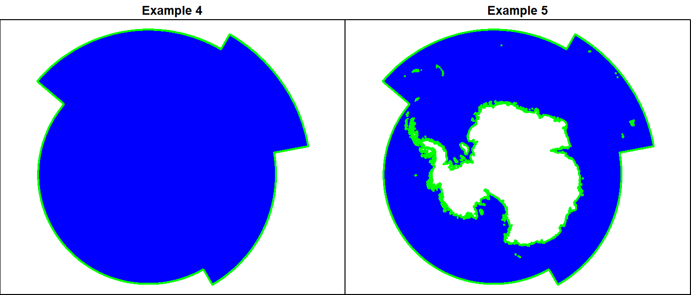

#### Create grids:

An advanced demo is given in this
[tutorial](https://github.com/ccamlr/CCAMLRGIS/blob/master/Advanced_Grids/Advanced_Grids.md).

For details, type:

``` r
?create_PolyGrids
```

``` r

#Prepare layout for 3 sub-plots
par(mfrow=c(1,3),mai=c(0,0.01,0.2,0.01))

#Example 1: Simple grid, using automatic colors
MyGrid=create_PolyGrids(GridData,dlon=2,dlat=1)
plot(st_geometry(MyGrid),col=MyGrid$Col_Catch_sum,main='Example 1',cex.main=0.75,lwd=0.1)
box()

#Example 2: Equal area grid, using automatic colors
MyGrid=create_PolyGrids(GridData,Area=10000)
plot(st_geometry(MyGrid),col=MyGrid$Col_Catch_sum,main='Example 2',cex.main=0.75,lwd=0.1)
box()

#Example 3: Equal area grid, using custom cuts and colors
MyGrid=create_PolyGrids(GridData,Area=10000,cuts=c(0,50,100,500,2000,3500),cols=c('blue','red'))
plot(st_geometry(MyGrid),col=MyGrid$Col_Catch_sum,main='Example 3',cex.main=0.75,lwd=0.1)
box()
```

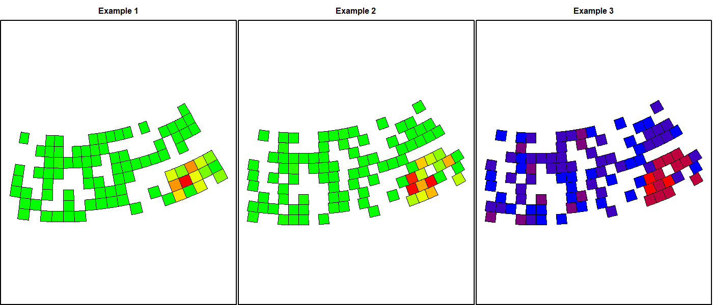

Customizing a grid and adding a color scale:

``` r

#Prepare layout for 2 sub-plots
par(mfrow=c(2,1),mai=c(0.2,0.05,0.1,1.3))

#Step 1: Generate your grid
MyGrid=create_PolyGrids(GridData,Area=10000)

#Step 2: Inspect your gridded data (e.g. sum of Catch) to determine whether irregular cuts are required
hist(MyGrid$Catch_sum,100,cex=0.75,main='Frequency distribution of data',
     cex.main=0.5,col='grey',axes=F)
axis(1,pos=0,tcl=-0.15,lwd=0.8,lwd.ticks=0.8,labels=F)
text(seq(0,2500,by=500),-1.5,seq(0,2500,by=500),cex=0.75,xpd=T)

#In this case (heterogeneously distributed data) irregular cuts would be preferable
#Such as:
MyCuts=c(0,50,100,500,2000,2500)
abline(v=MyCuts,col='green',lwd=0.1,lty=2) #Add classes to histogram as green dashed lines

#Step 3: Generate colors according to the desired classes (MyCuts)
Gridcol=add_col(MyGrid$Catch_sum,cuts=MyCuts,cols=c('yellow','purple'))

#Step 4: Plot result and add color scale
#Use the colors generated by add_col
plot(st_geometry(MyGrid),col=Gridcol$varcol,lwd=0.1) 
#Add color scale using cuts and cols generated by add_col
add_Cscale(title='Sum of Catch (t)',cuts=Gridcol$cuts,cols=Gridcol$cols,width=18,
     fontsize=0.6,lwd=0.5,height = 100) 
box()
```

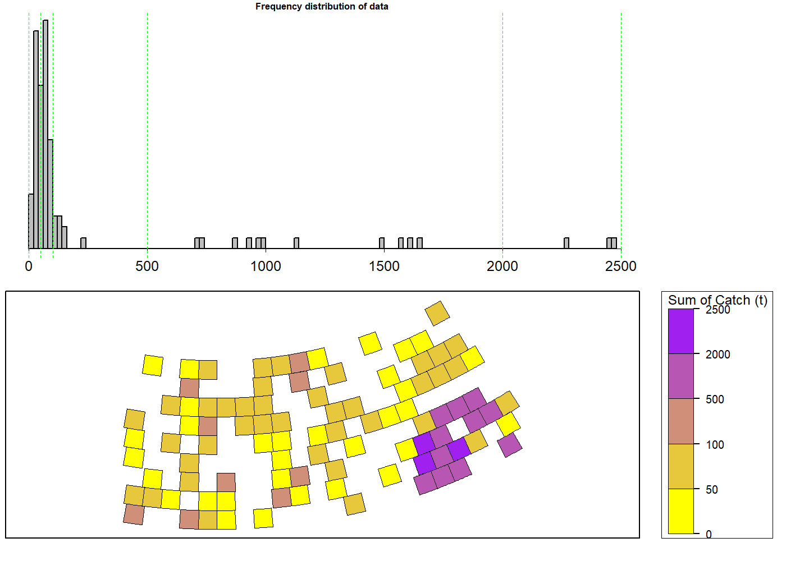

### 2.2. Create Stations

This function was designed to create random point locations inside a
polygon and within bathymetry strata constraints. A distance constraint
between stations may also be used if desired. The examples below use the
‘SmallBathy’ data for illustrative purposes; users should use a higher
resolution bathymetry dataset instead, as obtained via the
*load_Bathy()* function.

For details, type:

``` r
?create_Stations
```

First, create a polygon within which stations will be created:

``` r
#Create polygons
MyPoly=create_Polys(
        data.frame(Name="mypol",
             Latitude=c(-75,-75,-70,-70),
             Longitude=c(-170,-180,-180,-170))
        ,Densify=T)

#Set the figure margins as c(bottom, left, top, right)
par(mai=c(0,0,0,0))
plot(st_geometry(Coast[Coast$ID=='88.1',]),col='grey')
plot(st_geometry(MyPoly),col='green',add=T)
text(MyPoly$Labx,MyPoly$Laby,MyPoly$ID)
box()
```

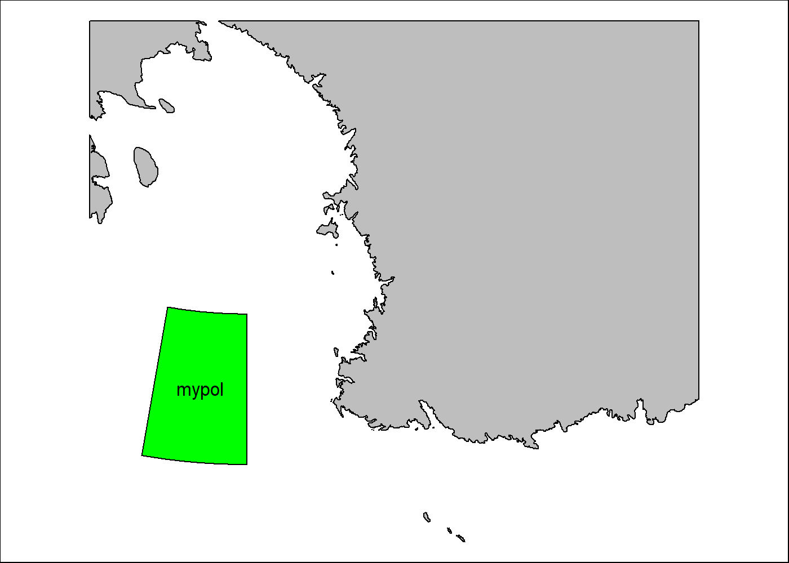

Example 1. Set numbers of stations, no distance constraint:

``` r

#optional: crop your bathymetry raster to match the extent of your polygon
BathyCroped=crop(SmallBathy(),ext(MyPoly))

#Create stations
MyStations=create_Stations(MyPoly,BathyCroped,Depths=c(-2000,-1500,-1000,-550),N=c(20,15,10))

#add custom colors to the bathymetry to indicate the strata of interest
MyCols=add_col(var=c(-10000,10000),cuts=c(-2000,-1500,-1000,-550),cols=c('blue','cyan'))
plot(BathyCroped,breaks=MyCols$cuts,col=MyCols$cols,legend=F,axes=F,main="Example 1")
add_Cscale(height=90,fontsize=0.75,width=16,lwd=0.5,offset=-130,cuts=MyCols$cuts,cols=MyCols$cols)
plot(st_geometry(MyPoly),add=T,border='red',lwd=2,xpd=T)
plot(st_geometry(MyStations),add=T,col='orange',cex=0.75,lwd=1.5,pch=3)
```


Example 2. Set numbers of stations, with distance constraint:

``` r

#Create Stations
MyStations=create_Stations(MyPoly,BathyCroped,
                           Depths=c(-2000,-1500,-1000,-550),N=c(20,15,10),dist=10)

#add custom colors to the bathymetry to indicate the strata of interest
MyCols=add_col(var=c(-10000,10000),cuts=c(-2000,-1500,-1000,-550),cols=c('blue','cyan'))
plot(BathyCroped,breaks=MyCols$cuts,col=MyCols$cols,legend=F,axes=F,main="Example 2")
add_Cscale(height=90,fontsize=0.75,width=16,lwd=0.5,offset=-130,cuts=MyCols$cuts,cols=MyCols$cols)
plot(st_geometry(MyPoly),add=T,border='red',lwd=2,xpd=T)
plot(st_geometry(MyStations[MyStations$Stratum=='1000-550',]),pch=21,bg='yellow',add=T,cex=0.75,lwd=0.1)
plot(st_geometry(MyStations[MyStations$Stratum=='1500-1000',]),pch=21,bg='orange',add=T,cex=0.75,lwd=0.1)
plot(st_geometry(MyStations[MyStations$Stratum=='2000-1500',]),pch=21,bg='red',add=T,cex=0.75,lwd=0.1)
```

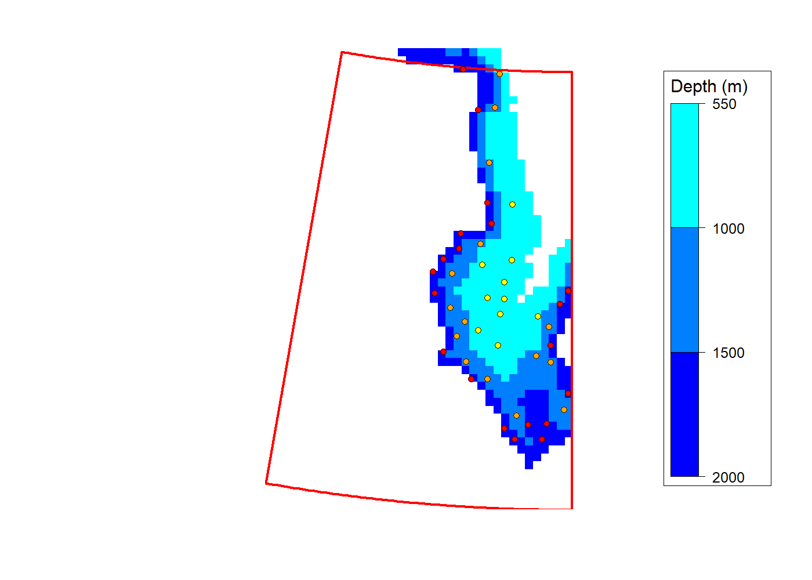

Example 3. Automatic numbers of stations, with distance constraint:

``` r

#Create Stations
MyStations=create_Stations(MyPoly,BathyCroped,Depths=c(-2000,-1500,-1000,-550),Nauto=30,dist=10)

#add custom colors to the bathymetry to indicate the strata of interest
MyCols=add_col(var=c(-10000,10000),cuts=c(-2000,-1500,-1000,-550),cols=c('blue','cyan'))
plot(BathyCroped,breaks=MyCols$cuts,col=MyCols$cols,legend=F,axes=F,main="Example 3")
add_Cscale(height=90,fontsize=0.75,width=16,lwd=0.5,offset=-130,cuts=MyCols$cuts,cols=MyCols$cols)
plot(st_geometry(MyPoly),add=T,border='red',lwd=2,xpd=T)
plot(st_geometry(MyStations[MyStations$Stratum=='1000-550',]),pch=21,bg='yellow',add=T,cex=0.75,lwd=0.1)
plot(st_geometry(MyStations[MyStations$Stratum=='1500-1000',]),pch=21,bg='orange',add=T,cex=0.75,lwd=0.1)
plot(st_geometry(MyStations[MyStations$Stratum=='2000-1500',]),pch=21,bg='red',add=T,cex=0.75,lwd=0.1)
```

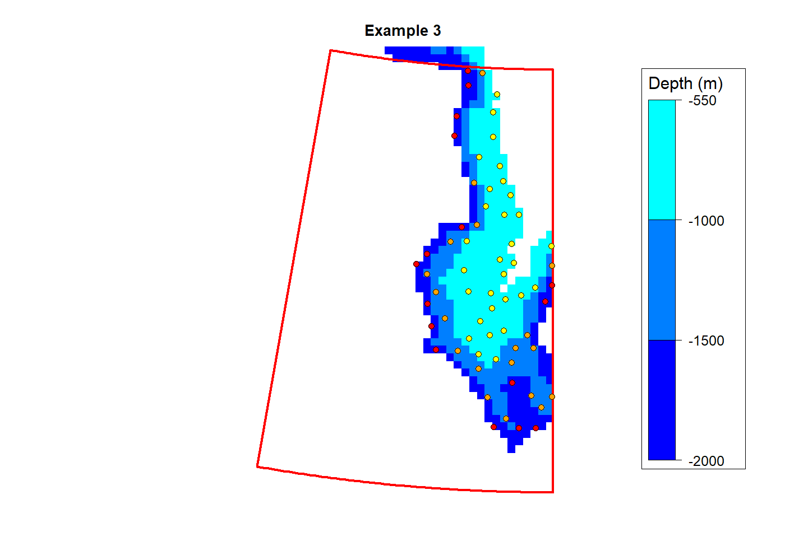

### 2.3. Create pies

The function *create_Pies()* generates pie charts that can be overlaid
on maps. The *Input* data must be a dataframe with, at least, columns
for latitude, longitude, class and value. For each location, a pie is
created with pie pieces for each class, and the size of each pie piece
depends on the proportion of each class (the value of each class divided
by the sum of values). Optionally, the area of each pie can be
proportional to a chosen variable (if that variable is different than
the value mentioned above, the *Input* data must have a fifth column and
that variable must be unique to each location). If the *Input* data
contains locations that are too close together, the data can be gridded
by setting *GridKm* (see Examples 6-8). Once pie charts have been
created, the function *add_PieLegend()* may be used to add a legend to
the figure.

For details, type:

``` r
?create_Pies
?add_PieLegend
#The examples below use the following example datasets:
View(PieData)
View(PieData2)
```

<br>

Example 1. Pies of constant size, all classes displayed:

``` r
#Plot the bathymetry (See section 'Local map' where B486 was created)
plot(B486,breaks=Depth_cuts,col=Depth_cols,legend=FALSE,axes=FALSE,mar=c(6,0,0,0))
#Add coastline
plot(Coast[Coast$ID=='48.6',],col='grey',lwd=0.01,add=T)
#Create pies
MyPies=create_Pies(Input=PieData,
                   NamesIn=c("Lat","Lon","Sp","N"),
                   Size=50
                   )
#Plot Pies
plot(st_geometry(MyPies),col=MyPies$col,add=TRUE)
#Add Pies legend
add_PieLegend(Pies=MyPies,PosX=-0.1,PosY=-1.6,Boxexp=c(0.5,0.45,0.12,0.45),
              PieTitle="Species")
```

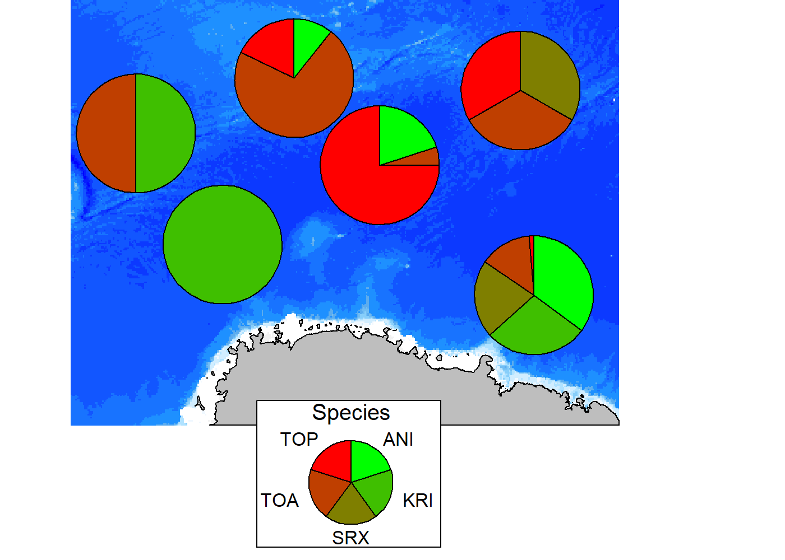

<br>

Example 2. Pies of constant size, selected classes displayed:

``` r
#Plot the bathymetry (See section 'Local map' where B486 was created)
plot(B486,breaks=Depth_cuts,col=Depth_cols,legend=FALSE,axes=FALSE,mar=c(6,0,0,0))
#Add coastline
plot(Coast[Coast$ID=='48.6',],col='grey',lwd=0.01,add=T)
#Create pies
MyPies=create_Pies(Input=PieData,
                   NamesIn=c("Lat","Lon","Sp","N"),
                   Size=50,
                   Classes=c("TOP","TOA","ANI")
                   )
#Plot Pies
plot(st_geometry(MyPies),col=MyPies$col,add=TRUE)
#Add Pies legend
add_PieLegend(Pies=MyPies,PosX=-0.1,PosY=-1.6,Boxexp=c(0.6,0.6,0.12,0.55),
              PieTitle="Selected species")
```

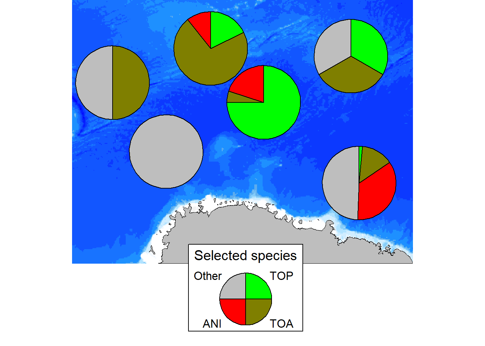

<br>

Example 3. Pies of constant size, proportions below 25% are grouped in a
‘Other’ class (*N.B.*: unlike Example 2, the ‘Other’ class may contain
classes that are displayed in the legend. Please compare Example 1 and
Example 3):

``` r
#Plot the bathymetry (See section 'Local map' where B486 was created)
plot(B486,breaks=Depth_cuts,col=Depth_cols,legend=FALSE,axes=FALSE,mar=c(6,0,0,0))
#Add coastline
plot(Coast[Coast$ID=='48.6',],col='grey',lwd=0.01,add=T)
#Create pies
MyPies=create_Pies(Input=PieData,
                   NamesIn=c("Lat","Lon","Sp","N"),
                   Size=50,
                   Other=25
                   )
#Plot Pies
plot(st_geometry(MyPies),col=MyPies$col,add=TRUE)
#Add Pies legend
add_PieLegend(Pies=MyPies,PosX=-0.1,PosY=-1.6,Boxexp=c(0.55,0.55,0.12,0.45),
              PieTitle="Other (%) class")
```

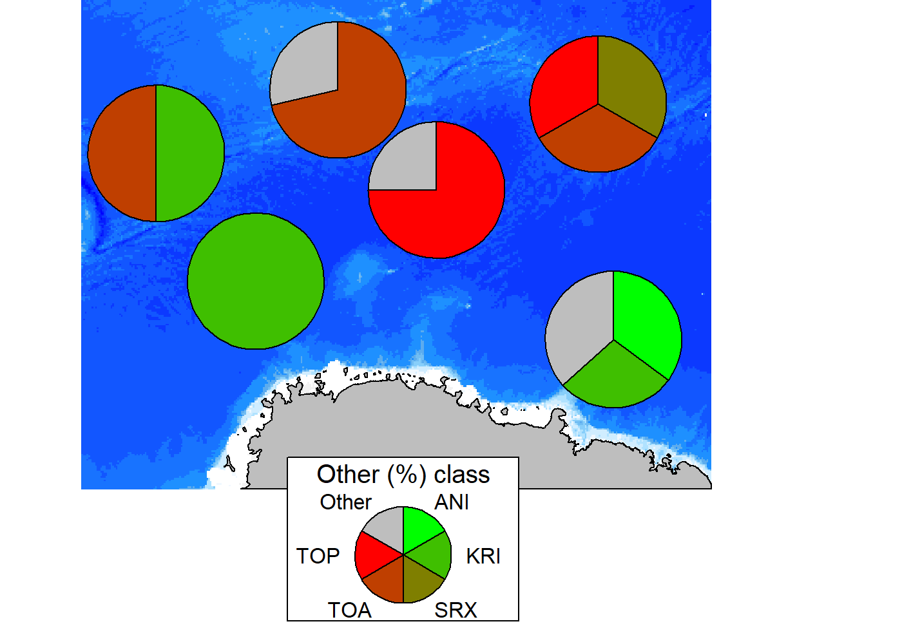

<br>

Example 4. Pies of variable size (here, their area is proportional to
‘Catch’), all classes displayed, horizontal legend:

``` r
#Plot the bathymetry (See section 'Local map' where B486 was created)
plot(B486,breaks=Depth_cuts,col=Depth_cols,legend=FALSE,axes=FALSE,mar=c(6,0,0,0))
#Add coastline
plot(Coast[Coast$ID=='48.6',],col='grey',lwd=0.01,add=T)
#Create pies
MyPies=create_Pies(Input=PieData,
                   NamesIn=c("Lat","Lon","Sp","N"),
                   Size=18,
                   SizeVar="Catch"
                   )
#Plot Pies
plot(st_geometry(MyPies),col=MyPies$col,add=TRUE)
#Add Pies legend
add_PieLegend(Pies=MyPies,PosX=-0.1,PosY=-1.6,Boxexp=c(0.16,0.1,0.1,0.4),
              PieTitle="Species",SizeTitle="Catch (t.)")
```

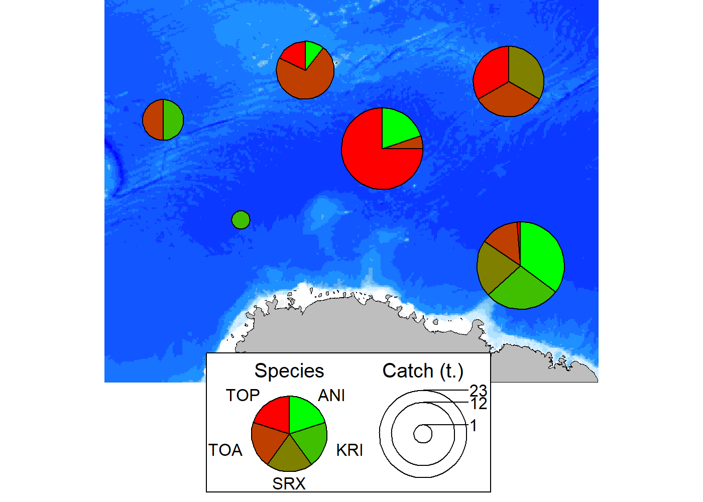

<br>

Example 5. Pies of variable size (here, their area is proportional to
‘Catch’), all classes displayed, vertical legend:

``` r
#Plot the bathymetry (See section 'Local map' where B486 was created)
plot(B486,breaks=Depth_cuts,col=Depth_cols,legend=FALSE,axes=FALSE,mar=c(0,0,0,10))
#Add coastline
plot(Coast[Coast$ID=='48.6',],col='grey',lwd=0.01,add=T)
#Create pies
MyPies=create_Pies(Input=PieData,
                   NamesIn=c("Lat","Lon","Sp","N"),
                   Size=18,
                   SizeVar="Catch"
                   )
#Plot Pies
plot(st_geometry(MyPies),col=MyPies$col,add=TRUE)
#Add Pies legend
add_PieLegend(Pies=MyPies,PosX=2.32,PosY=0.1,Boxexp=c(0.35,0.32,0.02,0.15),
              PieTitle="Species",SizeTitle="Catch (t.)",Horiz=FALSE,LegSp=0.6)
```

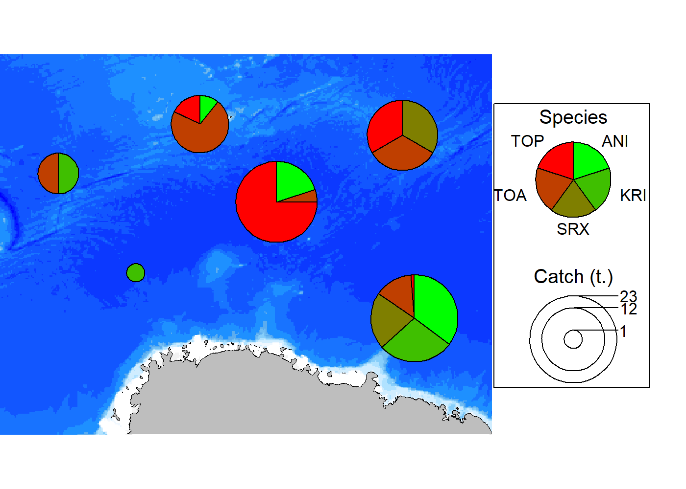

<br>

Example 6. Pies of constant size, all classes displayed. Too many pies
(see next example for solution):

``` r
#Plot the bathymetry (See section 'Local map' where B486 was created)
plot(B486,breaks=Depth_cuts,col=Depth_cols,legend=FALSE,axes=FALSE,mar=c(6,0,0,0))
#Add coastline
plot(Coast[Coast$ID=='48.6',],col='grey',lwd=0.01,add=T)
#Create pies
MyPies=create_Pies(Input=PieData2,
                   NamesIn=c("Lat","Lon","Sp","N"),
                   Size=5
                   )
#Plot Pies
plot(st_geometry(MyPies),col=MyPies$col,add=TRUE)
#Add Pies legend
add_PieLegend(Pies=MyPies,PosX=0.4,PosY=-1.5,Boxexp=c(0.5,0.45,0.12,0.45),
              PieTitle="Species")
```

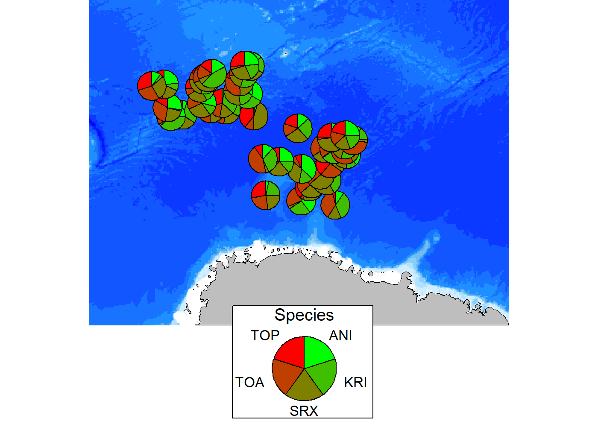

<br>

Example 7. Pies of constant size, all classes displayed. Gridded
locations (in which case numerical variables in the *Input* are summed
for each grid point):

``` r
#Plot the bathymetry (See section 'Local map' where B486 was created)
plot(B486,breaks=Depth_cuts,col=Depth_cols,legend=FALSE,axes=FALSE,mar=c(6,0,0,0))
#Add coastline
plot(Coast[Coast$ID=='48.6',],col='grey',lwd=0.01,add=T)
#Create pies
MyPies=create_Pies(Input=PieData2,
                   NamesIn=c("Lat","Lon","Sp","N"),
                   Size=5,
                   GridKm=250
                   )
#Plot Pies
plot(st_geometry(MyPies),col=MyPies$col,add=TRUE)
#Add Pies legend
add_PieLegend(Pies=MyPies,PosX=0.4,PosY=-1.3,Boxexp=c(0.5,0.45,0.12,0.45),
              PieTitle="Species")
```

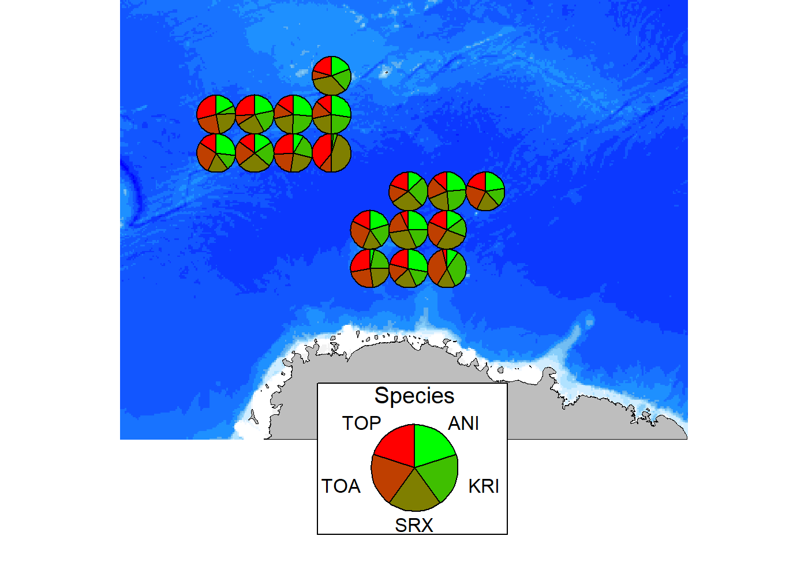

<br>

Example 8. Pies of variable size (here, their area is proportional to
‘Catch’), all classes displayed, vertical legend, gridded locations (in
which case numerical variables in the *Input* are summed for each grid
point):

``` r
#Plot the bathymetry (See section 'Local map' where B486 was created)
plot(B486,breaks=Depth_cuts,col=Depth_cols,legend=FALSE,axes=FALSE,mar=c(0,0,0,10))
#Add coastline
plot(Coast[Coast$ID=='48.6',],col='grey',lwd=0.01,add=T)
#Create pies
MyPies=create_Pies(Input=PieData2,
                   NamesIn=c("Lat","Lon","Sp","N"),
                   Size=3,
                   GridKm=250,
                   SizeVar='Catch'
                   )
#Plot Pies
plot(st_geometry(MyPies),col=MyPies$col,add=TRUE)
#Add Pies legend
add_PieLegend(Pies=MyPies,PosX=2.8,PosY=0.15,Boxexp=c(0.38,0.32,0.08,0.18),
              PieTitle="Species",Horiz=FALSE,SizeTitle="Catch (t.)",
              SizeTitleVadj=0.8,nSizes=2)
```

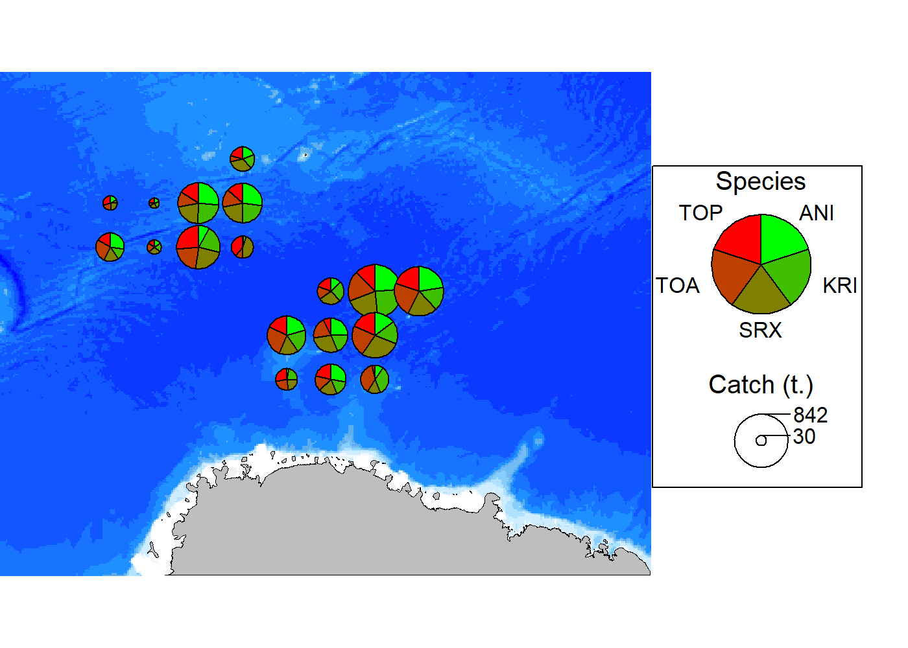

### 2.4. Create Arrow

This function creates an arrow, which can be curved and/or segmented.
Input is a dataframe with columns Latitude, Longitude, Weight
(optional). First row is start, last row is end (where the arrow will
point to), and intermediate rows are points towards which the arrow’s
path will bend. A weight can be added to the intermediate points to make
the arrow’s path bend more towards them. The arrow’s path is a curve
along *Np* points, if it appears too segmented, increase *Np*. The
arrow’s path width is controlled by *Pwidth*. The arrow’s head length
and width are controlled by *Hlength* and *Hwidth* respectively. Two
types of arrows (*Atype*) can be created: ‘normal’ or ‘dashed’. A normal
arrow is a single polygon, with a single color (set by *Acol*) and
transparency (set by *Atrans*). A dashed arrow is a series of polygons
which can be colored separately by setting two or more values as
*Acol=c(“color start”,“color end”)* and two or more transparency values
as *Atrans=c(“transparency start”,“transparency end”)*. The length of
dashes is controlled by *dlength*.

For details, type:

``` r
?create_Arrow
```

Examples 1-4:

``` r
ASDs=load_ASDs()
ASDs=ASDs[ASDs$GAR_Short_Label%in%c("481","482","483"),]

# Example 1: straight green arrow.
myInput=data.frame(lat=c(-61,-52),
                 lon=c(-60,-40))

Arrow=create_Arrow(Input=myInput)

par(mai=c(0,0,0.5,0),mfrow=c(2,2))
plot(st_geometry(ASDs),main="Example 1")
plot(st_geometry(Coast[Coast$ID%in%c("48.1","48.2","48.3"),]),col="grey",add=TRUE)
plot(st_geometry(Arrow),col=Arrow$col,add=TRUE)

# Example 2: blue arrow with one bend.
myInput=data.frame(lat=c(-61,-65,-52),
                   lon=c(-60,-45,-40))

Arrow=create_Arrow(Input=myInput,Acol="lightblue")

plot(st_geometry(ASDs),main="Example 2")
plot(st_geometry(Coast[Coast$ID%in%c("48.1","48.2","48.3"),]),col="grey",add=TRUE)
plot(st_geometry(Arrow),col=Arrow$col,add=TRUE)

#Example 3: blue arrow with two bends
myInput=data.frame(lat=c(-61,-60,-65,-52),
                   lon=c(-60,-50,-45,-40))

Arrow=create_Arrow(Input=myInput,Acol="lightblue")

plot(st_geometry(ASDs),main="Example 3")
plot(st_geometry(Coast[Coast$ID%in%c("48.1","48.2","48.3"),]),col="grey",add=TRUE)
plot(st_geometry(Arrow),col=Arrow$col,add=TRUE)


#Example 4: blue arrow with two bends, with more weight on the second bend and a big head
myInput=data.frame(lat=c(-61,-60,-65,-52),
                   lon=c(-60,-50,-45,-40),
                   w=c(1,1,2,1))

Arrow=create_Arrow(Input=myInput,Acol="lightblue",Hlength=20,Hwidth=20)

plot(st_geometry(ASDs),main="Example 4")
plot(st_geometry(Coast[Coast$ID%in%c("48.1","48.2","48.3"),]),col="grey",add=TRUE)
plot(st_geometry(Arrow),col=Arrow$col,add=TRUE)
```

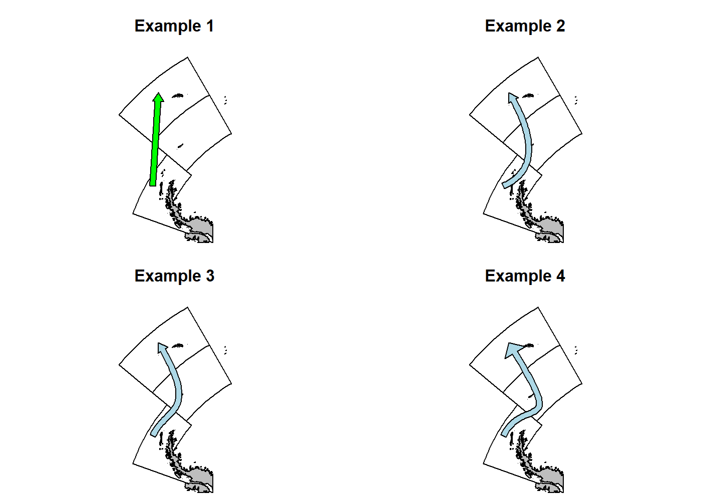

Examples 5-8:

``` r
#Example 5: Dashed arrow, small dashes
myInput=data.frame(lat=c(-61,-60,-65,-52),
                   lon=c(-60,-50,-45,-40),
                   w=c(1,1,2,1))

Arrow=create_Arrow(Input=myInput,Acol="blue",Atype = "dashed",dlength = 1)

par(mai=c(0,0,0.5,0),mfrow=c(2,2))
plot(st_geometry(ASDs),main="Example 5")
plot(st_geometry(Coast[Coast$ID%in%c("48.1","48.2","48.3"),]),col="grey",add=TRUE)
plot(st_geometry(Arrow),col=Arrow$col,add=TRUE,border=NA)


#Example 6: Dashed arrow, big dashes
myInput=data.frame(lat=c(-61,-60,-65,-52),
                   lon=c(-60,-50,-45,-40),
                   w=c(1,1,2,1))

Arrow=create_Arrow(Input=myInput,Acol="blue",Atype = "dashed",dlength = 2)

plot(st_geometry(ASDs),main="Example 6")
plot(st_geometry(Coast[Coast$ID%in%c("48.1","48.2","48.3"),]),col="grey",add=TRUE)
plot(st_geometry(Arrow),col=Arrow$col,add=TRUE,border=NA)

#Example 7: Dashed arrow, no dashes, 3 colors and transparency gradient
myInput=data.frame(lat=c(-61,-60,-65,-52),
                   lon=c(-60,-50,-45,-40),
                   w=c(1,1,2,1))

Arrow=create_Arrow(Input=myInput,Acol=c("red","green","blue"),Atrans = c(0,0.9,0),Atype = "dashed",dlength = 0)

plot(st_geometry(ASDs),main="Example 7")
plot(st_geometry(Coast[Coast$ID%in%c("48.1","48.2","48.3"),]),col="grey",add=TRUE)
plot(st_geometry(Arrow),col=Arrow$col,add=TRUE,border=NA)

#Example 8: Same as example 7 but with more points, so smoother
myInput=data.frame(lat=c(-61,-60,-65,-52),
                   lon=c(-60,-50,-45,-40),
                   w=c(1,1,2,1))

Arrow=create_Arrow(Input=myInput,Np=200,Acol=c("red","green","blue"),
                   Atrans = c(0,0.9,0),Atype = "dashed",dlength = 0)

plot(st_geometry(ASDs),main="Example 8")
plot(st_geometry(Coast[Coast$ID%in%c("48.1","48.2","48.3"),]),col="grey",add=TRUE)
plot(st_geometry(Arrow),col=Arrow$col,add=TRUE,border=NA)
```

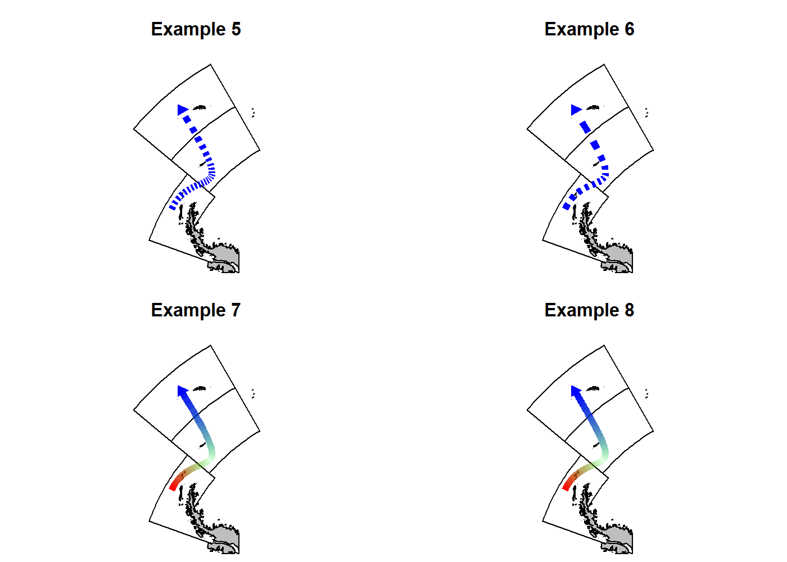

Example 9:

``` r
#Example 9
#Prepare mapping elements
ASDs=ASDs[ASDs$GAR_Short_Label=="481",]
bb=st_bbox(st_buffer(ASDs,20000)) #Get bounding box (x/y limits) +20,000m buffer
bx=st_as_sfc(bb) #Build spatial box to plot
coast=load_Coastline()
C481=st_intersection(st_union(coast[coast$surface=="Land",]),bx) #Crop coastline to box limits
B481=crop(SmallBathy(),ext(bb))

#Create arrows

myInput=data.frame(lat=c(-68,-65,-64,-61,-61,-60),
                   lon=c(-75,-70,-65,-60,-55,-50),
                   w=c(1,3,3,3,3,1))
Arrow1=create_Arrow(Input=myInput,Acol="orange",Atrans=0.3,Pwidth=3,Hlength=10,Hwidth=6)

myInput=data.frame(lat=c(-66,-65,-66),
                   lon=c(-71,-70,-67))
Arrow2=create_Arrow(Input=myInput,Acol="orange",Atrans=0.3,Pwidth=1,Hlength=5,Hwidth=2.5)

myInput=data.frame(lat=c(-63.8,-63,-63),
                   lon=c(-65,-62,-60))
Arrow3=create_Arrow(Input=myInput,Acol="orange",Atrans=0.3,Pwidth=1,Hlength=5,Hwidth=2.5)

myInput=data.frame(lat=c(-61,-62,-63,-64.5),
                   lon=c(-55,-52,-53,-55))
Arrow4=create_Arrow(Input=myInput,Acol="orange",Atrans=0.3,Pwidth=1,Hlength=5,Hwidth=2.5)

#Merge arrows 1 to 4
Arrow1_4=suppressWarnings(st_union(Arrow1,Arrow2))
Arrow1_4=suppressWarnings(st_union(Arrow1_4,Arrow3))
Arrow1_4=suppressWarnings(st_union(Arrow1_4,Arrow4))

myInput=data.frame(lat=c(-71,-67,-65),
                   lon=c(-57,-60,-55))
Arrow5=create_Arrow(Input=myInput,Acol=c("white","red"),Atrans = c(1,0),Pwidth=5,
                    Hlength=10,Hwidth=10,Atype = "dashed",Np=100)

myInput=data.frame(lat=c(-59,-60,-62,-63,-65),
                   lon=c(-52,-60,-65,-70,-75))
Arrow6=create_Arrow(Input=myInput,Acol=c("purple","cyan","black"),Pwidth=2,
                    Hlength=10,Hwidth=5,Atype = "dashed",dlength = 1)


#Plot the bathymetry
plot(B481,breaks=Depth_cuts,col=Depth_cols,legend=FALSE,axes=FALSE,mar=rep(1.5,4))
text(-2050000,2070000,"Example 9",font=2,xpd=TRUE,cex=2)
#Plot border
plot(bx,border='black',lwd=1,xpd=TRUE,add=TRUE)
#Add coastline (for Subarea 48.6 only)
plot(C481,col="grey",add=TRUE,xpd=T)
#Add reference grid
add_RefGrid(bb=bb,ResLat=2,ResLon=5,fontsize=1,lwd=0.75,offset = c(20000,30000))
#Add Subarea 48.1 boundaries
plot(st_geometry(ASDs),add=TRUE,lwd=3,border='black',xpd=T)
#Add Arrows
plot(st_geometry(Arrow1_4),col=Arrow1_4$col,add=TRUE,border="orange",lwd=2,xpd=T)
plot(st_geometry(Arrow5),col=Arrow5$col,add=TRUE,border=NA,xpd=T)
plot(st_geometry(Arrow6),col=Arrow6$col,add=TRUE,border='white',xpd=T)
```

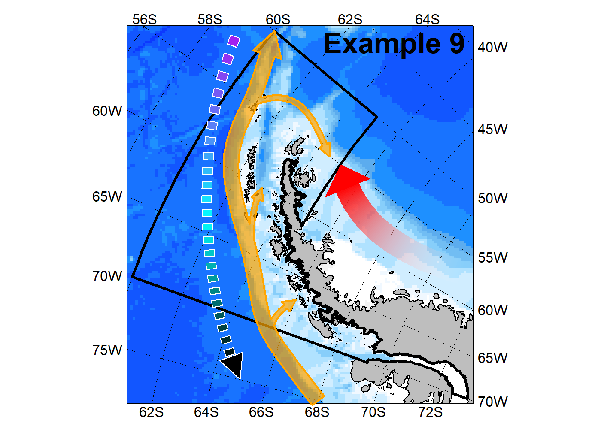

### 2.5. Create Hashes

This function creates hashed lines to fill a polygon. Its output is a
spatial object in your environment, to be added to your plot.

For details, type:

``` r
?create_Hashes
```

Example:

``` r

#load ASDs
ASDs=load_ASDs()
#Generate colors, angles, spacings and widths of hashes, one per ASD
Colors=rainbow(nrow(ASDs))
angles=seq(10,355,length.out=nrow(ASDs))
spacings=seq(3,10,length.out=nrow(ASDs))
widths=seq(3,10,length.out=nrow(ASDs))

#Set the figure margins as c(bottom, left, top, right)
par(mai=c(0,0,0,0))

plot(st_geometry(ASDs))
for(i in seq(1,nrow(ASDs))){
  H=create_Hashes(pol=ASDs[i,],angle=angles[i],spacing=spacings[i],width=widths[i])
  plot(st_geometry(H),col=Colors[i],add=T)

}
plot(st_geometry(ASDs),lwd=2,add=T)
```

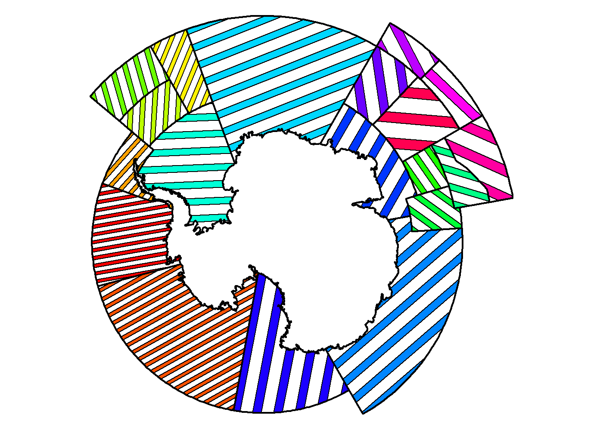

<br>

## 3. Load functions

### 3.1. Online use

Download the up-to-date spatial layers from the online CCAMLR GIS and
load them to your environment.

For details, type:

``` r
?load_ASDs
?load_Bathy
```

``` r

#Load ASDs, EEZs, and Coastline
ASDs=load_ASDs()
EEZs=load_EEZs()
Coastline=load_Coastline()
Coastline=Coastline[Coastline$surface=="Land",]

#Set the figure margins as c(bottom, left, top, right)
par(mai=c(0,0,0,0))
#Plot
plot(st_geometry(ASDs),col='green',border='blue')
plot(st_geometry(EEZs),col='orange',border='purple',add=T)
plot(st_geometry(Coastline),col='grey',add=T)
add_labels(mode='auto',layer='ASDs',fontsize=0.75,col='red')
box()
```

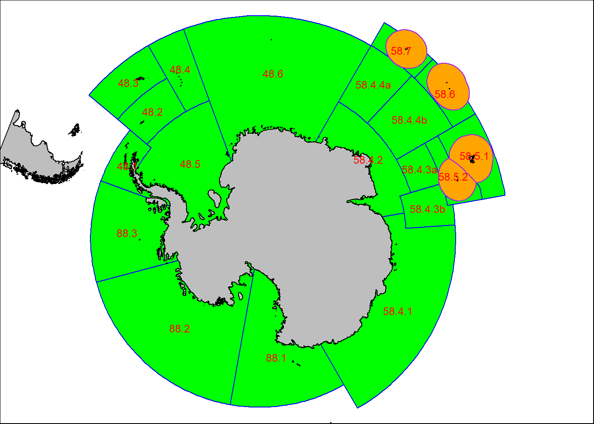

### 3.2. Offline use

Since the ‘*load\_*’ functions require an internet connection, users may
desire to save layers on their hard drive for offline use. This may be
done, at the risk of not having the most up-to-date layers, as follows:

``` r

#Load all layers
ASDs=load_ASDs()
EEZs=load_EEZs()
Coastline=load_Coastline()
SSRUs=load_SSRUs()
RBs=load_RBs()
SSMUs=load_SSMUs()
MAs=load_MAs()
MPAs=load_MPAs()

#Save as .RData file (here in the temp directory, but users might want to chose their own directory)
save(list=c('ASDs','EEZs','Coastline','SSRUs','RBs','SSMUs','MAs','MPAs'),
     file = file.path(tempdir(), "CCAMLRLayers.RData"), compress='xz')

#Later, when offline load layers:
load(file.path(tempdir(), "CCAMLRLayers.RData"))
```

The *load_Bathy()* function may also be used to download and store
bathymetry data for later use, see ?load_Bathy for details.

## 4. Other functions

### 4.1. get_depths

Given a bathymetry raster and an input dataframe of
latitudes/longitudes, this function computes the depths at these
locations. The examples below use the ‘SmallBathy’ data for illustrative
purposes; users should use a higher resolution bathymetry dataset
instead, as obtained via the *load_Bathy()* function.

For details, type:

``` r
?get_depths
```

``` r

#Generate a dataframe
MyData=data.frame(Lat=PointData$Lat,
                  Lon=PointData$Lon,
                  Catch=PointData$Catch)
#The input data looks like this:
head(MyData)
#>         Lat       Lon    Catch
#> 1 -68.63966 -175.0078 53.33002
#> 2 -67.03475 -178.0322 38.66385
#> 3 -65.44164 -170.1656 20.32608
#> 4 -68.36806  151.0247 69.81201
#> 5 -63.89171  154.4327 52.32101
#> 6 -66.35370  153.6906 78.65576

#Get depths of locations
MyDataD=get_depths(Input=MyData,Bathy=SmallBathy())
#The resulting data looks like this (where 'd' is the depth):
head(MyDataD)
#>         Lat       Lon    Catch          d
#> 1 -68.63966 -175.0078 53.33002 -3794.5107
#> 2 -67.03475 -178.0322 38.66385 -3960.5574
#> 3 -65.44164 -170.1656 20.32608 -3016.5554
#> 4 -68.36806  151.0247 69.81201  -335.0405
#> 5 -63.89171  154.4327 52.32101 -3235.2156
#> 6 -66.35370  153.6906 78.65576 -1961.1792

#Plot Catch vs Depth
plot(MyDataD$d,MyDataD$Catch,xlab='Depth',ylab='Catch',pch=21,bg='red')
```

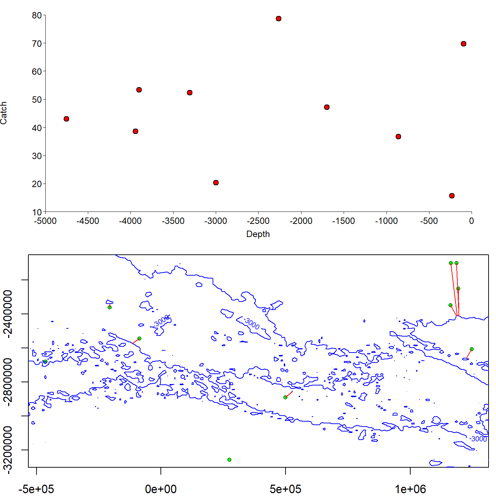

### 4.2. seabed_area

Function to calculate planimetric seabed area within polygons and depth
strata in square kilometers. Its accuracy depends on the input
bathymetry raster. The examples below use the ‘SmallBathy’ data for
illustrative purposes; users should use a higher resolution bathymetry
dataset instead, as obtained via the *load_Bathy()* function. Higher
accuracy will be obtained with raw, unprojected bathymetry data.

For details, type:

``` r
?seabed_area
```

``` r
#create some polygons
MyPolys=create_Polys(PolyData,Densify=T)
#compute the seabed areas
FishDepth=seabed_area(SmallBathy(),MyPolys,PolyNames="ID",depth_classes=c(0,-200,-600,-1800,-3000,-5000))
#Result looks like this (note that the 600-1800 stratum is renamed 'Fishable_area')
head(FishDepth)
#>      ID 0|-200 -200|-600 Fishable_area -1800|-3000 -3000|-5000
#> 1   one      0  19300.01      41400.01    40200.01    92800.03
#> 2   two      0    200.00       1900.00     9100.00    93400.03
#> 3 three    800   1300.00       7600.00   229600.07   138300.04
```

### 4.3. assign_areas

Given a set of polygons and a set of point locations (given in decimal
degrees), finds in which polygon those locations fall. Finds, for
example, in which ASD the given fishing locations occurred.

For details, type:

``` r
?assign_areas
```

``` r
#Generate a dataframe with random locations
MyData=data.frame(Lat=runif(100,min=-65,max=-50),
                  Lon=runif(100,min=20,max=40))
#The input data looks like this:
head(MyData)
#>         Lat      Lon
#> 1 -52.54421 38.74173
#> 2 -62.66283 32.30073
#> 3 -50.14694 38.99038
#> 4 -54.78676 36.31189
#> 5 -52.02953 20.98631
#> 6 -61.37509 26.03940

#load ASDs and SSRUs
ASDs=load_ASDs()
SSRUs=load_SSRUs()

#Assign ASDs and SSRUs to these locations 
MyData=assign_areas(MyData,Polys=c('ASDs','SSRUs'),NamesOut=c('MyASDs','MySSRUs'))
#The output data looks like this:
head(MyData)
#>         Lat      Lon  MyASDs   MySSRUs
#> 1 -52.54421 38.74173 58.4.4a 58.4.4a D
#> 2 -62.66283 32.30073  58.4.2  58.4.2 A
#> 3 -50.14694 38.99038 58.4.4a 58.4.4a D
#> 4 -54.78676 36.31189 58.4.4a 58.4.4a D
#> 5 -52.02953 20.98631    48.6    48.6 G
#> 6 -61.37509 26.03940    48.6    48.6 F

#count of locations per ASD
table(MyData$MyASDs) 
#> 
#>    48.6  58.4.2 58.4.4a 
#>      52       7      41

#count of locations per SSRU
table(MyData$MySSRUs) 
#> 
#>    48.6 F    48.6 G  58.4.2 A 58.4.4a D 
#>        17        35         7        41
```

### 4.4. project_data

A simple function to project user-supplied locations. Input must be a
dataframe, outputs may be appended to the dataframe.

For details, type:

``` r
?project_data
```

``` r

#The input data looks like this:
head(PointData)
#>         Lat       Lon  name    Catch Nfishes n
#> 1 -68.63966 -175.0078   one 53.33002     460 1
#> 2 -67.03475 -178.0322   two 38.66385     945 2
#> 3 -65.44164 -170.1656   two 20.32608     374 3
#> 4 -68.36806  151.0247   two 69.81201      87 4
#> 5 -63.89171  154.4327 three 52.32101     552 5
#> 6 -66.35370  153.6906  four 78.65576      22 6
#Generate a dataframe with random locations
MyData=project_data(Input=PointData,NamesIn=c('Lat','Lon'),
                    NamesOut=c('Projected_Y','Projected_X'),append=TRUE)
#The output data looks like this:
head(MyData)
#>         Lat       Lon  name    Catch Nfishes n Projected_Y Projected_X
#> 1 -68.63966 -175.0078   one 53.33002     460 1    -2361962  -206321.41
#> 2 -67.03475 -178.0322   two 38.66385     945 2    -2545119   -87445.72
#> 3 -65.44164 -170.1656   two 20.32608     374 3    -2680488  -464656.29
#> 4 -68.36806  151.0247   two 69.81201      87 4    -2100218  1162986.84
#> 5 -63.89171  154.4327 three 52.32101     552 5    -2606157  1246832.20
#> 6 -66.35370  153.6906  four 78.65576      22 6    -2349505  1161675.96
```

### 4.5. get_C_intersection

Get Cartesian coordinates of lines intersection in Euclidean space. This
may have several uses, including when creating polygons with shared
boundaries. Uses the coordinates of line extremities as input.

For details, type:

``` r
?get_C_intersection
```

``` r

#Prepare layout for 4 sub-plots
par(mfrow=c(2,2),mai=c(0.8,0.8,0.2,0.05))

#Example 1 (Intersection beyond the range of segments)
get_C_intersection(Line1=c(-30,-55,-29,-50),Line2=c(-50,-60,-40,-60))
#> Lon Lat 
#> -31 -60
text(-40,-42,"Example 1",xpd=T)
box()
#Example 2 (Intersection on one of the segments)
get_C_intersection(Line1=c(-30,-65,-29,-50),Line2=c(-50,-60,-40,-60))
#>       Lon       Lat 
#> -29.66667 -60.00000
text(-40,-41,"Example 2",xpd=T)
box()
#Example 3 (Crossed segments)
get_C_intersection(Line1=c(-30,-65,-29,-50),Line2=c(-50,-60,-25,-60))
#>       Lon       Lat 
#> -29.66667 -60.00000
text(-38,-41,"Example 3",xpd=T)
box()
#Example 4 (Antimeridian crossed)
get_C_intersection(Line1=c(-179,-60,-150,-50),Line2=c(-120,-60,-130,-62))
#> Warning in get_C_intersection(Line1 = c(-179, -60, -150, -50), Line2 = c(-120,
#> : Antimeridian crossed. Find where your line crosses it first, using
#> Line=c(180,-90,180,0) or Line=c(-180,-90,-180,0).
#>        Lon        Lat 
#> -260.47619  -88.09524
text(-180,-37,"Example 4",xpd=T)
box()
```

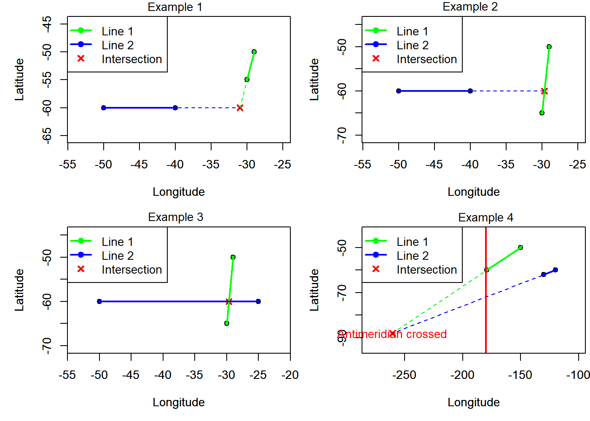

### 4.6. get_iso_polys

From an input raster and chosen cuts (classes), turns areas between
contours into polygons. An input polygon may optionally be given to
constrain boundaries. The accuracy is dependent on the resolution of the
raster (e.g., see *load_Bathy()* to get high resolution bathymetry). if
*Grp* is set to TRUE (slower), contour polygons that touch each other
are identified and grouped (a Grp column is added to the object). This
can be used, for example, to identify seamounts that are constituted of
several isobaths (see example 2 below).

For details, type:

``` r
?get_iso_polys
```

``` r

#Prepare layout for 4 sub-plots
par(mfrow=c(1,3),mai=c(0,0.01,0.2,0.01))

#Example 1 - Whole Convention Area 
IsoPols=get_iso_polys(Rast=SmallBathy(),Cuts=c(-10000,-4000,-2000,0),Cols=c("blue","white","red"))

plot(st_geometry(IsoPols),col=IsoPols$c,main="Example 1")
box()

#Example 2 - SSRU 882H seamounts
SSRUs=load_SSRUs()
Poly=SSRUs[SSRUs$GAR_Short_Label=="882H",]
IsoPols=get_iso_polys(Rast=SmallBathy(),Poly=Poly,Cuts=c(-2500,-1800,-600),Cols=c("cyan","green"),Grp=TRUE)

plot(st_geometry(IsoPols),col=IsoPols$c,main="Example 2")
text(IsoPols$Labx,IsoPols$Laby,IsoPols$Grp,col="red",font=2,xpd=TRUE,cex=1.25, adj=c(-.5,-.5))
box()

#Example 3 - Custom polygon
Poly=create_Polys(Input=data.frame(ID=1,Lat=c(-55,-55,-61,-61),Lon=c(-30,-25,-25,-30)))
IsoPols=get_iso_polys(Rast=SmallBathy(),Poly=Poly,Cuts=seq(-8000,0,length.out=10),Cols=rainbow(9))

plot(st_geometry(Poly),main="Example 3")
plot(st_geometry(IsoPols),col=IsoPols$c,add=TRUE)
box()
```

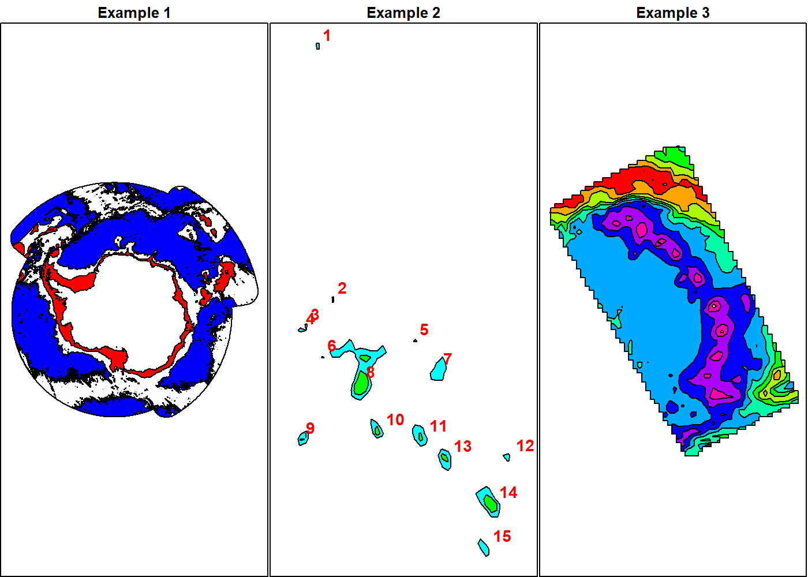

### 4.7. Rotate_obj

Rotate an *sf* or *SpatRaster* object by setting the longitude that
should point up. The output should **only** be used for plotting, not
analysis (as the projection is modified to a non-standard EPSG
projection). See also
[here](https://github.com/ccamlr/CCAMLRGIS/blob/master/Basemaps/Basemaps.md)
for more examples.

``` r
library(gifski)
gif_file = "Weeee.gif"

save_gif(
for(Lonzero in c(seq(0,180,by=20),seq(-160,-20,by=20))){
Rot_SmallBathy=Rotate_obj(SmallBathy(),Lon0=Lonzero)
terra::plot(Rot_SmallBathy,breaks=Depth_cuts, col=Depth_cols,
            legend=FALSE,axes=FALSE,box=FALSE,ext=ext(SmallBathy()),
            mar=rep(0,4))
add_RefGrid(bb=st_bbox(Rot_SmallBathy),ResLat=10,ResLon=20,LabLon = Lonzero,offset = 3)
}
, gif_file, 800, 800, res = 150,delay = 0.1,progress = F)
#> [1] "C:\\Users\\stephane\\Desktop\\CCAMLR\\CODES\\72 - CCAMLRGIS\\CCAMLRGIS\\Weeee.gif"
```


## 5. Adding colors, legends and labels

### 5.1. Bathymetry colors

Coloring bathymetry requires a vector of depth classes and a vector of
colors. Colors are applied between depth classes (so there is one less
color than there are depth classes). Two sets of bathymetry colors are
included in the package. One simply colors the bathymetry in shades of
blue (*Depth_cols* and *Depth_cuts*), the other adds shades of green to
highlight the Fishable Depth range (600-1800m; *Depth_cols2* and
*Depth_cuts2*). The examples below use the ‘SmallBathy’ data for
illustrative purposes; users should use a higher resolution bathymetry
dataset instead, as obtained via the *load_Bathy()* function.

#### Simple set of colors:

``` r
#Plot the bathymetry
plot(SmallBathy(),breaks=Depth_cuts,col=Depth_cols,axes=FALSE,box=FALSE,legend=FALSE,mar=c(0,0,0,2))
#Add color scale
add_Cscale(cuts=Depth_cuts,cols=Depth_cols,fontsize=0.75,height=80,offset=-1500,width=16,maxVal=-1)
```

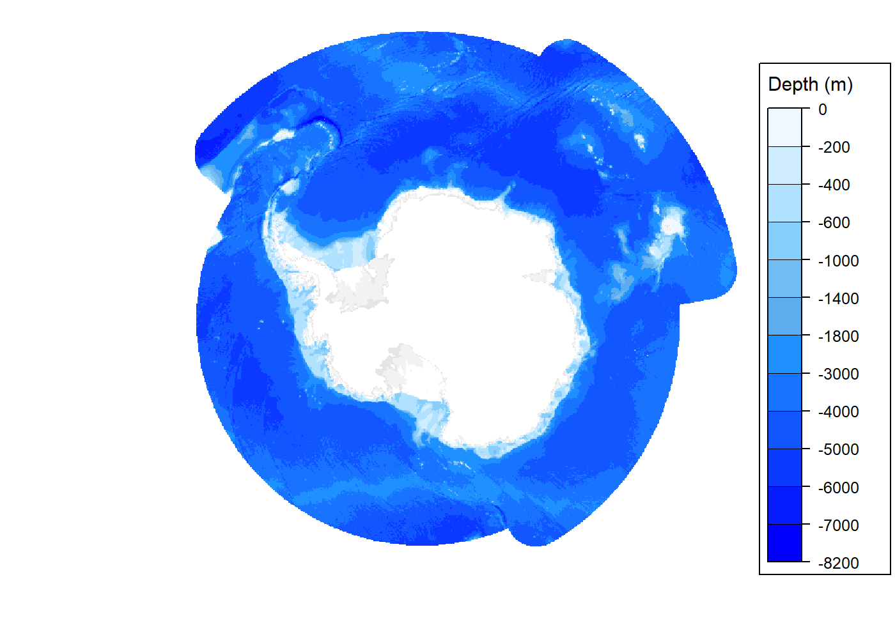

#### Highlighting the Fishable Depth range:

``` r
#Plot the bathymetry
plot(SmallBathy(),breaks=Depth_cuts2,col=Depth_cols2,axes=FALSE,box=FALSE,legend=FALSE,mar=c(0,0,0,2))
#Add color scale
add_Cscale(cuts=Depth_cuts2,cols=Depth_cols2,fontsize=0.75,height=80,offset=-1500,width=16,maxVal=-1)
```


### 5.2. Adding colors to data

Adding colors to plots revolves around two functions:

``` r
?add_col
#and
?add_Cscale
```

*add_col()* generates colors for a variable of interest as well as a set
of color classes and colors to be used as inputs to the *add_Cscale()*
function. Colors and color classes may be generated automatically or
customized, depending on the intended appearance. Knowing the names of
colors in R would be useful here
(<http://www.stat.columbia.edu/~tzheng/files/Rcolor.pdf>).

``` r

#Adding color to points

#Prepare layout for 3 sub-plots
par(mfrow=c(3,1),mai=c(0.1,0.1,0.1,1))
#Create some points
MyPoints=create_Points(PointData)

#Example 1: Add default cols and cuts
MyCols=add_col(MyPoints$Nfishes) 
plot(st_geometry(MyPoints),pch=21,bg=MyCols$varcol,main='Example 1:',cex.main=0.75,cex=1.5,lwd=0.5)
box()
add_Cscale(title='Number of fishes',
           height=95,fontsize=0.75,width=16,lwd=1,offset=0,
           cuts=MyCols$cuts,cols=MyCols$cols)

#Example 2: Given the look of example 1, reduce the number of cuts and round their values (in add_Cscale)
MyCols=add_col(MyPoints$Nfishes,cuts=10) 
plot(st_geometry(MyPoints),pch=21,bg=MyCols$varcol,main='Example 2:',cex.main=0.75,cex=1.5,lwd=0.5)
box()
add_Cscale(title='Number of fishes',
           height=95,fontsize=0.75,width=16,lwd=1,offset=0,
           cuts=round(MyCols$cuts,1),cols=MyCols$cols)

#Example 3: same as example 2 but with custom colors
MyCols=add_col(MyPoints$Nfishes,cuts=10,cols=c('black','yellow','purple','cyan')) 
plot(st_geometry(MyPoints),pch=21,bg=MyCols$varcol,main='Example 3:',cex.main=0.75,cex=1.5,lwd=0.5)
add_Cscale(title='Number of fishes',
           height=95,fontsize=0.75,width=16,lwd=1,offset=0,
           cuts=round(MyCols$cuts,1),cols=MyCols$cols)
box()
```

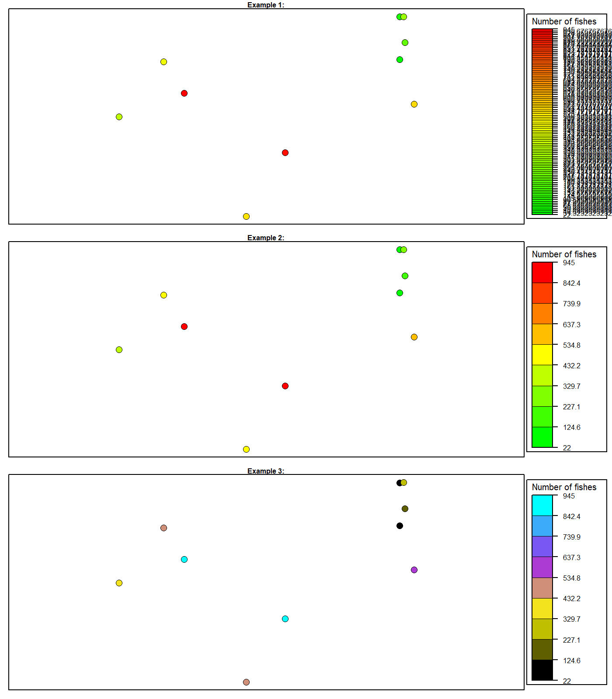

``` r

#Adding colors to a grid with custom cuts (see also the last example in section 2.1.)

#Step 1: Generate your grid
MyGrid=create_PolyGrids(GridData,Area=10000)

#Step 2: Inspect your gridded data (e.g. hist(MyGrid$Catch_sum,100))
#to determine whether irregular cuts are required.
#In this case (heterogeneously distributed data) irregular cuts 
#would be preferable, such as:
MyCuts=c(0,50,100,500,2000,2500)

#Step 3: Generate colors according to the desired classes (MyCuts)
Gridcol=add_col(MyGrid$Catch_sum,cuts=MyCuts,cols=c('blue','white','red'))

#Step 4: Plot result and add color scale
par(mai=c(0,0,0,1.5)) #set plot margins as c(bottom, left, top, right)
#Use the colors generated by add_col
plot(st_geometry(MyGrid),col=Gridcol$varcol,lwd=0.1) 
#Add color scale using cuts and cols generated by add_col
add_Cscale(title='Sum of Catch (t)',cuts=Gridcol$cuts,cols=Gridcol$cols,width=22,
     fontsize=0.75,lwd=1) 
```

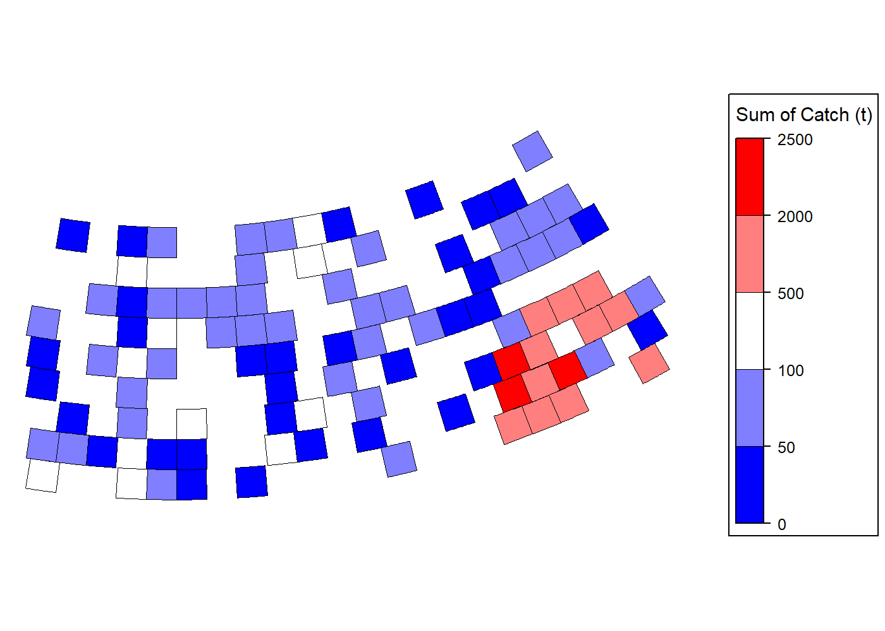

### 5.3. Adding legends

A simple way to quickly add a legend, is by using the base *legend()*
function:

``` r
?legend
```

To position the legend, the *add_Cscale()* function can generate legend
coordinates which correspond to the top-left corner of the legend box.
These may be adjusted using the ‘pos’, ‘height’ and ‘offset’ arguments
within *add_Cscale()*, *e.g.*:

``` r
Legend_Coordinates=add_Cscale(pos='2/3',offset=1000,height=40,mode="Legend")
```

``` r
#Adding a color scale and a legend

#Create some point data
MyPoints=create_Points(PointData)

#Crop the bathymetry to match the extent of MyPoints (extended extent)
BathyCr=crop(SmallBathy(),extend(ext(MyPoints),100000))
#Plot the bathymetry
plot(BathyCr,breaks=Depth_cuts,col=Depth_cols,legend=F,axes=F,mar=c(0,0,0,7))
#Add a color scale
add_Cscale(pos='3/8',height=50,maxVal=-1,minVal=-4000,fontsize=0.75,lwd=1,width=16)

#Plot points with different symbols and colors (see ?points)
Psymbols=c(21,22,23,24)
Pcolors=c('red','green','blue','yellow')
plot(st_geometry(MyPoints[MyPoints$name=='one',]),pch=Psymbols[1],bg=Pcolors[1],add=T,xpd=T)
plot(st_geometry(MyPoints[MyPoints$name=='two',]),pch=Psymbols[2],bg=Pcolors[2],add=T,xpd=T)
plot(st_geometry(MyPoints[MyPoints$name=='three',]),pch=Psymbols[3],bg=Pcolors[3],add=T,xpd=T)
plot(st_geometry(MyPoints[MyPoints$name=='four',]),pch=Psymbols[4],bg=Pcolors[4],add=T,xpd=T)

#Add legend with position determined by add_Cscale
Loc=add_Cscale(pos='7/8',height=40,mode='Legend')
legend(Loc,legend=c('one','two','three','four'),
       title='Vessel',pch=Psymbols,pt.bg=Pcolors,xpd=T,
       box.lwd=1,cex=0.75,pt.cex=1,y.intersp=1.2)
```

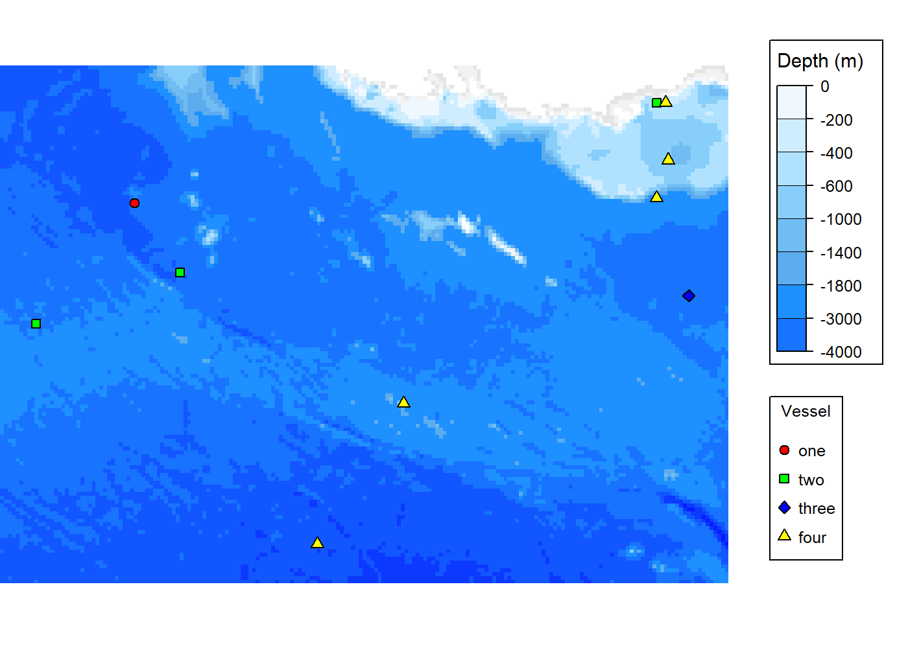

<br>

For a more complete and customizable approach, use the *add_Legend()*
function. It uses the bounding box of your plot and lists of parameters
as inputs. The help given in the R package contains all the details:

``` r
?add_Legend
```

Below is an example showing its capabilities:

``` r
#load ASDs to get their bounding box
ASDs=load_ASDs()
bb=st_bbox(ASDs) #Get bounding box
bx=st_as_sfc(bb) #Convert to polygon to plot it

# Set general options:
LegOpt=list( 
Title= "Title",
Subtitle="(Subtitle)",
Pos = "bottomright",
BoxW= 80,
BoxH= 140,
Boxexp = c(5,-2,-4,-4),
Titlefontsize = 2
)

#Create separate legend items, each with their own options:
Rectangle1=list(
  Text="Rectangle 1", 
  Shape="rectangle",
  ShpFill="cyan",
  ShpBord="blue",
  Shplwd=2,
  fontsize=1.2,
  STSpace=3,
  RectW=10,
  RectH=7
)

Rectangle2=list(
  Text="Rectangle 2", 
  Shape="rectangle",
  ShpFill="red",
  ShpBord="orange",
  ShpHash=TRUE,
  Shplwd=2,
  fontsize=1.2,
  STSpace=3,
  RectW=10,
  RectH=7,
  Hashcol="white",
  Hashangle=45,
  Hashspacing=1,
  Hashwidth=1
)

Circle1=list(
  Text="Circle 1", 
  Shape="circle",
  ShpFill="grey",
  ShpBord="yellow",
  Shplwd=2,
  fontsize=1.2,
  STSpace=3,
  CircD=10
)

Circle2=list(
  Text="Circle 2", 
  Shape="circle",
  ShpFill="white",
  ShpBord="red",
  ShpHash=TRUE,
  Shplwd=2,
  fontsize=1.2,
  STSpace=3,
  CircD=10,
  Hashcol="black",
  Hashangle=0,
  Hashspacing=2,
  Hashwidth=2
)

Line1=list(
  Text="Line 1", 
  Shape="line",
  ShpFill="black",
  Shplwd=5,
  fontsize=1.2,
  STSpace=3,
  LineL=10
)

Line2=list(
  Text="Line 2", 
  Shape="line",
  Shplwd=5,
  ShpFill="green",
  Shplwd=5,
  fontsize=1.2,
  STSpace=3,
  LineTyp=6, 
  LineL=10
)

Arrow1=list(
  Text="Arrow 1", 
  Shape="arrow",
  ShpBord="green",
  Shplwd=1,
  ArrL=10,
  ArrPwidth=5,
  ArrHlength=15, 
  ArrHwidth=10, 
  Arrcol="orange",
  fontsize=1.2,
  STSpace=3
)

Arrow2=list(
  Text="Arrow 2", 
  Shape="arrow",
  ShpBord=NA,
  ArrL=10,
  ArrPwidth=5,
  ArrHlength=15, 
  ArrHwidth=10, 
  Arrdlength=0, 
  Arrtype="dashed",
  Arrcol=c("red","green","blue"),
  fontsize=1.2,
  STSpace=3
)

Arrow3=list(
  Text="Arrow 3", 
  Shape="arrow",
  ShpBord=NA,
  ArrL=10,
  ArrPwidth=5,
  ArrHlength=15, 
  ArrHwidth=10, 
  Arrdlength=5, 
  Arrtype="dashed",
  Arrcol="darkgreen",
  fontsize=1.2,
  STSpace=3
)

Arrow4=list(
  Text="Arrow 4", 
  Shape="arrow",
  ShpBord="black",
  Shplwd=0.1,
  ArrL=10,
  ArrPwidth=5,
  ArrHlength=15, 
  ArrHwidth=10, 
  Arrcol="pink",
  ShpHash=TRUE,
  Hashcol="blue",
  Hashangle=-45,
  Hashspacing=1,
  Hashwidth=1,
  fontsize=1.2,
  STSpace=3
)

None=list(
  Text="None", 
  Shape="none",
  fontsize=1.2,
  STSpace=3,
  ShiftX=10
)


#Combine all items into a single list:

Items=list(Rectangle1,Rectangle2,Circle1,Circle2,Line1,Line2,Arrow1,Arrow2,Arrow3,Arrow4,None)

#Set the figure margins as c(bottom, left, top, right)
par(mai=c(0,0,0,0))
#Plot and add legend
plot(bx,col="grey")
plot(st_geometry(ASDs),add=TRUE)
add_Legend(bb,LegOpt,Items)
```

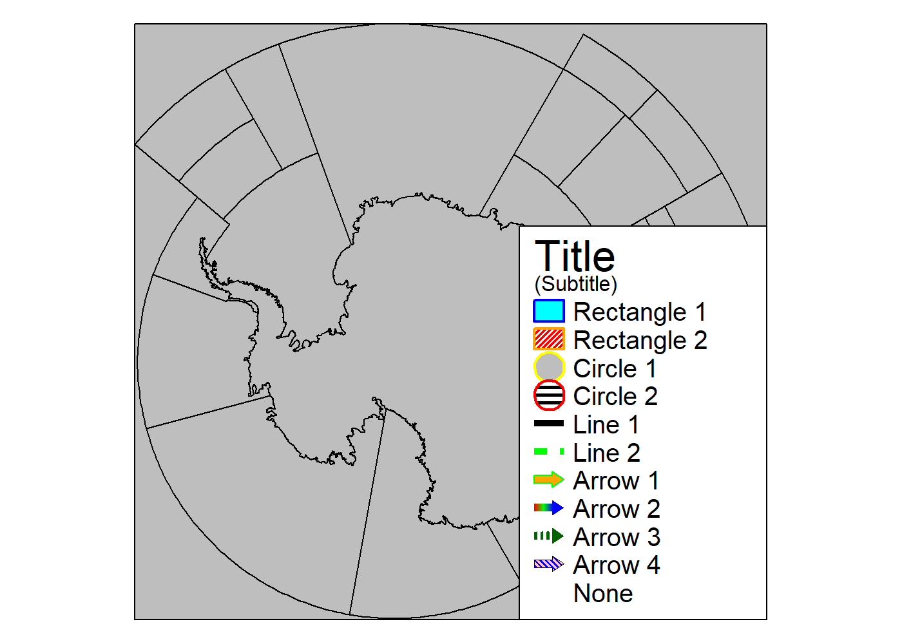

### 5.4. Adding labels

To add labels, use the *add_labels()* function:

``` r
?add_labels
```

Three modes are available within the *add_labels()* function:

- In ‘auto’ mode, labels are placed at the centres of polygon parts of
  spatial objects loaded via the *load\_* functions.
- In ‘manual’ mode, users may click on their plot to position labels. An
  editable label table is generated to allow fine-tuning of labels
  appearance, and may be saved for later use. To edit the label table,
  double-click inside one of its cells, edit the value, then close the
  table.
- In ‘input’ mode, a label table that was generated in ‘manual’ mode is
  re-used.

``` r
#Example 1: 'auto' mode
#label ASDs in bold and red
ASDs=load_ASDs()
#set plot margins as c(bottom, left, top, right)
par(mai=c(0,0,0,0))
plot(st_geometry(ASDs))
add_labels(mode='auto',layer='ASDs',fontsize=0.75,fonttype=2,col='red')
#add MPAs and EEZs and their labels in large, green and vertical text
MPAs=load_MPAs()
EEZs=load_EEZs()
plot(st_geometry(MPAs),add=TRUE,border='green')
plot(st_geometry(EEZs),add=TRUE,border='green')
add_labels(mode='auto',layer=c('EEZs','MPAs'),fontsize=1,col='green',angle=90)
```

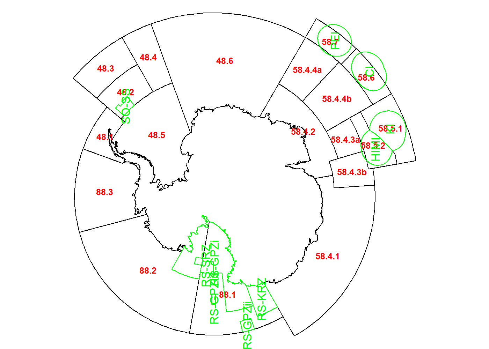

``` r
#Example 2: 'auto' and 'input' modes
#This example is not executed here because it needs user interaction.
#Please copy and paste it in the Console to see how it works.

#Prepare a basemap
plot(SmallBathy())
ASDs=load_ASDs()
plot(st_geometry(ASDs),add=T)

#Build your labels
MyLabels=add_labels(mode='manual') 

#Re-use the label table generated (if desired)
plot(SmallBathy())
plot(st_geometry(ASDs),add=T)
add_labels(mode='input',LabelTable=MyLabels)
```

### 5.5. Using sf

Due to the retirement of some packages that the CCAMLRGIS package used
to rely on, since CCAMLRGIS V4.0.0 the package relies on the [sf
package](https://CRAN.R-project.org/package=sf), users may need to
familiarize themselves with it. Using *sf* objects has advantages such
as the ability to use [Tidyverse
methods](https://r-spatial.github.io/sf/reference/tidyverse.html).
Further, additional [plotting
methods](https://r-spatial.github.io/sf/articles/sf5.html) are
available, some of which are described in this section.

Depending on the function used, the CCAMLRGIS package computes data
summaries and includes them in the resulting spatial object. For
example, *create_Polys* takes any numerical values included in the
*Input* data frame and computes, for each polygon, the minimum, maximum,
mean, median, sum, count and standard deviation of values associated
with each polygon. The *sf* package has some useful plotting methods,
some of which are shown below.

``` r

#First, let's create some example polygons
MyPolys=create_Polys(PolyData)

#MyPolys is an sf object; it is a data frame that includes a column named 'geometry':
kableExtra::kable(MyPolys,row.names = F)
```

| ID    | Catch_min | Nfishes_min | n_min | Catch_max | Nfishes_max | n_max | Catch_mean | Nfishes_mean | n_mean | Catch_sum | Nfishes_sum | n_sum | Catch_count | Nfishes_count | n_count |  Catch_sd | Nfishes_sd |     n_sd | Catch_median | Nfishes_median | n_median | geometry                     |  AreaKm2 |      Labx |     Laby |
|:------|----------:|------------:|------:|----------:|------------:|------:|-----------:|-------------:|-------:|----------:|------------:|------:|------------:|--------------:|--------:|----------:|-----------:|---------:|-------------:|---------------:|---------:|:-----------------------------|---------:|----------:|---------:|
| one   |  52.61262 |          11 |     1 |  71.65909 |         329 |     4 |   64.17380 |     172.5000 |    2.5 |  256.6952 |         690 |    10 |           4 |             4 |       4 |  9.084736 |   153.3917 | 1.290994 |     66.21175 |          175.0 |      2.5 | POLYGON ((-290035.9 -164487… | 187281.3 | -170519.8 | -1949051 |
| two   |  23.12032 |         116 |     5 |  73.49383 |         954 |     8 |   51.94951 |     505.0000 |    6.5 |  207.7980 |        2020 |    26 |           4 |             4 |       4 | 22.264999 |   428.9188 | 1.290994 |     55.59195 |          475.0 |      6.5 | POLYGON ((-423880.7 -240394… |  95294.2 |       0.0 | -2483470 |
| three |  10.23393 |          13 |     9 |  95.57774 |         988 |    14 |   52.50313 |     412.3333 |   11.5 |  315.0188 |        2474 |    69 |           6 |             6 |       6 | 32.152675 |   382.8685 | 1.870829 |     54.15367 |          341.5 |     11.5 | POLYGON ((480755.1 -2726497… | 361556.2 |  786933.1 | -2846388 |

The ‘geometry’ column contains the locations of each point of a given
polygon (each row), and can be plotted using
*plot(st_geometry(MyPolys))*, as shown previously in this document.
Alternatively, one can use *plot(MyPolys)* directly:

``` r
plot(MyPolys)
#> Warning: plotting the first 9 out of 25 attributes; use max.plot = 25 to plot
#> all
```

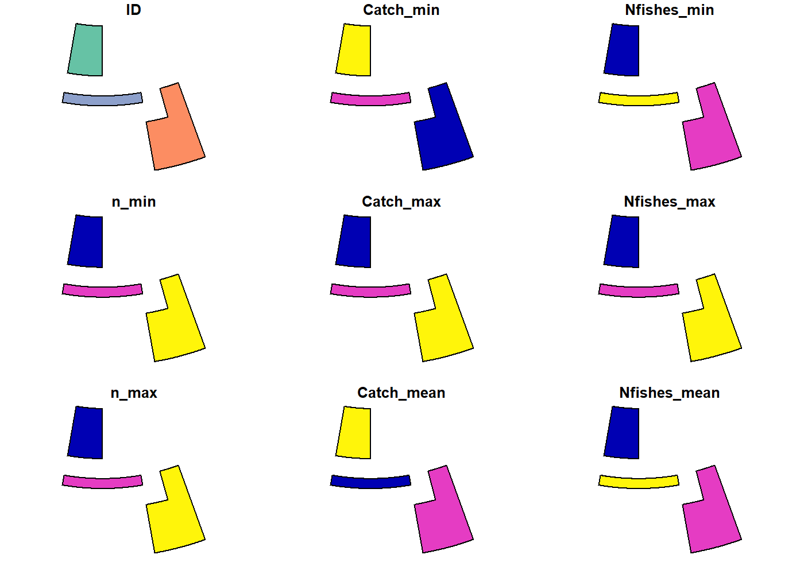

This results in a warning *Warning: plotting the first 9 out of 25
attributes…* and a 9-panel plot as shown above, with each panel
corresponding to each column present in *MyPolys* and automatic colors
generated according to the values in each column. In order to plot only
one variable, it must be named in the plotting command:

``` r
plot(MyPolys["Catch_mean"])
```

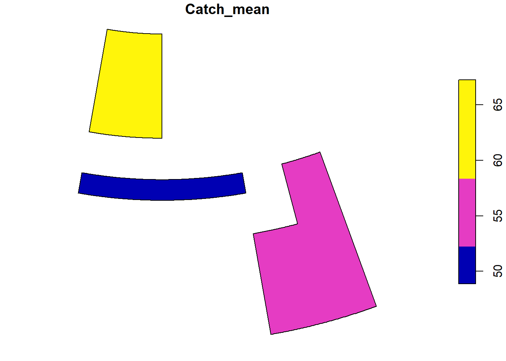

There are several available options, for example:

``` r
Gr=st_graticule(MyPolys,lon=seq(-180,180,by=5),lat=seq(-80,0,by=2.5))
plot(MyPolys["Catch_mean"],
     graticule=Gr,axes=T,key.pos=1,key.width=0.2,key.length=0.8,breaks=seq(50,65,by=2.5))
```

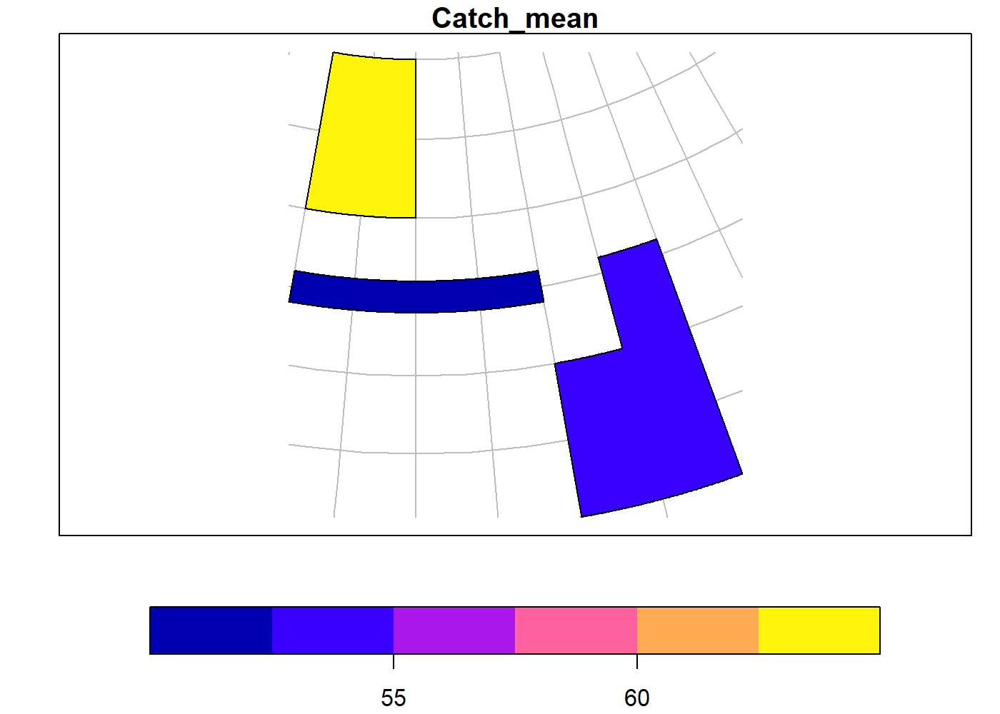

Where:

- *key.pos* controls the color legend position as 1=below, 2=left,
  3=above and 4=right,

- *key.width* and *key.length* control the size of the color legend,

- *breaks* controls the classes,

- The function *st_graticule* generates a Lat/Lon grid.

Additionally, *sf* objects can be plotted using *ggplot2*. For example:

``` r
library(ggplot2)
ggplot() + 
  geom_sf(data = MyPolys, aes(fill = Catch_mean))
```

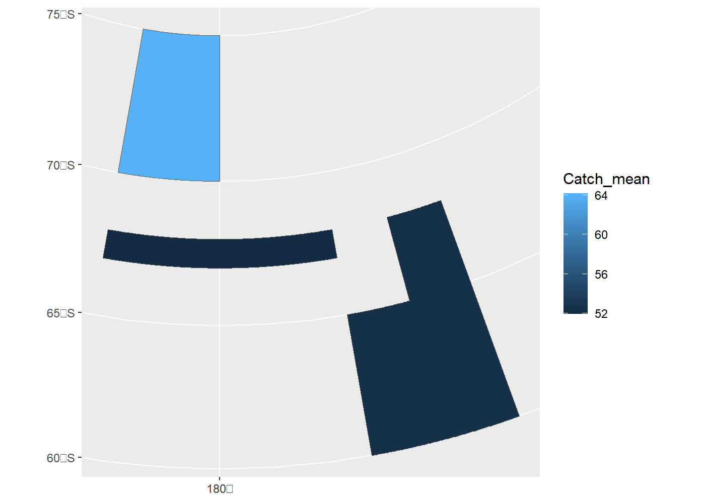

Using *ggplot2* and *gridExtra*, multi-panel plots can be drawn:

``` r
library(gridExtra)
map1 <- ggplot() +
  geom_sf(data = MyPolys, aes(fill = Catch_mean)) + 
  labs(title="Mean catch")

map2 <- ggplot() +
  geom_sf(data = MyPolys, aes(fill = Catch_sd)) + 
  labs(title="S.D. of catch")

map3 <- ggplot() +
  geom_sf(data = MyPolys, aes(fill = AreaKm2)) + 
  labs(title="Polygon area")

grid.arrange(map1, map2, map3, ncol=2)
```

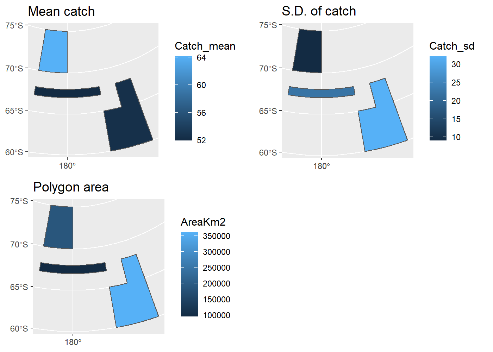
