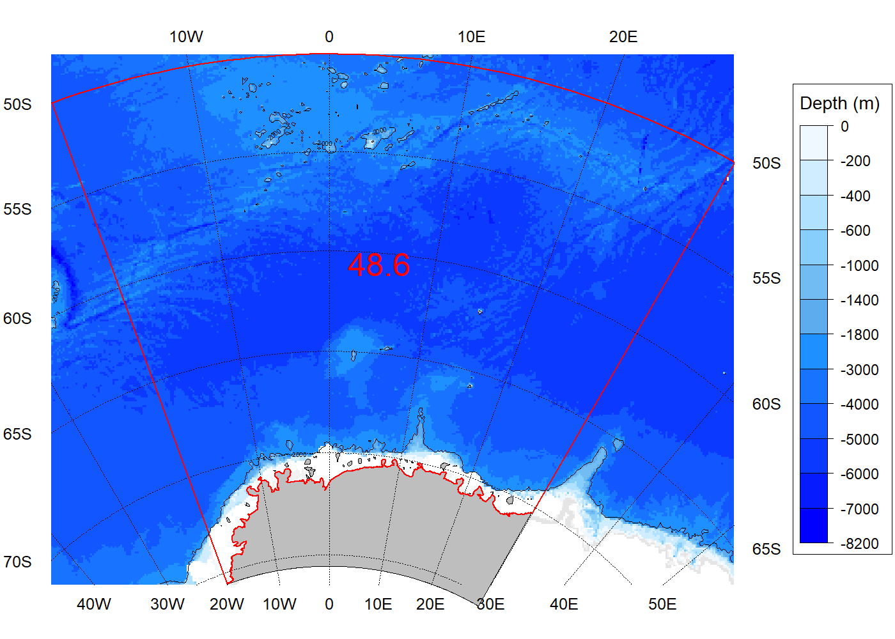
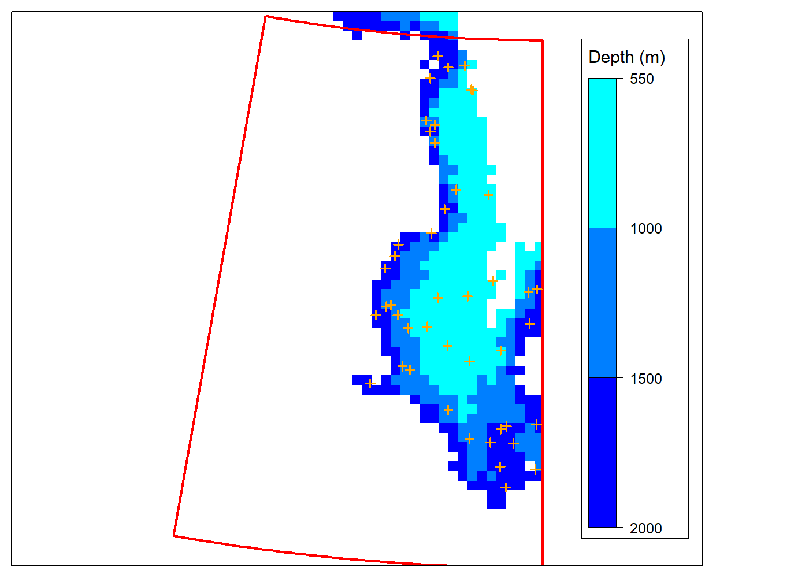
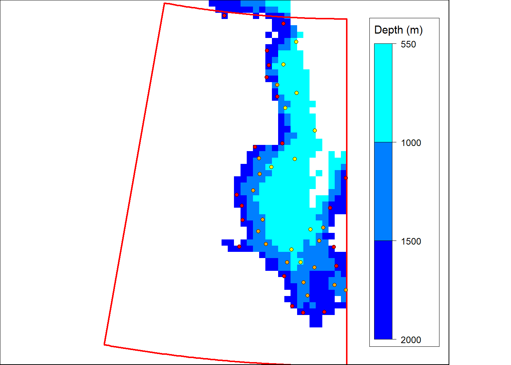
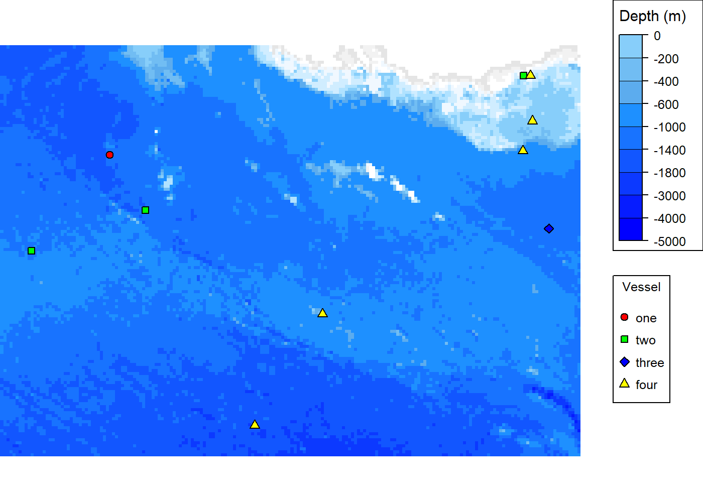

<!-- README.md is generated from README.Rmd. Please edit that file -->

# CCAMLRGIS R package

This package was developed to simplify the production of maps in the
CCAMLR Convention Area. It provides two categories of functions: load
functions and create functions. Load functions are used to import
spatial layers from the online CCAMLR GIS (<http://gis.ccamlr.org/>)
such as the ASD boundaries. Create functions are used to create layers
from user data such as polygons and grids.

## Installation

You can install the CCAMLRGIS R package from CRAN with:

``` r
install.packages("CCAMLRGIS")
```

## Vignette

<center>

### A package to load and create spatial data, including layers and tools that are relevant to CCAMLR activities.

</center>

------------------------------------------------------------------------

<center>

### Table of contents

</center>

------------------------------------------------------------------------

1.  Basemaps
2.  Create functions

-   2.1. Points, lines, polygons and grids
-   2.2. Create Stations

3.  Load functions

-   3.1. Online use
-   3.2. Offline use

4.  Other functions

-   4.1. get\_depths
-   4.2. seabed\_area
-   4.3. assign\_areas
-   4.4. project\_data

5.  Adding colors, legends and labels

-   5.1. Bathymetry colors
-   5.2. Adding colors to data
-   5.3. Adding legends
-   5.4. Adding labels

------------------------------------------------------------------------

## Introduction

The CCAMLRGIS package was developed to simplify the production of maps
in the CCAMLR Convention Area. It provides two categories of functions:
load functions and create functions. Load functions are used to import
spatial layers from the online CCAMLR GIS (<http://gis.ccamlr.org/>)
such as the ASD boundaries. Create functions are used to create layers
from user data such as polygons and grids.

First, install the package by typing:

``` r
install.packages("CCAMLRGIS")
```

Then, load the package by typing:

``` r
library(CCAMLRGIS)
```

All spatial manipulations are made using the South Pole Lambert
Azimuthal Equal Area projection (type ?CCAMLRp for more details).

``` r
#Map with axes, to understand projection

#Set the figure margins as c(bottom, left, top, right)
Mypar<-par(mai=c(1.2,0.7,0.5,0.45),xpd=TRUE)
#plot entire Coastline
plot(Coast[Coast$ID=='All',],col='grey',lwd=0.1)
#Add reference grid
add_RefGrid(bb=bbox(Coast[Coast$ID=='All',]),ResLat=10,ResLon=20,LabLon=-40,fontsize=0.8,lwd=0.5)
#add axes and labels
axis(1,pos=0,at=seq(-4000000,4000000,by=1000000),tcl=-0.15,labels=F,lwd=0.8,lwd.ticks=0.8,col='blue')
axis(2,pos=0,at=seq(-4000000,4000000,by=1000000),tcl=-0.15,labels=F,lwd=0.8,lwd.ticks=0.8,col='blue')
text(seq(1000000,4000000,by=1000000),0,seq(1,4,by=1),cex=0.75,col='blue',adj=c(0.5,1.75))
text(seq(-4000000,-1000000,by=1000000),0,seq(-4,-1,by=1),cex=0.75,col='blue',adj=c(0.5,1.75))
text(0,seq(1000000,4000000,by=1000000),seq(1,4,by=1),cex=0.75,col='blue',adj=c(1.75,0.5))
text(0,seq(-4000000,-1000000,by=1000000),seq(-4,-1,by=1),cex=0.75,col='blue',adj=c(1.75,0.5))
text(0,0,0,cex=0.75,col='blue',adj=c(-0.5,-0.5))
text(5200000,0,expression('x ('*10^6~'m)'),cex=0.75,col='blue')
text(0,4700000,expression('y ('*10^6~'m)'),cex=0.75,col='blue')
```


``` r
par(Mypar)
```

<center>

#### The South Pole Lambert Azimuthal Equal Area projection converts Latitudes and Longitudes into locations on a disk with x/y axes and units of meters. The South Pole is at x=0m ; y=0m. The tip of the Peninsula, for example, is around x=-2,500,000m ; y=2,000,000m.

</center>

## 1. Basemaps

Prior to detailing the package’s capabilities, a set of basic commands
are shown here to display a few core mapping elements. In a first
instance, the code used to produce the bathymetry raster included in the
package (‘SmallBathy’) is shown, and may be used to produce a raster at
a higher resolution:

``` r
#Step 1: Download the global GEBCO Grid, from:
#http://www.gebco.net/data_and_products/gridded_bathymetry_data/

#Step 2: load the 'raster' and 'rgeos' libraries
library(raster)
library(rgeos)

#Step 3: Read the data
G=raster(" Path to the folder containing the GEBCO data /GEBCO_YearXXXX.nc")

#Step 4: Crop the data to below 40 degrees South
G=crop(G,extent(-180,180,-90,-40))

#Step 5: Project the data using the CCAMLR projection
Gp=projectRaster(G, crs=proj4string(CCAMLRp))

#Step 6: Mask the data using a buffered contour of the Convention area
#load ASDs, buffer them and extract the outer polygon (first polygon within the list of polygons)
ASDs=load_ASDs()
#Build 500km contour
Contour=gBuffer(ASDs,width=500000,quadsegs = 25)
#Extract outer boundary (first polygon)
pol=Contour@polygons[[1]]@Polygons[1]
pol=Polygons(pol,ID='1')
pol=SpatialPolygons(list(pol),proj4string = CRS(CCAMLRp))
#Apply mask
Gpm=mask(Gp, pol)

#Step 7: Clamp the raster to exclude values higher than 500m
Gpmc=clamp(Gpm, upper=500,useValues=F)

#At this point, you may export the data and use it in its native resolution
#Export:
writeRaster(Gpmc,"GEBCOpmc.tif")
#to re-Import:
Gpmc=raster(' Path to the folder containing the GEBCO data /GEBCOpmc.tif')

#Or, resample it (e.g., at a 500m resolution, using the nearest neighbor method):
newR=raster(crs=crs(Gpmc), ext=extent(Gpmc), resolution=500)
Gr=resample(Gpmc,newR,method="ngb")
#Export:
writeRaster(Gr,"GEBCOpmcr500NN.tif")
#to re-Import:
Gpmcr500N=raster(' Path to the folder containing the data /GEBCOpmc.tif')
```

#### Circumpolar map:

``` r
#Load ASDs and EEZs
ASDs=load_ASDs()
EEZs=load_EEZs()
#Set the figure margins as c(bottom, left, top, right)
Mypar<-par(mai=c(0,0.4,0,0))
#Plot the bathymetry
plot(SmallBathy,breaks=Depth_cuts,col=Depth_cols,legend=F,axes=F,box=F)
#Add color scale
add_Cscale(height=90,fontsize=0.75,offset=-500,width=15,maxVal=-1,lwd=0.5)
#Add reference grid
add_RefGrid(bb=bbox(SmallBathy),ResLat=10,ResLon=20,LabLon=0,fontsize=0.75,lwd=0.75)
#Add ASD and EEZ boundaries
plot(ASDs,add=T,lwd=0.75,border='red')
plot(EEZs,add=T,lwd=0.75,border='red')
#Add coastline (for all ASDs)
plot(Coast[Coast$ID=='All',],col='grey',lwd=0.01,add=T)
#Add ASD labels
add_labels(mode='auto',layer='ASDs',fontsize=0.6,col='red')
```


``` r
par(Mypar)
```

#### Local map (e.g. Subarea 48.6):

``` r
#Load ASDs
ASDs=load_ASDs()
#Subsample ASDs to only keep Subarea 48.6
S486=ASDs[ASDs$GAR_Short_Label=='486',]
#Crop bathymetry to match the extent of S486
B486=raster::crop(SmallBathy,S486)
#Optional: get the maximum depth in that area to constrain the color scale
minD=raster::minValue(B486)
#Set the figure margins as c(bottom, left, top, right)
Mypar<-par(mai=c(0.2,0.4,0.2,0.55))
#Plot the bathymetry
plot(B486,breaks=Depth_cuts,col=Depth_cols,legend=F,axes=F,box=F)
#Add color scale
add_Cscale(height=80,fontsize=0.7,offset=300,width=15,lwd=0.5,minVal=minD,maxVal=-1)
#Add coastline (for Subarea 48.6 only)
plot(Coast[Coast$ID=='48.6',],col='grey',lwd=0.01,add=T)
#Add reference grid
add_RefGrid(bb=bbox(B486),ResLat=5,ResLon=10,fontsize=0.75,lwd=0.75,offset = 100000)
#Add Subarea 48.6 boundaries
plot(S486,add=T,lwd=1,border='red')
#Add a -2000m contour
raster::contour(B486,levels=-2000,add=T,lwd=0.5,labcex=0.3)
#Add single label at the centre of the polygon (see ?Labels)
text(Labels$x[Labels$t=='48.6'],Labels$y[Labels$t=='48.6'],labels='48.6',col='red',cex=1.5)
```



``` r
par(Mypar)
```

## 2. Create functions

### 2.1. Points, lines, polygons and grids

These functions are used to transform user data into spatial layers with
the appropriate projection. User data may either be generated within an
R script or imported from a ‘.csv’ file located in the working
directory. Users can set their working directory using the command
setwd(). It is however recommended to, instead, create an R project in a
folder and put your ‘.csv’ files in it.

To see your current working directory, type:

``` r
getwd()
```

#### Create points:

For details, type:

``` r
?create_Points
```

``` r
#Prepare layout for 4 sub-plots
Mypar<-par(mfrow=c(2,2),mai=c(0,0.01,0.2,0.01))

#Example 1: Simple points with labels
MyPoints=create_Points(PointData)
plot(MyPoints,main='Example 1',cex.main=0.75,cex=0.5,lwd=0.5)
text(MyPoints$x,MyPoints$y,MyPoints$name,adj=c(0.5,-0.5),xpd=T,cex=0.75)
box()

#Example 2: Simple points with labels, highlighting one group of points with the same name
MyPoints=create_Points(PointData)
plot(MyPoints,main='Example 2',cex.main=0.75,cex=0.5,lwd=0.5)
text(MyPoints$x,MyPoints$y,MyPoints$name,adj=c(0.5,-0.5),xpd=T,cex=0.75)
plot(MyPoints[MyPoints$name=='four',],bg='red',pch=21,cex=1,add=T)
box()

#Example 3: Buffered points with radius proportional to catch
MyPoints=create_Points(PointData,Buffer=1*PointData$Catch)
plot(MyPoints,col='green',main='Example 3',cex.main=0.75,cex=0.5,lwd=0.5)
text(MyPoints$x,MyPoints$y,MyPoints$name,adj=c(0.5,0.5),xpd=T,cex=0.75)
box()

#Example 4: Buffered points with radius proportional to catch and clipped to the Coast
MyPoints=create_Points(PointData,Buffer=2*PointData$Catch,Clip=T)
plot(MyPoints,col='cyan',main='Example 4',cex.main=0.75,cex=0.75,lwd=0.5)
plot(Coast[Coast$ID=='All',],add=T,col='grey',lwd=0.5)
box()
```


``` r
par(Mypar)
```

#### Create lines:

For details, type:

``` r
?create_Lines
```

``` r
#If your data contains line end locations in separate columns, you may reformat it as follows:

#Example data:
MyData=data.frame(
  Line=c(1,2),
  Lat_Start=c(-60,-65),
  Lon_Start=c(-10,5),
  Lat_End=c(-61,-66),
  Lon_End=c(-2,2)
)

#Reformat to us as input in create_Lines as:
Input=data.frame(
  Line=c(MyData$Line,MyData$Line),
  Lat=c(MyData$Lat_Start,MyData$Lat_End),
  Lon=c(MyData$Lon_Start,MyData$Lon_End)
)
```

``` r
#Prepare layout for 3 sub-plots
Mypar<-par(mai=c(0,0.01,0.2,0.01),mfrow=c(1,3))

#Example 1: Simple and non-densified lines
MyLines=create_Lines(LineData)
plot(MyLines,col=rainbow(length(MyLines)),main='Example 1',cex.main=0.75,lwd=2)
box()

#Example 2: Simple and densified lines (note the curvature of the purple line)
MyLines=create_Lines(LineData,Densify=T)
plot(MyLines,col=rainbow(length(MyLines)),main='Example 2',cex.main=0.75,lwd=2)
box()

#Example 3: Densified, buffered and clipped lines
MyLines=create_Lines(LineData,Densify=T,Buffer=c(10,40,50,80,100),Clip=T)
plot(MyLines,col=rainbow(length(MyLines)),main='Example 3',cex.main=0.75,lwd=1)
plot(Coast[Coast$ID=='All',],col='grey',add=T,lwd=0.5)
box()
```


``` r
par(Mypar)
```

Adding a buffer with the argument SeparateBuf set to FALSE results in a
single polygon which may be viewed as a footprint:

``` r
#Set the figure margins as c(bottom, left, top, right)
Mypar<-par(mai=c(0.01,0.01,0.01,0.01))

#Buffer merged lines
MyLines=create_Lines(LineData,Buffer=10,SeparateBuf=F)
#The resulting polygon has an area of:
MyLines$Buffered_AreaKm2
#> [1] 222653.6

plot(MyLines,col='green',lwd=1)
box()
```


``` r
par(Mypar)
```

#### Create polygons:

For details, type:

``` r
?create_Polys
```

``` r
#Prepare layout for 3 sub-plots
Mypar<-par(mfrow=c(1,3),mai=c(0,0.01,0.2,0.01))

#Example 1: Simple and non-densified polygons
MyPolys=create_Polys(PolyData,Densify=F)
plot(MyPolys,col='blue',main='Example 1',cex.main=0.75,lwd=0.5)
text(MyPolys$Labx,MyPolys$Laby,MyPolys$ID,col='white',cex=0.75)
box()

#Example 2: Simple and densified polygons (note the curvature of iso-latitude lines)
MyPolys=create_Polys(PolyData)
plot(MyPolys,col='red',main='Example 2',cex.main=0.75,lwd=0.5)
text(MyPolys$Labx,MyPolys$Laby,MyPolys$ID,col='white',cex=0.75)
box()

#Example 3: Buffered and clipped polygons
MyPolysBefore=create_Polys(PolyData,Buffer=c(10,-15,120))
MyPolysAfter=create_Polys(PolyData,Buffer=c(10,-15,120),Clip=T)
plot(MyPolysBefore,col='green',main='Example 3',cex.main=0.75,lwd=0.5)
plot(Coast[Coast$ID=='All',],add=T,lwd=0.5)
plot(MyPolysAfter,col='orange',add=T,lwd=0.5)
text(MyPolysAfter$Labx,MyPolysAfter$Laby,MyPolysAfter$ID,col='white',cex=0.75)
box()
```


``` r
par(Mypar)
```

#### Create grids:

For details, type:

``` r
?create_PolyGrids
```

``` r
#Prepare layout for 3 sub-plots
Mypar<-par(mfrow=c(1,3),mai=c(0,0.01,0.2,0.01))

#Example 1: Simple grid, using automatic colors
MyGrid=create_PolyGrids(GridData,dlon=2,dlat=1)
plot(MyGrid,col=MyGrid$Col_Catch_sum,main='Example 1',cex.main=0.75,lwd=0.1)
box()

#Example 2: Equal area grid, using automatic colors
MyGrid=create_PolyGrids(GridData,Area=10000)
plot(MyGrid,col=MyGrid$Col_Catch_sum,main='Example 2',cex.main=0.75,lwd=0.1)
box()

#Example 3: Equal area grid, using custom cuts and colors
MyGrid=create_PolyGrids(GridData,Area=10000,cuts=c(0,50,100,500,2000,3500),cols=c('blue','red'))
plot(MyGrid,col=MyGrid$Col_Catch_sum,main='Example 3',cex.main=0.75,lwd=0.1)
box()
```


``` r
par(Mypar)
```

Customizing a grid and adding a color scale:

``` r
#Prepare layout for 2 sub-plots
Mypar<-par(mfrow=c(2,1),mai=c(0.2,0.05,0.1,1.3))

#Step 1: Generate your grid
MyGrid=create_PolyGrids(GridData,Area=10000)

#Step 2: Inspect your gridded data (e.g. sum of Catch) to determine whether irregular cuts are required
hist(MyGrid$Catch_sum,100,cex=0.75,main='Frequency distribution of data',
     cex.main=0.5,col='grey',axes=F)
axis(1,pos=0,tcl=-0.15,lwd=0.8,lwd.ticks=0.8,labels=F)
text(seq(0,2500,by=500),-1.5,seq(0,2500,by=500),cex=0.75,xpd=T)

#In this case (heterogeneously distributed data) irregular cuts would be preferable
#Such as:
MyCuts=c(0,50,100,500,2000,2500)
abline(v=MyCuts,col='green',lwd=0.1,lty=2) #Add classes to histogram as green dashed lines

#Step 3: Generate colors according to the desired classes (MyCuts)
Gridcol=add_col(MyGrid$Catch_sum,cuts=MyCuts,cols=c('yellow','purple'))

#Step 4: Plot result and add color scale
#Use the colors generated by add_col
plot(MyGrid,col=Gridcol$varcol,lwd=0.1) 
#Add color scale using cuts and cols generated by add_col
add_Cscale(title='Sum of Catch (t)',cuts=Gridcol$cuts,cols=Gridcol$cols,width=18,
     fontsize=0.6,lwd=0.5,height = 100) 
box()
```


``` r
par(Mypar)
```

### 2.2. Create Stations

This function was designed to create random point locations inside a
polygon and within bathymetry strata constraints. A distance constraint
between stations may also be used if desired.

For details, type:

``` r
?create_Stations
```

First, create a polygon within which stations will be created:

``` r
#Create polygons
MyPolys=create_Polys(PolyData,Densify=T)

#Set the figure margins as c(bottom, left, top, right)
Mypar<-par(mai=c(0,0,0,0))
plot(MyPolys)

#Subsample MyPolys to only keep the polygon with ID 'one'
MyPoly=MyPolys[MyPolys$ID=='one',]

plot(MyPoly,col='green',add=T)
text(MyPolys$Labx,MyPolys$Laby,MyPolys$ID)
box()
```


``` r
par(Mypar)
```

Example 1. Set numbers of stations, no distance constraint:

``` r
#Create polygon as shown above
MyPolys=create_Polys(PolyData,Densify=T)
MyPoly=MyPolys[MyPolys$ID=='one',]

#optional: crop your bathymetry raster to match the extent of your polygon
BathyCroped=raster::crop(SmallBathy,MyPoly)


MyStations=create_Stations(MyPoly,BathyCroped,Depths=c(-2000,-1500,-1000,-550),N=c(20,15,10))
#Set the figure margins as c(bottom, left, top, right)
Mypar<-par(mai=c(0.1,0.1,0.1,0.1))

#add custom colors to the bathymetry to indicate the strata of interest
MyCols=add_col(var=c(-10000,10000),cuts=c(-2000,-1500,-1000,-550),cols=c('blue','cyan'))
plot(BathyCroped,breaks=MyCols$cuts,col=MyCols$cols,legend=F,axes=F,box=F)
add_Cscale(height=90,fontsize=0.75,width=16,lwd=0.5,offset=-130,cuts=MyCols$cuts,cols=MyCols$cols)
plot(MyPoly,add=T,border='red',lwd=2)
plot(MyStations,add=T,col='orange',cex=0.75,lwd=1.5)
box()
```



``` r
par(Mypar)
```

Example 2. Set numbers of stations, with distance constraint:

``` r
#Create polygon as shown above
MyPolys=create_Polys(PolyData,Densify=T)
MyPoly=MyPolys[MyPolys$ID=='one',]

#optional: crop your bathymetry raster to match the extent of your polygon
BathyCroped=raster::crop(SmallBathy,MyPoly)

MyStations=create_Stations(MyPoly,BathyCroped,
                           Depths=c(-2000,-1500,-1000,-550),N=c(20,15,10),dist=10)
#Set the figure margins as c(bottom, left, top, right)
Mypar<-par(mai=c(0,0,0,0))

#add custom colors to the bathymetry to indicate the strata of interest
MyCols=add_col(var=c(-10000,10000),cuts=c(-2000,-1500,-1000,-550),cols=c('blue','cyan'))
plot(BathyCroped,breaks=MyCols$cuts,col=MyCols$cols,legend=F,axes=F,box=F)
add_Cscale(height=90,fontsize=0.75,width=16,lwd=0.5,offset=-130,cuts=MyCols$cuts,cols=MyCols$cols)
plot(MyPoly,add=T,border='red',lwd=2)
plot(MyStations[MyStations$Stratum=='1000-550',],pch=21,bg='yellow',add=T,cex=0.75,lwd=0.1)
plot(MyStations[MyStations$Stratum=='1500-1000',],pch=21,bg='orange',add=T,cex=0.75,lwd=0.1)
plot(MyStations[MyStations$Stratum=='2000-1500',],pch=21,bg='red',add=T,cex=0.75,lwd=0.1)
box()
```



``` r
par(Mypar)
```

Example 3. Automatic numbers of stations, with distance constraint:

``` r
#Create polygon as shown above
MyPolys=create_Polys(PolyData,Densify=T)
MyPoly=MyPolys[MyPolys$ID=='one',]

#optional: crop your bathymetry raster to match the extent of your polygon
BathyCroped=raster::crop(SmallBathy,MyPoly)

MyStations=create_Stations(MyPoly,BathyCroped,Depths=c(-2000,-1500,-1000,-550),Nauto=30,dist=10)
#Set the figure margins as c(bottom, left, top, right)
Mypar<-par(mai=c(0,0,0,0))

#add custom colors to the bathymetry to indicate the strata of interest
MyCols=add_col(var=c(-10000,10000),cuts=c(-2000,-1500,-1000,-550),cols=c('blue','cyan'))
plot(BathyCroped,breaks=MyCols$cuts,col=MyCols$cols,legend=F,axes=F,box=F)
add_Cscale(height=90,fontsize=0.75,width=16,lwd=0.5,offset=-130,cuts=MyCols$cuts,cols=MyCols$cols)
plot(MyPoly,add=T,border='red',lwd=2)
plot(MyStations[MyStations$Stratum=='1000-550',],pch=21,bg='yellow',add=T,cex=0.75,lwd=0.1)
plot(MyStations[MyStations$Stratum=='1500-1000',],pch=21,bg='orange',add=T,cex=0.75,lwd=0.1)
plot(MyStations[MyStations$Stratum=='2000-1500',],pch=21,bg='red',add=T,cex=0.75,lwd=0.1)
box()
```


``` r
par(Mypar)
```

## 3. Load functions

### 3.1. Online use

Download the up-to-date spatial layers from the online CCAMLRGIS and
load them to your environment.

For details, type:

``` r
?load_ASDs
```

``` r
#Load ASDs, EEZs, and Coastline
ASDs=load_ASDs()
EEZs=load_EEZs()
Coastline=load_Coastline()

#Set the figure margins as c(bottom, left, top, right)
Mypar<-par(mai=c(0,0,0,0))
#Plot
plot(ASDs,col='green',border='blue')
plot(EEZs,col='orange',border='purple',add=T)
plot(Coastline,col='grey',add=T)
add_labels(mode='auto',layer='ASDs',fontsize=0.75,col='red')
box()
```


``` r
par(Mypar)
```

### 3.2. Offline use

Since the ‘load\_’ functions require an internet connection, users may
desire to save layers on their hard drive for offline use. This may be
done, at the risk of not having the most up-to-date layers, as follows:

``` r
#Load all layers
ASDs=load_ASDs()
EEZs=load_EEZs()
Coastline=load_Coastline()
SSRUs=load_SSRUs()
RBs=load_RBs()
SSMUs=load_SSMUs()
MAs=load_MAs()
MPAs=load_MPAs()

#Save as .RData file (here in the temp directory)
save(list=c('ASDs','EEZs','Coastline','SSRUs','RBs','SSMUs','MAs','MPAs'),
     file = file.path(tempdir(), "CCAMLRLayers.RData"), compress='xz')

#Later, when offline load layers:
load(file.path(tempdir(), "CCAMLRLayers.RData"))
```

## 4. Other functions

### 4.1. get\_depths

Given a bathymetry raster and a an input dataframe of
latitudes/longitudes, this function computes the depths at these
locations. Optionally it can also compute the horizontal distance of
locations to chosen isobaths.

For details, type:

``` r
?get_depths
```

``` r
#Generate a dataframe
MyData=data.frame(Lat=PointData$Lat,
                  Lon=PointData$Lon,
                  Catch=PointData$Catch)
#The input data looks like this:
head(MyData)
#>         Lat       Lon    Catch
#> 1 -68.63966 -175.0078 53.33002
#> 2 -67.03475 -178.0322 38.66385
#> 3 -65.44164 -170.1656 20.32608
#> 4 -68.36806  151.0247 69.81201
#> 5 -63.89171  154.4327 52.32101
#> 6 -66.35370  153.6906 78.65576


#Example 1: get depths of locations
MyDataD=get_depths(Input=MyData,Bathy=SmallBathy)
#The resulting data looks like this (where 'd' is the depth and 'x' and 'y' are the projected locations):
head(MyDataD)
#>         Lat       Lon    Catch          x        y           d
#> 1 -68.63966 -175.0078 53.33002 -206321.41 -2361962 -3902.17494
#> 2 -67.03475 -178.0322 38.66385  -87445.72 -2545119 -3944.33588
#> 3 -65.44164 -170.1656 20.32608 -464656.29 -2680488 -3002.31098
#> 4 -68.36806  151.0247 69.81201 1162986.84 -2100218   -95.20888
#> 5 -63.89171  154.4327 52.32101 1246832.20 -2606157 -3306.09463
#> 6 -66.35370  153.6906 78.65576 1161675.96 -2349505 -2263.46712
#Prepare layout for 2 sub-plots
Mypar<-par(mfrow=c(2,1),mai=c(0.4,0.4,0.1,0.1))
#Plot Catch vs Depth
XL=c(-5000,0) #Set plot x-axis limits
YL=c(10,80)       #Set plot y-axis limits
plot(MyDataD$d,MyDataD$Catch,xlab='',ylab='',pch=21,bg='red',axes=F,xpd=T,xlim=XL,ylim=YL)
axis(1,pos=YL[1],tcl=-0.15,lwd=0.8,lwd.ticks=0.8,at=seq(XL[1],XL[2],by=500),cex.axis=0.75,labels=F)
axis(2,pos=XL[1],tcl=-0.15,lwd=0.8,lwd.ticks=0.8,at=seq(YL[1],YL[2],by=10),cex.axis=0.75,labels=F)
text(seq(XL[1],XL[2],by=500),YL[1]-3,seq(XL[1],XL[2],by=500),cex=0.75,xpd=T)
text(XL[1]-100,seq(YL[1],YL[2],by=10),seq(YL[1],YL[2],by=10),cex=0.75,xpd=T)

text(mean(XL),YL[1]-8,'Depth',cex=0.75,xpd=T)
text(XL[1]-500,mean(YL),'Catch',cex=0.75,xpd=T,srt=90)


#Example 2: get depths of locations and distance to isobath -3000m
MyDataD=get_depths(Input=MyData,Bathy=SmallBathy,Isobaths=-3000,IsoLocs=T,d=200000)
plot(MyDataD$x,MyDataD$y,pch=21,bg='green',cex=0.75,lwd=0.5)
raster::contour(SmallBathy,levels=-3000,add=T,col='blue',maxpixels=10000000)
segments(x0=MyDataD$x,
         y0=MyDataD$y,
         x1=MyDataD$X_3000,
         y1=MyDataD$Y_3000,col='red')
```


``` r
par(Mypar)
```

### 4.2. seabed\_area

Function to calculate planimetric seabed area within polygons and depth
strata in square kilometers. Its accuracy depends on the input
bathymetry raster.

For details, type:

``` r
?seabed_area
```

``` r
#create some polygons
MyPolys=create_Polys(PolyData,Densify=T)
#compute the seabed areas
FishDepth=seabed_area(SmallBathy,MyPolys,depth_classes=c(0,-200,-600,-1800,-3000,-5000))
#Result looks like this (note that the -600m to -1800m is renamed 'Fishable_area')
head(FishDepth)
#>   Polys 0|-200 -200|-600 Fishable_area -1800|-3000 -3000|-5000
#> 1   one      0     18000         40300       39200       89800
#> 2   two      0      1100          1100        8900       84300
#> 3 three    300      1600          6400      223200      128100
```

### 4.3. assign\_areas

Given a set of polygons and a set of point locations (given in decimal
degrees), finds in which polygon those locations fall. Finds, for
example, in which ASD the given fishing locations occurred.

For details, type:

``` r
?assign_areas
```

``` r
#Generate a dataframe with random locations
MyData=data.frame(Lat=runif(100,min=-65,max=-50),
                  Lon=runif(100,min=20,max=40))
#The input data looks like this:
head(MyData)

#load ASDs and SSRUs
ASDs=load_ASDs()
SSRUs=load_SSRUs()

#Assign ASDs and SSRUs to these locations 
MyData=assign_areas(MyData,Polys=c('ASDs','SSRUs'),NamesOut=c('MyASDs','MySSRUs'))
#The output data looks like this:
head(MyData)

#count of locations per ASD
table(MyData$MyASDs) 

#count of locations per SSRU
table(MyData$MySSRUs) 
```

### 4.4. project\_data

A simple function to project user-supplied locations. Input must be a
dataframe, outputs may be appended to the dataframe.

``` r
#The input data looks like this:
head(PointData)
#>         Lat       Lon  name    Catch Nfishes n
#> 1 -68.63966 -175.0078   one 53.33002     460 1
#> 2 -67.03475 -178.0322   two 38.66385     945 2
#> 3 -65.44164 -170.1656   two 20.32608     374 3
#> 4 -68.36806  151.0247   two 69.81201      87 4
#> 5 -63.89171  154.4327 three 52.32101     552 5
#> 6 -66.35370  153.6906  four 78.65576      22 6
#Generate a dataframe with random locations
MyData=project_data(Input=PointData,NamesIn=c('Lat','Lon'),NamesOut=c('Projected_Y','Projectd_X'),append=TRUE)
#The output data looks like this:
head(MyData)
#>         Lat       Lon  name    Catch Nfishes n Projected_Y Projectd_X
#> 1 -68.63966 -175.0078   one 53.33002     460 1    -2361962 -206321.41
#> 2 -67.03475 -178.0322   two 38.66385     945 2    -2545119  -87445.72
#> 3 -65.44164 -170.1656   two 20.32608     374 3    -2680488 -464656.29
#> 4 -68.36806  151.0247   two 69.81201      87 4    -2100218 1162986.84
#> 5 -63.89171  154.4327 three 52.32101     552 5    -2606157 1246832.20
#> 6 -66.35370  153.6906  four 78.65576      22 6    -2349505 1161675.96
```

## 5. Adding colors, legends and labels

### 5.1. Bathymetry colors

Coloring bathymetry requires a vector of depth classes and a vector of
colors. Colors are applied between depth classes (so there is one less
color than there are depth classes). Two sets of bathymetry colors are
included in the package. One simply colors the bathymetry in shades of
blue (Depth\_cols and Depth\_cuts), the other adds shades of green to
highlight the Fishable Depth (600-1800m; Depth\_cols2 and Depth\_cuts2).

#### Simple set of colors:

``` r
#Set the figure margins as c(bottom, left, top, right)
Mypar<-par(mai=c(0,0.4,0,0))
#Plot the bathymetry
plot(SmallBathy,breaks=Depth_cuts,col=Depth_cols,axes=FALSE,box=FALSE,legend=FALSE)
#Add color scale
add_Cscale(cuts=Depth_cuts,cols=Depth_cols,fontsize=0.75,height=80,offset=-500,width=16)
```


``` r
par(Mypar)
```

#### Highlighting the Fishable Depth range:

``` r
#Set the figure margins as c(bottom, left, top, right)
Mypar<-par(mai=c(0,0.4,0,0))
#Plot the bathymetry
plot(SmallBathy,breaks=Depth_cuts2,col=Depth_cols2,axes=FALSE,box=FALSE,legend=FALSE)
#Add color scale
add_Cscale(cuts=Depth_cuts2,cols=Depth_cols2,fontsize=0.75,height=80,offset=-500,width=16)
```


``` r
par(Mypar)
```

### 5.2. Adding colors to data

Adding colors to plots revolves around two functions:

``` r
?add_col
#and
?add_Cscale
```

add\_col() generates colors for a variable of interest as well as a set
of color classes and colors to be used as inputs to the add\_Cscale()
function. Colors and color classes may be generated automatically or
customized, depending on the intended appearance. Knowing the names of
colors in R would be useful here
(<http://www.stat.columbia.edu/~tzheng/files/Rcolor.pdf>).

``` r
#Adding color to points

#Prepare layout for 3 sub-plots
Mypar<-par(mfrow=c(3,1),mai=c(0.1,0.1,0.1,1))
#Create some points
MyPoints=create_Points(PointData)

#Example 1: Add default cols and cuts
MyCols=add_col(MyPoints$Nfishes) 
plot(MyPoints,pch=21,bg=MyCols$varcol,main='Example 1:',cex.main=0.75,cex=1.5,lwd=0.5)
box()
add_Cscale(title='Number of fishes',
           height=95,fontsize=0.75,width=16,lwd=1,offset=0,
           cuts=MyCols$cuts,cols=MyCols$cols)

#Example 2: Given the look of example 1, reduce the number of cuts and round their values (in add_Cscale)
MyCols=add_col(MyPoints$Nfishes,cuts=10) 
plot(MyPoints,pch=21,bg=MyCols$varcol,main='Example 2:',cex.main=0.75,cex=1.5,lwd=0.5)
box()
add_Cscale(title='Number of fishes',
           height=95,fontsize=0.75,width=16,lwd=1,offset=0,
           cuts=round(MyCols$cuts,1),cols=MyCols$cols)

#Example 3: same as example 2 but with custom colors
MyCols=add_col(MyPoints$Nfishes,cuts=10,cols=c('black','yellow','purple','cyan')) 
plot(MyPoints,pch=21,bg=MyCols$varcol,main='Example 3:',cex.main=0.75,cex=1.5,lwd=0.5)
add_Cscale(title='Number of fishes',
           height=95,fontsize=0.75,width=16,lwd=1,offset=0,
           cuts=round(MyCols$cuts,1),cols=MyCols$cols)
box()
```


``` r
par(Mypar)
```

``` r
#Adding colors to a grid with custom cuts (see also the last example in section 2.1.)

#Step 1: Generate your grid
MyGrid=create_PolyGrids(GridData,Area=10000)

#Step 2: Inspect your gridded data (e.g. hist(MyGrid$Catch_sum,100))
#to determine whether irregular cuts are required.
#In this case (heterogeneously distributed data) irregular cuts 
#would be preferable, such as:
MyCuts=c(0,50,100,500,2000,2500)

#Step 3: Generate colors according to the desired classes (MyCuts)
Gridcol=add_col(MyGrid$Catch_sum,cuts=MyCuts,cols=c('blue','white','red'))

#Step 4: Plot result and add color scale
Mypar<-par(mai=c(0,0,0,1.5)) #set plot margins as c(bottom, left, top, right)
#Use the colors generated by add_col
plot(MyGrid,col=Gridcol$varcol,lwd=0.1) 
#Add color scale using cuts and cols generated by add_col
add_Cscale(title='Sum of Catch (t)',cuts=Gridcol$cuts,cols=Gridcol$cols,width=22,
     fontsize=0.75,lwd=1) 
```


``` r
par(Mypar)
```

### 5.3. Adding legends

To add a legend, use the base legend() function:

``` r
?legend
```

To position the legend, the add\_Cscale() function can generate legend
coordinates which correspond to the top-left corner of the legend box.
These may be adjusted using the ‘pos’, ‘height’ and ‘offset’ arguments
within add\_Cscale(), e.g.:

``` r
Legend_Coordinates=add_Cscale(pos='2/3',offset=1000,height=40)
```

``` r
#Adding a color scale and a legend

#Create some point data
MyPoints=create_Points(PointData)

#Crop the bathymetry to match the extent of MyPoints (extended extent)
BathyCr=raster::crop(SmallBathy,raster::extend(raster::extent(MyPoints),100000))
#set plot margins as c(bottom, left, top, right)
Mypar<-par(mai=c(0,0,0,0.5))
#Plot the bathymetry
plot(BathyCr,breaks=Depth_cuts,col=Depth_cols,legend=F,axes=F,box=F)
#Add a color scale
add_Cscale(pos='1/2',height=50,maxVal=-1,minVal=-4000,fontsize=0.75,lwd=1,width=16)

#Plot points with different symbols and colors (see ?points)
Psymbols=c(21,22,23,24)
Pcolors=c('red','green','blue','yellow')
plot(MyPoints[MyPoints$name=='one',],pch=Psymbols[1],bg=Pcolors[1],add=T)
plot(MyPoints[MyPoints$name=='two',],pch=Psymbols[2],bg=Pcolors[2],add=T)
plot(MyPoints[MyPoints$name=='three',],pch=Psymbols[3],bg=Pcolors[3],add=T)
plot(MyPoints[MyPoints$name=='four',],pch=Psymbols[4],bg=Pcolors[4],add=T)

#Add legend with position determined by add_Cscale
Loc=add_Cscale(pos='2/2',height=40,mode='Legend')
legend(Loc,legend=c('one','two','three','four'),
       title='Vessel',pch=Psymbols,pt.bg=Pcolors,xpd=T,
       box.lwd=1,cex=0.75,pt.cex=1,y.intersp=1.5)
```



``` r
par(Mypar)
```

### 5.4. Adding labels

To add labels, use the add\_labels() function:

``` r
?add_labels
```

Three modes are available within the add\_labels function:

-   In ‘auto’ mode, labels are placed at the centres of polygon parts of
    spatial objects loaded via the load\_ functions.
-   In ‘manual’ mode, users may click on their plot to position labels.
    An editable label table is generated to allow fine-tuning of labels
    appearance, and may be saved for external use. To edit the label
    table, double-click inside one of its cells, edit the value, then
    close the table.
-   In ‘input’ mode, a label table that was generated in ‘manual’ mode
    is re-used.

``` r
#Example 1: 'auto' mode
#label ASDs in bold and red
ASDs=load_ASDs()
#set plot margins as c(bottom, left, top, right)
Mypar<-par(mai=c(0,0,0,0))
plot(ASDs)
add_labels(mode='auto',layer='ASDs',fontsize=0.75,fonttype=2,col='red')
#add MPAs and EEZs and their labels in large, green and vertical text
MPAs=load_MPAs()
EEZs=load_EEZs()
plot(MPAs,add=TRUE,border='green')
plot(EEZs,add=TRUE,border='green')
add_labels(mode='auto',layer=c('EEZs','MPAs'),fontsize=1,col='green',angle=90)
```


``` r
par(Mypar)
```

``` r
#Example 2: 'auto' and 'input' modes
#This example is not executed here because it needs user interaction.
#Please copy and paste it to see how it works.

#Prepare a basemap
plot(SmallBathy)
ASDs=load_ASDs()
plot(ASDs,add=T)

#Build your labels
MyLabels=add_labels(mode='manual') 

#Re-use the label table generated (if desired)
plot(SmallBathy)
plot(ASDs,add=T)
add_labels(mode='input',LabelTable=MyLabels)
```
