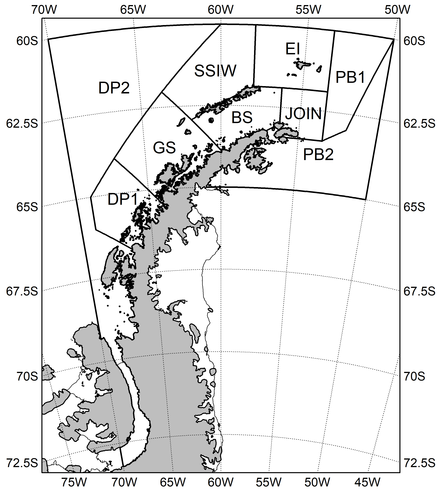

<!-- README.md is generated from README.Rmd. Please edit that file -->

# Report maps

------------------------------------------------------------------------

Each of the following sections contain code to produce maps that were
published in CCAMLR reports.

# Contents

------------------------------------------------------------------------

1.  [WG-ASAM](#1-wg-asam)

2.  [WG-IMAF](#2-wg-imaf)

3.  [WG-EMM](#3-wg-emm)

4.  [WG-SAM](#4-wg-sam)

5.  [WG-FSA](#5-wg-fsa)

6.  [SC-Other](#6-sc-other)

    6.1. [WS-48.2-2026](#61-ws-482-2026)

7.  [SC-CAMLR](#7-sc-camlr)

    7.1. [SC-CAMLR-43](#71-sc-camlr-43)

------------------------------------------------------------------------

 

## 1. WG-ASAM

*Pending new maps.*

 

## 2. WG-IMAF

*Pending new maps.*

 

## 3. WG-EMM

*Pending new maps.*

 

## 4. WG-SAM

*Pending new maps.*

 

## 5. WG-FSA

*Pending new maps.*

 

## 6. SC-Other

### 6.1. WS-48.2-2026

An R script along with all resources needed to reproduce Figure 2 of
[WS-48.2-2026](https://meetings.ccamlr.org/en/ws-48-2-2026) are
available in the [WS-482-2026
folder](https://github.com/ccamlr/CCAMLRGIS/tree/master/Report%20maps/Files/WS-482-2026).
The resulting map is shown below (*N.B.*: The currents shown on the
original map were added manually, and given in ‘Add_Currents.pptx’), as
well as the areas of the marine part of each plotted polygon.

Figure 6.1.: Options for defining a core area in Subarea 48.2 (A: black;
B: yellow; C: orange; D: pink). CCAMLR Subareas (grey; black labels);
South Orkney Islands southern shelf MPA (red; CM 91-03); General
Protection Zone of the proposed D1MPA in Subarea 48.2 (GPZ-SOI; green;
CCAMLR-44/24); Krill Fishery Concentration Areas (KFCA; blue ellipses;
WS-48.2-2026/05, Figure 8); and CCAMLR Ecosystem Monitoring Program
(CEMP) sites (green circles; WS-48.2-2026/05, Figure 1). Black arrows
are a schematic of the mean currents around the South Orkney Shelf,
based on Thompson et al., 2009 and Young et al., 2024. The black dashed
line indicates the general flow associated with the southern boundary of
the Antarctic Circumpolar Current. Variability in the currents is
strong, particularly on the western and northern sides of the shelf.
Bathymetric contour of 400 m is shown as a thin black line. Sources:
CCAMLR, UK Polar Data Centre/BAS and Natural Earth. Projection: EPSG
6932 (rotated). Figure adapted from WS-48.2-2026, arrows to be added
manually.

 

The marine areas of the polygons shown above are:

| Polygon       | Marine_Area_km2 |
|:--------------|----------------:|
| Subarea 48.2  |          856091 |
| SOSS          |           93751 |
| D1MPA-GPZ-SOI |           20093 |
| Area A        |           62978 |
| Area B        |           83559 |
| Area C        |          118548 |
| Area D        |          169596 |

 

## 7. SC-CAMLR

### 7.1. SC-CAMLR-43

An R script along with all resources needed to reproduce Figure 1 of
[SC-CAMLR-43](https://meetings.ccamlr.org/en/sc-camlr-43) are available
in the [SC-CAMLR-43
folder](https://github.com/ccamlr/CCAMLRGIS/tree/master/Report%20maps/Files/SC-CAMLR-43).
The resulting map is shown below, as well as the areas of the marine
part of each plotted polygon.

Figure 7.1.: Candidate krill fishery Management Units in Subarea 48.1.
EI: Elephant Island, JOIN: Joinville, BS: Bransfield Strait, SSIW: South
Shetland Islands West, GS: Gerlache Strait, DP: Drake Passage, PB:
Powell Basin. Sources: CCAMLR/UK Polar Data Centre/BAS and Natural
Earth. Projection: EPSG 6932 (rotated). Figure adapted from SC-CAMLR-43.

 

The marine areas of the polygons shown above are:

| Polygon | Marine_Area_km2 |
|:--------|----------------:|
| EI      |           51669 |
| BS      |           35208 |
| JOIN    |           23033 |
| PB1     |           45456 |
| PB2     |           99236 |
| GS      |           61088 |
| SSIW    |           59293 |
| DP1     |           41688 |
| DP2     |          224045 |
